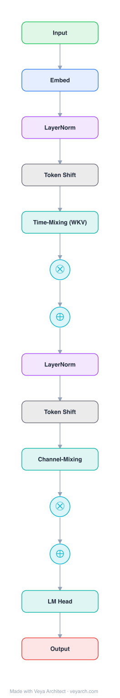

# Architecture: RWKV

## Motivation

Transformers have revolutionized NLP but suffer from memory and computational complexity that scales **quadratically** with sequence length. RNNs exhibit linear scaling but struggle to match Transformer performance due to limitations in parallelization and scalability. RWKV aims to bridge the gap between computational efficiency and expressive capacity — combining the efficient parallelizable training of Transformers with the efficient inference of RNNs.

## Core Idea

Receptance Weighted Key Value (RWKV) combines a linear attention mechanism that can be formulated as either a Transformer (for parallel training) or an RNN (for efficient inference), achieving O(Td) time and O(d) space complexity. It is the first non-Transformer architecture scaled to tens of billions of parameters.

## Architecture

### Overview

<b>Layer-by-layer (14 nodes)</b>

| # | Layer | Type | Params |
|---|---|---|---|
| 1 | Input | `input` |  |
| 2 | Embed | `embed` |  |
| 3 | LayerNorm | `norm` |  |
| 4 | Token Shift | `custom` |  |
| 5 | Time-Mixing (WKV) | `ssm` | decay: channel-wise |
| 6 | R (Receptance) | `gate` |  |
| 7 | ⊕ | `residual` |  |
| 8 | LayerNorm | `norm` |  |
| 9 | Token Shift | `custom` |  |
| 10 | Channel-Mixing | `ffn` |  |
| 11 | R (Receptance) | `gate` |  |
| 12 | ⊕ | `residual` |  |
| 13 | LM Head | `linear` |  |
| 14 | Output | `output` |  |

RWKV is comprised of a series of stacked residual blocks, each formed by a **time-mixing** and a **channel-mixing** sub-block with recurrent structures. The architecture derives its name from four primary elements: **R** (Receptance), **W** (Weight decay), **K** (Key), and **V** (Value). The key innovation is reformulating attention as a linear attention mechanism with channel-wise time-decaying weights, which can be computed as either a parallel Transformer-style operation during training or a constant-memory RNN during inference.

### Components

1. **Time-mixing block** — The core attention-like component. It uses a channel-wise time decay vector W that decays backwards in time: `w_{t,i} = -(t-i)w`, where `w ∈ (R≥0)^d`. This replaces the pairwise attention matrix in Transformers with a much more efficient channel-wise decay. The WKV computation is:
   - `WKV_t = (Σ_{i=1}^{t} e^{-(t-i)w + k_i} v_i + e^{u_t + k_t} v_t) / (Σ_{i=1}^{t} e^{-(t-i)w + k_i} + e^{u_t + k_t})`
   - W is a trainable parameter vector (not a matrix), making it O(d) instead of O(T²)
   - U compensates for potential degeneration of W at the current position

2. **Channel-mixing block** — A feedforward-like component with gating, analogous to the MLP block in Transformers. It uses R and K elements to produce gated outputs, and is fully parallelizable.

3. **Token shift (time-shift mixing)** — A linear interpolation between the current input and the input at the previous time step, applied independently to every linear projection of the input embedding (R, K, V in time-mixing; R, K in channel-mixing).

4. **Receptance (R)** — A vector acting as the acceptance of past information, computed via sigmoid gating. It controls how much of the WKV output is accepted.

### Data Flow

1. **Token shift**: Input is linearly interpolated with the previous time step's input (token shift).
2. **Time-mixing**: R, K, V are computed from the shifted input. The WKV state is updated using the time-decaying weights W and the current K, V. The output is gated by R (receptance).
3. **Channel-mixing**: A separate R, K are computed from the shifted input. The output is gated and projected.
4. **Residual connection**: Both time-mixing and channel-mixing outputs are added to the residual stream.
5. **Layer normalization**: Applied before each sub-block.

### State / Memory

- **WKV state**: During RNN-mode inference, the model maintains a constant-size state that accumulates the time-decayed weighted values. This is the "memory" — it compresses the entire context into a fixed-size vector.
- **No KV cache**: Unlike Transformers, RWKV requires O(d) space (not O(Td)) during inference, as the recurrent formulation naturally compresses history.
- **Time decay**: The W vector controls how quickly past information decays, providing a principled mechanism for forgetting irrelevant history.

## Design Decisions

1. **Channel-wise time decay (W)** — Instead of a pairwise T×T attention matrix, RWKV uses a channel-wise d-dimensional decay vector. This reduces space from O(T²) to O(d) while preserving the ability to model temporal dependencies.

2. **Dual formulation (Transformer/RNN)** — The linear attention mechanism can be computed as either a parallel Transformer-style operation (for training) or a sequential RNN (for inference). This gives the best of both worlds: parallel training and constant-memory inference.

3. **No approximation** — Unlike Performer or linear attention approximations, RWKV's linear attention is exact, not an approximation of standard attention. This preserves expressiveness.

4. **U vector for current token** — Separately attending to the current token via U compensates for potential degeneration of W, ensuring the current input is not underweighted.

5. **Token shift** — The linear interpolation between current and previous inputs provides a simple but effective form of temporal mixing that can be applied to all projections.

6. **Non-negative W** — Requiring `w ≥ 0` ensures `e^{w_{t,i}} ≤ 1`, so per-channel weights decay backwards in time, providing stable recurrent dynamics.

## Evolution

**Predecessors:**
- **LSTM** (Hochreiter & Schmidhuber, 1997) — RNN with gating, but not parallelizable.
- **Transformer** (Vaswani et al., 2017) — Parallelizable but quadratic complexity.
- **Attention Free Transformer (AFT)** (Zhai et al., 2021) — Replaces dot-product attention with position biases. RWKV modifies AFT's interaction weights for RNN compatibility.
- **Quasi-RNN** (Bradbury et al., 2017) — Uses convolutional layers and recurrent pooling. RWKV uses time-mixing with time-decaying factors instead.

**Successors:**
- **RWKV-v4, v5, v6** — Successive versions with architectural improvements.
- **Mamba** (Gu & Dao, 2023) — Another linear-time architecture with selective state spaces.
- **Various linear attention variants** — Inspired by RWKV's approach to combining RNN and Transformer properties.

## Characteristics

| Property | Value |
|----------|-------|
| Year | 2023 |
| Authors | Peng et al. |
| Category | DL/Sequence |
| Source Paper | `RWKV_Reinventing_RNNs_for_the_Transformer_Era_Albalak_Arcadinho_Chung_2023.md` |
| PaperVault Path | `DL-Architectures/02-sequence-models/RWKV_Reinventing_RNNs_for_the_Transformer_Era_Albalak_Arcadinho_Chung_2023.md` |

## Limitations

1. **Fixed decay rate** — The channel-wise time decay W is a fixed parameter, not input-dependent. This limits content-based selectivity compared to Mamba's input-dependent parameters.
2. **State compression** — The constant-size state must compress all context, potentially losing information for very long sequences.
3. **No explicit attention** — Some tasks may benefit from the dense token-to-token routing that attention provides.
4. **Training-inference discrepancy** — The dual formulation means the training (parallel) and inference (recurrent) computations differ, which can introduce subtle inconsistencies.
5. **Newer architecture** — Less mature ecosystem and fewer optimized implementations compared to Transformers.

## Implementation Notes

See `implementation/` for a minimal runnable implementation. Key details:
- Time complexity: O(Td) for training, O(d) per step for inference
- Space complexity: O(d) for inference (no KV cache)
- WKV computation: `w_{t,i} = -(t-i)w` (channel-wise time decay)
- Token shift: linear interpolation between current and previous input
- Dual mode: parallel (Transformer) for training, sequential (RNN) for inference
- Pre-trained models from 169M to 14B parameters available

## Information Layers

- **Evidence:** Source paper available in `references/papers/` (Peng et al., 2023, "RWKV: Reinventing RNNs for the Transformer Era")
- **Analysis:** RWKV's key insight is that the pairwise attention matrix can be replaced with a channel-wise time decay vector, reducing complexity from O(T²) to O(Td) while maintaining the ability to model temporal dependencies. The dual Transformer/RNN formulation elegantly resolves the parallelization-vs-efficiency tradeoff. The channel-directed attention (vs. token-directed in Transformers) is a fundamental shift in how information is routed.
- **Hypothesis:** The channel-wise time decay mechanism may be sufficient for most language modeling tasks, as token-level interactions can be approximated by channel-level routing. The success of RWKV at scale (14B parameters) suggests that the quadratic complexity of attention may not be necessary for high-quality language modeling.
