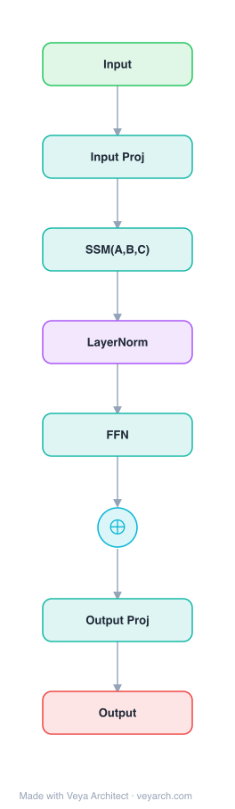

# Architecture: S4

## Motivation

A central problem in sequence modeling is efficiently handling data that contains long-range dependencies (LRDs). Real-world time-series data often requires reasoning over tens of thousands of time steps, while few sequence models address even thousands of time steps. Results from the Long Range Arena (LRA) benchmark highlight that sequence models perform poorly on LRD tasks, including one task (Path-X) where no model performs better than random guessing.

All standard model families — RNNs, CNNs, and Transformers — include specialized variants designed to address LRDs (orthogonal/Lipschitz RNNs, dilated convolutions, efficient Transformers with reduced quadratic dependence). Despite being designed for LRDs, these solutions still perform poorly on challenging benchmarks. An alternative approach based on the state space model (SSM) was recently introduced: the Linear State Space Layer (LSSL) showed that deep SSMs with special state matrices `A` can handle LRDs, unifying the strengths of continuous-time, RNN, and CNN models. However, the LSSL was computationally infeasible — for state dimension `N` and sequence length `L`, computing the latent state required `O(N²L)` operations and `O(NL)` space, and the theoretically efficient algorithms were numerically unstable (the special `A` matrix is highly non-normal, preventing conventional diagonalization).

S4 was proposed to solve this critical computational bottleneck while preserving the theoretical strengths of SSMs.

## Core Idea

Structured State Space Model using diagonal-plus-low-rank parameterization for efficient long-range modeling.

## Architecture

### Overview

<b>Layer-by-layer (8 nodes)</b>

| # | Layer | Type | Params |
|---|---|---|---|
| 1 | Input | `input` |  |
| 2 | Input Proj | `linear` |  |
| 3 | SSM(A,B,C) | `ssm` | parameterization: DPLR, matrix: HiPPO |
| 4 | LayerNorm | `norm` |  |
| 5 | FFN | `ffn` |  |
| 6 | ⊕ | `residual` |  |
| 7 | Output Proj | `linear` |  |
| 8 | Output | `output` |  |

S4 is based on the state space model (SSM), which maps a 1-D input signal `u(t)` to an N-D latent state `x(t)` before projecting to a 1-D output signal `y(t)`. The SSM is defined by: `x'(t) = Ax(t) + Bu(t)`, `y(t) = Cx(t) + Du(t)`, where `A`, `B`, `C`, `D` are learned parameters. S4's key innovation is a new parameterization of the structured state matrix `A` (derived from the HiPPO framework) that allows efficient computation of the SSM convolution kernel `K`, reducing complexity from `O(N²L)` to `Õ(N + L)`.

The SSM can be viewed in three representations: (1) **continuous-time** `(A, B, C)`, (2) **discrete-time recurrent** `(Ā, B̄, C̄)` computed via bilinear discretization, and (3) **convolutional** `K` (the SSM convolution kernel). S4's contribution is efficiently switching between these representations, allowing it to handle a wide range of tasks, be efficient at both training (convolution view) and inference (recurrent view), and excel at long sequences.

### Components

1. **State Space Model (SSM)** — The foundational model: `x'(t) = Ax(t) + Bu(t)`, `y(t) = Cx(t) + Du(t)`. Maps 1-D input to N-D latent state to 1-D output. Parameter `D` is omitted (treated as a skip connection). Used as a black-box representation in a deep sequence model where `A, B, C, D` are learned by gradient descent.

2. **HiPPO Matrix (A)** — A special class of matrices derived from the HiPPO theory of continuous-time memorization. The most important HiPPO matrix is defined by: `A_{nk} = (2n+1)^{1/2}(2k+1)^{1/2}` if `n > k`, `-(n+1)` if `n = k`, `0` if `n < k`. When incorporated into the SSM, the state `x(t)` can memorize the history of input `u(t)`. Simply modifying an SSM from a random matrix `A` to the HiPPO matrix improved sequential MNIST performance from 60% to 98%.

3. **Bilinear Discretization** — Converts the continuous-time SSM to discrete-time: `x_k = Āx_{k-1} + B̄u_k`, `y_k = C̄x_k`, where `Ā = (I - Δ/2·A)^{-1}(I + Δ/2·A)`, `B̄ = (I - Δ/2·A)^{-1}ΔB`, `C̄ = C`. Step size `Δ` represents the resolution of the input. This creates a recurrent representation that can be computed like an RNN.

4. **SSM Convolution Kernel (K)** — Unrolling the recurrence yields a convolution: `y = K * u`, where `K = (CB, CAB, ..., CA^{L-1}B) ∈ R^L`. This can be computed efficiently with FFTs, provided `K` is known. Computing `K` is the fundamental bottleneck that S4 solves.

5. **S4 Parameterization (Normal Plus Low-Rank)** — The HiPPO matrix is decomposed as: `A = VΛV* - PQ*` (Normal Plus Low-Rank, NPLR), for unitary `V`, diagonal `Λ`, and low-rank factors `P, Q` (rank `r = 1` or `2` for all HiPPO matrices). This is conjugated into Diagonal Plus Low-Rank (DPLR) form. The key insight: the low-rank term can be corrected by the Woodbury identity while the normal term can be diagonalized stably, reducing to a Cauchy kernel computation.

6. **Cauchy Kernel Computation** — The core algorithm: computing the SSM convolution filter `K` is reduced to 4 Cauchy multiplies, requiring only `Õ(N + L)` operations and `O(N + L)` space. Cauchy matrices (entries `1/(ω_j - ζ_k)`) are a well-studied problem in numerical analysis with stable near-linear algorithms based on the Fast Multipole Method (FMM).

7. **Truncated Generating Function (Frequency Space)** — Instead of computing `K` directly in coefficient space, S4 computes its spectrum by evaluating the truncated generating function `Σ_{j=0}^{L-1} K_j ζ^j` at the roots of unity `ζ`. `K` is then found by inverse FFT. This generating function involves a matrix inverse (related to the resolvent) instead of matrix powers, enabling the Woodbury identity correction.

### Data Flow

1. **Parameterization**: S4 parameters `Λ, P, Q, B, C` (in DPLR form) and step size `Δ` are initialized, with `A = Λ - PQ*` derived from the HiPPO matrix.
2. **Convolution kernel computation (training)**:
   a. Compute the truncated generating function in frequency space, involving the matrix resolvent `(I - A)^{-1}`.
   b. Apply the Woodbury identity to correct the low-rank term, reducing to the diagonal case.
   c. The diagonal case reduces to a Cauchy kernel computation: `1/(ω_j - ζ_k)`.
   d. Evaluate the generating function at all roots of unity `ω ∈ Ω_L`.
   e. Apply inverse FFT to recover `K`.
3. **Forward pass (training)**: Compute `y = K * u` via FFT-based convolution (parallelizable).
4. **Inference (recurrent view)**: Compute `x_k = Āx_{k-1} + B̄u_k`, `y_k = C̄x_k` step by step, using the recurrent representation. The DPLR form of `Ā` (product of two DPLR matrices) allows `O(N)` matrix-vector multiplication per step.
5. **Sampling resolution change**: Since the SSM is continuous-time, changing the discretization step `Δ` allows adapting to different sampling frequencies without retraining.

### State / Memory

- **Latent state x(t)** — The N-dimensional latent state `x(t)` serves as the memory mechanism. In the recurrent view, `x_k` is a hidden state with transition matrix `Ā` that is updated at each step, analogous to an RNN hidden state.
- **HiPPO memorization** — The special `A` matrix (HiPPO) allows the state `x(t)` to memorize the history of the input `u(t)`, addressing long-range dependencies. This is the key state mechanism that enables S4 to handle sequences of 10000+ steps.
- **Dual representation** — During training, the convolution view `K` is used (no sequential state needed; fully parallelizable). During inference, the recurrent view `(Ā, B̄, C̄)` is used (state `x_k` propagated step by step). S4 efficiently switches between these representations.
- **No attention-based memory** — Unlike Transformers that maintain a KV-cache of all past tokens, S4's state is fixed-size `O(N)` regardless of sequence length, enabling constant-memory inference.

## Design Decisions

1. **HiPPO matrix for A** — Chosen because it provides continuous-time memorization: the state `x(t)` can memorize the history of input `u(t)`. This addresses the vanishing/exploding gradients problem of naive linear ODEs (which solve to exponential functions). Simply using the HiPPO matrix instead of a random matrix improved sequential MNIST from 60% to 98%.

2. **Normal Plus Low-Rank (NPLR) decomposition** — The HiPPO matrix is not normal (cannot be diagonalized by a unitary matrix), preventing conventional diagonalization. S4's key observation: the HiPPO matrix can be decomposed as the sum of a normal and low-rank matrix. The normal term can be diagonalized stably; the low-rank term can be corrected by the Woodbury identity. This is the core technical innovation.

3. **Frequency space computation (generating function)** — Instead of computing `K` in coefficient space (requiring `O(N²L)` operations), S4 computes the truncated generating function in frequency space. This converts matrix powers `A^i` into a matrix inverse `(I - A)^{-1}`, enabling the Woodbury identity and Cauchy kernel reduction.

4. **Cauchy kernel reduction** — The final computation reduces to a Cauchy matrix `1/(ω_j - ζ_k)`, a well-studied problem with stable near-linear algorithms (Fast Multipole Method). This achieves `Õ(N + L)` computation, essentially tight for sequence models.

5. **Dual recurrent/convolution views** — S4 leverages both representations: convolution for efficient parallel training (via FFTs) and recurrence for efficient sequential inference (constant-size state). This combines the strengths of CNNs (parallel training) and RNNs (efficient inference) while addressing LRDs.

6. **Continuous-time foundation** — The SSM is defined in continuous time, discretized for specific input resolutions. This allows sampling resolution change (adapting to different frequencies without retraining) and provides a principled approach to handling irregularly sampled data.

## Evolution

**Predecessors:**
- **State Space Models (SSMs)** — Foundational scientific model from control theory and computational neuroscience; Gu et al. showed deep SSMs can address LRDs but were computationally infeasible.
- **Linear State Space Layer (LSSL)** — Conceptually unified CTM, RNN, and CNN models; showed SSMs can handle LRDs in principle but required `O(N²L)` computation and `O(NL)` space, and its efficient algorithms were numerically unstable.
- **HiPPO framework** — Derived the special `A` matrices that allow continuous-time memorization; the foundation for S4's parameterization.
- **RNNs/LSTMs** — Sequential models that S4 improves upon with principled LRD handling and parallelizable training.
- **Transformers** — Attention-based models with `O(n²)` complexity; S4 matches or exceeds them on LRD tasks while being more efficient.

**Successors:**
- **S5** — Simplified S4 by using a multi-input multi-output (MIMO) SSM, reducing complexity while maintaining performance.
- **H3** — Adapted S4-like SSMs into a hybrid attention-SSM architecture for language modeling.
- **Mamba (S6)** — Introduced selective state spaces, making the SSM input-dependent and achieving Transformer-level performance on language modeling. Directly builds on S4's foundation.
- **Mamba-2** — Further refined the structured SSM with hardware-aware design.

## Characteristics

| Property | Value |
|----------|-------|
| Year | 2021 |
| Authors | Gu & Goel |
| Category | DL/Transformer |
| Source Paper | `Efficiently_Modeling_Long_Sequences_with_Structured_State_Sp_Gu_Goel_2021.md` |
| PaperVault Path | `DL-Architectures/01-transformers/Efficiently_Modeling_Long_Sequences_with_Structured_State_Sp_Gu_Goel_2021.md` |

## Limitations

1. **Linear time-invariant (LTI) assumption** — S4's SSM is linear and time-invariant, meaning the same convolution kernel `K` is applied regardless of input content. This limits the model's ability to perform content-dependent reasoning or selectively filter information based on input. (This limitation was later addressed by Mamba/S6 with selective state spaces.)

2. **State dimension scaling** — The state dimension `N` is a hyperparameter tied to the hidden dimension `H`. While S4 achieves `O(N + L)` complexity, the constant factor depends on `N`, and larger `N` may be needed for more complex tasks, increasing computational cost.

3. **Cauchy kernel numerical precision** — While the Fast Multipole Method provides stable algorithms for Cauchy matrices, numerical precision can be a concern for very large `N` or `L`, requiring careful implementation.

4. **Not a full replacement for attention** — While S4 excels at LRD tasks, it does not fully match Transformers on all tasks (e.g., certain language modeling benchmarks). The gap to Transformers on WikiText-103 was within 0.8 perplexity but not closed.

5. **Specialized implementation** — The efficient computation requires custom algorithms (Woodbury identity, Cauchy kernel, FMM) that are more complex to implement than standard matrix operations or attention.

6. **Fixed discretization** — While the continuous-time foundation allows resolution changes, the discretization step `Δ` must be chosen, and the model is trained at a specific resolution. Adapting to very different resolutions may require retraining.

## Implementation Notes

See `implementation/` for a minimal runnable implementation.

Key implementation details from the paper:
- SSM: `x'(t) = Ax(t) + Bu(t)`, `y(t) = Cx(t) + Du(t)` (D omitted as skip connection)
- HiPPO matrix: `A_{nk} = (2n+1)^{1/2}(2k+1)^{1/2}` if `n > k`; `-(n+1)` if `n = k`; `0` if `n < k`
- Bilinear discretization: `Ā = (I - Δ/2·A)^{-1}(I + Δ/2·A)`, `B̄ = (I - Δ/2·A)^{-1}ΔB`, `C̄ = C`
- S4 parameterization: `A = VΛV* - PQ*` (NPLR), conjugated to DPLR form `Λ - PQ*`
- All HiPPO matrices (LegS, LegT, LagT) have NPLR representation with rank `r = 1` or `r = 2`
- Convolution kernel: `K = (CB, CAB, ..., CA^{L-1}B)`, computed via generating function + Cauchy kernel + inverse FFT
- Complexity: `Õ(N + L)` computation, `O(N + L)` memory (vs. LSSL's `O(N²L)` / `O(NL)`)
- Recurrence: `O(N)` per step (DPLR matrix-vector product)
- 30× faster than LSSL with 400× less memory
- Results: 91% on sequential CIFAR-10 (no augmentation), 88% on LRA Path-X (length 16384), 1.7% error on speech classification (length 16000), 60× faster generation than autoregressive models

## Information Layers

- **Evidence:** Source paper available in `references/papers/` — all architectural details (SSM definition, HiPPO matrix, NPLR/DPLR parameterization, Cauchy kernel algorithm, complexity analysis, experimental results) are directly stated in the paper.
- **Analysis:** S4's key insight is that the HiPPO matrix — while not normal and thus not directly diagonalizable — can be decomposed as Normal Plus Low-Rank, enabling stable diagonalization of the normal term and Woodbury correction of the low-rank term. Combined with frequency-space computation (generating function instead of coefficient space), this reduces the SSM convolution kernel computation to a Cauchy kernel with near-linear algorithms. The dual recurrent/convolution views combine CNN's parallel training with RNN's efficient inference.
- **Hypothesis:** S4 demonstrated that structured SSMs can serve as general-purpose sequence models across modalities (images, audio, text, time-series) with minimal specialization. The LTI limitation (same kernel regardless of input) was later identified as the key barrier to matching Transformers on language modeling, motivating selective state spaces (Mamba/S6) that make the SSM input-dependent.
