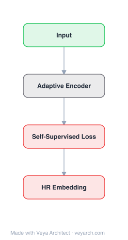

# Architecture: Sparse and Local Hypergraph Reasoning

## Motivation

The paper addresses **relational reasoning on large-scale hypergraphs** — predicting relationships between entities (e.g., whether Ari is a grandparent of Charlie) based on input facts, where the prediction requires jointly considering other entities not mentioned in the query (e.g., Charlie's parents). Hypergraph neural networks are a natural approach because hyperedges can connect more than two nodes, enabling inference of complex finitely-quantified logical relations beyond standard binary-edge GNNs.

However, existing hypergraph neural network approaches (e.g., Neural Logic Machines, NLM) maintain hyperedge representations for **all tuples of up to B entities**, requiring O(N^B) time and space complexity. This makes them intractable for large real-world domains — they can barely be applied to graphs with more than 100 nodes, while real-world knowledge graphs have more than 10K nodes.

SpaLoc (Sparse and Local Hypergraph Neural Network) fills this gap by exploiting two observations from traditional logic-based reasoning: relational inferences usually **apply locally** (involve only a small number of individuals) and relations are usually **sparse** (hold for only a small percentage of tuples). By exploiting sparsity and locality, SpaLoc enables hypergraph neural networks to scale to real-world knowledge graphs with 10K+ nodes.

## Core Idea

Sparse and local networks for efficient hypergraph reasoning with reduced computational cost.

## Architecture

### Overview

<b>Layer-by-layer (4 nodes)</b>

| # | Layer | Type | Params |
|---|---|---|---|
| 1 | Input | `input` |  |
| 2 | Adaptive Encoder | `custom` |  |
| 3 | Self-Supervised Loss | `loss` |  |
| 4 | HR Embedding | `output` |  |

SpaLoc is a sparse and local hypergraph neural network framework with three core components: (1) **Sparse hypergraph reasoning network** — uses a sparse tensor representation for hyperedge relationships, only keeping track of edges related to the prediction task rather than storing dense representations for all hyperedges; (2) **Sparsification through Hoyer regularization** — a training paradigm that regularizes graph sparsity to recover the underlying sparse relational structure, using sparsity as a soft constraint during training and explicit pruning during inference; (3) **Sub-domain training with information sufficiency-based adjustment** — focuses on a local induced subgraph during both training and inference, using a novel information sufficiency (IS) measure to quantify whether a sub-sampled graph contains sufficient information for prediction and to adjust training labels accordingly.

### Components

- **Sparse tensor-based hypergraph representation:** Instead of dense hyperedge tensors (all tuples of up to B entities), SpaLoc uses sparse tensors that encode only hyperedges relevant to the prediction task. This exploits the inherent sparsity of relational reasoning.
- **Sparsification loss (Hoyer regularization):** During training, a sparsity regularization term (based on the Hoyer sparsity measure) is added to the loss to encourage sparse hyperedge representations. This soft constraint pushes the model to discover the underlying sparse relational structure.
- **Inference-time pruning:** During inference, the sparsity measure is used to explicitly prune irrelevant hyperedges, accelerating prediction. This converts the soft sparsity constraint into a hard structural pruning.
- **Sub-graph sampling (information sufficiency):** During training and inference, SpaLoc focuses on a local induced subgraph of the input graph rather than considering all entities. The information sufficiency (IS) measure quantifies how much information a sub-sampled graph contains for predicting a specific hyperedge. If the sub-graph is insufficient, training labels are adjusted to account for the missing information.
- **Multi-arity hyperedge layers:** The network processes hyperedges of different arities (nullary, unary, binary, ternary) through expand-reduce operations, concatenating and permuting representations across arities.

### Data Flow

1. **Input:** A knowledge graph with entities and input relations (e.g., father, mother relations) and a query relation to predict (e.g., grandparent).
2. **Sub-graph sampling:** Sample a local induced subgraph around the query entities using the information sufficiency measure to ensure sufficient information.
3. **Sparse hyperedge construction:** Construct sparse hyperedge tensors for the sub-graph, encoding only relevant hyperedges (not all possible tuples).
4. **Hypergraph neural network processing:** Process the sparse hyperedges through multi-arity expand-reduce layers, updating hyperedge representations.
5. **Sparsification regularization:** During training, apply the Hoyer sparsity regularization to encourage sparse representations; adjust labels based on information sufficiency.
6. **Inference pruning:** During inference, prune irrelevant hyperedges based on the learned sparsity structure.
7. **Output:** Predictions for the query relation (e.g., whether entity pairs have the grandparent relationship).

### State / Memory

Stateless at inference (the model processes a sub-graph per query). The sparse hyperedge representations are constructed and updated within each forward pass. The learned sparsity structure (which hyperedges are relevant) is a persistent model property used for pruning. The sub-graph sampling is per-query, with the information sufficiency measure guiding which entities to include.

## Design Decisions

- **Sparse tensor representation (exploiting sparsity):** Relational reasoning is inherently sparse — only a small percentage of tuples hold for any relation. Using sparse tensors instead of dense representations reduces complexity from O(N^B) to the order of relevant hyperedges, enabling scalability to 10K+ node graphs.
- **Hoyer sparsity regularization:** Rather than assuming the sparsity structure is known, SpaLoc learns it through regularization, recovering the underlying sparse relational structure from data. The Hoyer measure provides a smooth, differentiable sparsity objective.
- **Local sub-graph sampling (exploiting locality):** Logical rules apply locally (e.g., grandparent involves only three people). Focusing on local sub-graphs avoids the need to consider all N entities simultaneously, dramatically reducing computation.
- **Information sufficiency-based label adjustment:** Sub-sampling may lose information needed for prediction. The IS measure quantifies this and adjusts training labels to account for insufficient sub-graphs, preventing the model from learning spurious patterns from incomplete information.
- **Inductive learning:** The learned rules generalize to completely novel domains with new entities, as long as the underlying relational inference patterns remain the same.

## Evolution

**Predecessors:**
- Neural Logic Machines (NLM, Dong et al., 2019) — dense hypergraph reasoning; O(N^B) complexity, limited to small graphs.
- Message passing neural networks (MPNNs, Gilmer et al., 2017) — binary-edge GNNs; cannot represent higher-order relations.
- Inductive logic programming (ILP, Muggleton, 1991) — logic-based rule learning; scalable but struggles with noisy/ambiguous inputs.
- Knowledge graph embedding methods (TransE, RotatE) — transductive, cannot learn lifted rules that generalize to unseen domains.

**Successors:**
- Scalable hypergraph neural networks incorporating sparse attention and adaptive sub-graph sampling.
- Neural-symbolic reasoning frameworks combining learned sparse structures with logical inference.
- Inductive hypergraph learning methods for cross-domain knowledge graph reasoning.

## Characteristics

| Property | Value |
|----------|-------|
| Year | 2025 |
| Authors | Xiao et al. |
| Category | GNN/Hypergraph |
| Source Paper | `Sparse_and_Local_Networks_for_Hypergraph_Reasoning_Xiao_Kaelbling_Wu_etal_2025.md` |
| PaperVault Path | `GNN/05-hypergraphs-topology/Sparse_and_Local_Networks_for_Hypergraph_Reasoning_Xiao_Kaelbling_Wu_etal_2025.md` |

## Limitations

- **Sub-graph sampling sensitivity:** The quality of predictions depends on the information sufficiency of sampled sub-graphs; insufficient sampling can lead to incorrect predictions, and the IS measure may not perfectly capture information relevance.
- **Sparsity assumption:** The approach assumes relations are sparse and rules apply locally; domains with dense relations or long-range dependencies may not benefit as much from sparsification.
- **Multi-arity complexity:** While sparse, processing multiple arities (binary, ternary, etc.) still adds architectural complexity; very high-arity relations remain expensive.
- **Knowledge graph-specific design:** The framework is designed for knowledge graph reasoning; adaptation to other hypergraph domains (e.g., social, biological) may require modifications.
- **Inductive generalization bounds:** While inductive, generalization to domains with fundamentally different relational patterns (not just new entities) is not guaranteed.

## Implementation Notes

See `implementation/` for a minimal runnable implementation.

## Information Layers

- **Evidence:** Source paper available in `references/papers/`
- **Analysis:** SpaLoc's contribution is making hypergraph neural networks practical for real-world-scale knowledge graphs by exploiting the sparsity and locality of relational reasoning. The theoretical motivation from logic-based reasoning (rules are local and sparse) provides a principled basis for the design. The information sufficiency measure is a novel contribution that addresses the real problem of information loss during sub-sampling. Being the first framework to apply hypergraph neural networks to 10K+ node graphs is a significant scalability milestone.
- **Hypothesis:** The sparsity and locality assumptions may not hold in all domains; domains with dense, long-range relational dependencies (e.g., molecular interaction networks) may require denser representations. The information sufficiency measure could be improved with learned (rather than heuristic) sufficiency estimators. The sub-graph sampling could be made adaptive, growing or shrinking based on prediction confidence during inference.
