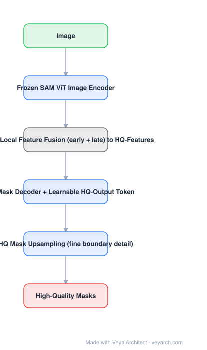

# Architecture: SAM-HQ (HQ-SAM)

## Motivation

SAM's masks are semantically right but geometrically soft: the ViT encoder runs at a fixed stride and the decoder's output is a 4×-upsampled low-resolution mask, so thin structures, hair-like details and precise boundaries are lost. Retraining SAM for quality would cost its zero-shot ability — so SAM-HQ freezes SAM entirely and adds a small, learnable high-quality path on top.

## Core Idea

Two additions to a **frozen** SAM: (1) **HQ-Features** — a global-local fusion of early (high-resolution, local) and final (global) ViT features, giving a feature map that carries detail *and* semantics; (2) an **HQ-Output Token** in the mask decoder, dedicated to producing the high-quality mask, followed by a small upsampling/refinement path.

## Architecture

### Overview

<b>Layer-by-layer (6 nodes)</b>

| # | Layer | Type | Params |
|---|---|---|---|
| 1 | Image | `input` |  |
| 2 | Frozen SAM ViT Image Encoder | `conv2d` |  |
| 3 | Global-Local Feature Fusion (early + late) to HQ-Features | `custom` |  |
| 4 | Mask Decoder + Learnable HQ-Output Token | `attention` |  |
| 5 | HQ Mask Upsampling (fine boundary detail) | `conv2d` |  |
| 6 | High-Quality Masks | `output` |  |

### Components

1. **Frozen SAM ViT image encoder** — untouched; provides both the final features and the early high-resolution features used by the fusion.
2. **Global-local feature fusion** — combines early-layer and last-layer features (with learnable fusion) into **HQ-Features**; the paper reports this simple fusion beats an FPN-style alternative.
3. **Frozen SAM prompt encoder** — points, boxes, masks; unchanged.
4. **Mask decoder + learnable HQ-Output Token** — a new token attends over HQ-Features and produces the HQ mask embedding, while the original output token keeps producing SAM's coarse mask.
5. **HQ mask upsampling** — a small convolutional path (early features + HQ mask embedding) that produces the final fine-grained mask.
6. **Training** — only the fusion, the HQ token and the upsampling path are trained, on a high-quality mask set.

### Data Flow

Image → frozen SAM encoder → (early features + final features) → global-local fusion → HQ-Features → decoder with HQ-Output Token → HQ mask embedding → upsampling with early features → accurate mask.

### State / Memory

No recurrent state. The one new persistent structure is the HQ-Features map — a fused multi-scale feature carried alongside SAM's normal embedding.

## Design Decisions

- **Freeze SAM** — preserves zero-shot prompting and avoids retraining a foundation model; the cost is a few million trainable parameters.
- **Fuse early and late features** — detail lives in early layers, semantics in late ones; quality needs both.
- **A separate output token** — keeps the original mask available and confines the quality behavior to a new branch.
- **Small upsampling path, not a new decoder** — the refinement is deliberately cheap.

## Evolution

- **SAM (2023)** (predecessor): correct but coarse masks.
- **SAM-HQ / HQ-SAM (2023)**: frozen SAM + HQ-Features + HQ-Output Token.
- **Siblings**: MobileSAM / EdgeSAM / EfficientSAM (speed), FastSAM (CNN), SAM 2 (video), SAM 3 (concepts).
- **Downstream**: matting, annotation tools, any task where the boundary is the output.
- **Later**: quality improvements folded into SAM 2/3 pipelines; HQ token idea reused by other mask refiners.

## Characteristics

| Property | Value |
|---|---|
| Task | high-quality promptable segmentation |
| Base model | SAM, frozen |
| New modules | global-local fusion, HQ-Output Token, HQ upsampling |
| Feature source | early high-resolution + final ViT features |
| Trainable parameters | small fraction of SAM |
| Zero-shot | retained |

## Limitations

- Adds parameters and latency over SAM (small, but non-zero) and needs HQ supervision data.
- The HQ mask is only as good as SAM's underlying embedding: if SAM's mask is semantically wrong, refinement will not fix it.
- Image-only; no video consistency (combining with SAM 2 is a separate effort).
- Thin structures beyond a few pixels remain hard even with early-feature fusion.

## Implementation Notes

Essentials: (1) freeze all SAM weights and expose early-layer features from the encoder, (2) build the global-local fusion to produce HQ-Features, (3) add one learnable HQ-Output Token to the decoder and route it to a dedicated mask embedding, (4) upsample using both the HQ embedding and early features, (5) train only the new modules with a high-quality mask dataset and verify that the original SAM mask output is unchanged — that is the guarantee the design promises.
