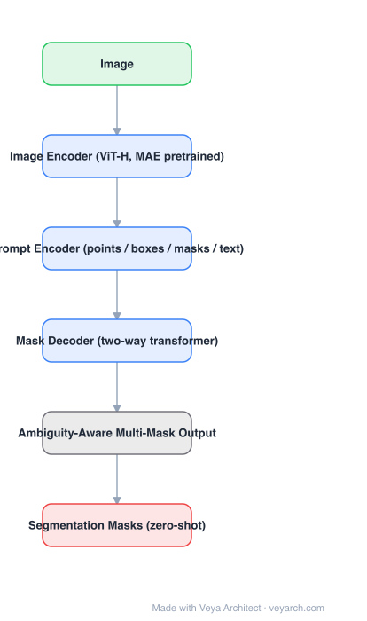

# Architecture: SAM (Segment Anything)

## Motivation

Segmentation models were task-specific: a model trained on a fixed category set cannot be reused for a new one, and each new task needs new annotations. SAM's premise is that a **promptable** model plus a **data engine** breaks this: train once on a huge, model-assisted annotation loop, then transfer zero-shot to new distributions by changing the prompt rather than the weights.

## Core Idea

Split the compute according to what needs to be recomputed. The **image embedding is expensive but prompt-independent** — compute it once per image. The **prompt encoder and mask decoder are cheap** — run them per prompt, so a user can click interactively. And because prompts are ambiguous, do not force a single answer: emit **multiple plausible masks** with confidence scores.

## Architecture

### Overview

<b>Layer-by-layer (6 nodes)</b>

| # | Layer | Type | Params |
|---|---|---|---|
| 1 | Image | `input` |  |
| 2 | Image Encoder (ViT-H, MAE pretrained) | `conv2d` |  |
| 3 | Prompt Encoder (points / boxes / masks / text) | `embed` |  |
| 4 | Mask Decoder (two-way transformer) | `attention` |  |
| 5 | Ambiguity-Aware Multi-Mask Output | `custom` |  |
| 6 | Segmentation Masks (zero-shot) | `output` |  |

### Components

1. **Image encoder (ViT-H, MAE-pretrained)** — runs once per image and produces a 64× downsampled embedding (e.g. 64×64 for 1024×1024 input). This is the whole compute cost for repeated prompting.
2. **Prompt encoder** — sparse prompts (points, boxes, text) become learned positional/type embeddings summed with the prompt's positional encoding; dense prompts (masks) are embedded by convolutions and added to the image embedding.
3. **Mask decoder (two-way transformer)** — a lightweight decoder with prompt→image and image→prompt cross-attention in alternating directions, plus a transposed-convolution upsampling path back to full resolution.
4. **Ambiguity-aware multi-mask output** — the decoder produces several masks plus per-mask IoU confidence; the "whole / part / subpart" ambiguity of a point prompt is resolved by choice, not by the model guessing.
5. **Data engine / SA-1B** — three annotation stages (assisted-manual, semi-automatic with predicted masks, fully automatic) producing **1B masks on 11M images**; the dataset is the reason zero-shot transfer works.
6. **Training** — focal and dice losses on mask prediction plus IoU-prediction loss, with random prompt simulation so the model sees realistic interactive prompts.

### Data Flow

Image → image encoder (once) → cached embedding; prompt → prompt encoder → mask decoder (per prompt, cross-attending the cached embedding) → multiple masks + IoU scores → chosen mask.

### State / Memory

The cached image embedding is the model's de-facto memory: it is what makes interactive use cheap and what SAM 2 later extends into a memory bank for video.

## Design Decisions

- **Amortize the encoder** — one heavy pass per image, many cheap passes per prompt.
- **Multi-mask output for ambiguity** — a point prompt genuinely has several valid answers; predicting one collapses them.
- **Promptable pretraining task** — the training objective *is* "given a prompt, produce a valid mask", which aligns training with zero-shot use.
- **Data engine over human annotation volume** — model-assisted annotation scales; the dataset is a designed artifact, not a crawl.

## Evolution

- **Interactive segmentation / instance segmentation** (predecessors): task- and category-bound.
- **SAM**: promptable, ambiguity-aware, SA-1B; the segmentation foundation model.
- **SAM 2**: extends to video with a streaming memory bank (same encoder/decoder split, plus memory attention).
- **Efficiency variants**: EfficientSAM, FastSAM (CNN+YOLO-based, ~50× faster), MobileSAM (distilled tiny encoder), EdgeSAM, SAM-HQ (mask quality).
- **Downstream**: Grounded SAM (Grounding DINO boxes → SAM masks), medical/remote-sensing adaptations, video object segmentation pipelines.

## Characteristics

| Property | Value |
|---|---|
| Task | promptable / zero-shot segmentation |
| Image encoder | ViT-H (MAE pretrained), 1024×1024 input |
| Prompt encoder | points / boxes / masks / text |
| Decoder | two-way transformer + transposed-conv upsampler |
| Output | multiple masks + predicted IoU |
| Training data | SA-1B: 1B masks, 11M images |

## Limitations

- The image encoder dominates latency; interactive speed depends on caching and on distilled variants.
- Zero-shot quality drops on thin structures, heavy occlusion, and domain-shifted imagery (medical, satellite) without adaptation.
- No semantic labels — SAM outputs *a* mask, not a class; text prompts are a later addition with weaker grounding than dedicated open-set detectors.
- Not video-native: applying SAM per frame flickers; SAM 2 addresses this.

## Implementation Notes

Essentials: (1) compute and cache the image embedding once, (2) keep the prompt encoder/decoder tiny so prompts are cheap, (3) always emit multiple masks with an IoU head, (4) simulate realistic prompts during training (random points/boxes/mask-iteration) or interactive quality collapses. For real-time use, replace the ViT-H encoder with a distilled one and precompute embeddings offline where possible.
