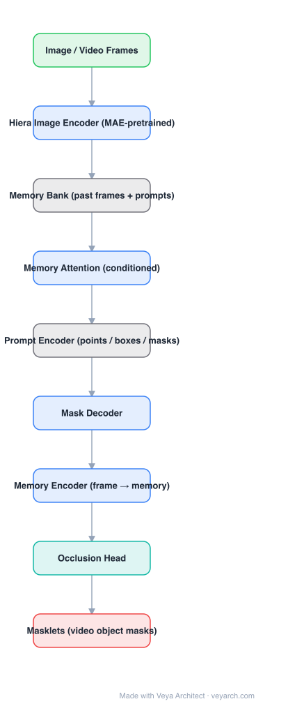

# Architecture: SAM 2

## Motivation

SAM solved promptable segmentation for *images*: click a point, get a mask. Video needs more — the same object must be tracked consistently across frames, re-identified after occlusion, and handled under motion and appearance change, while still accepting interactive prompts at any frame. SAM 2 turns image segmentation into video segmentation by adding a memory mechanism and by treating the image case as the single-frame special case of one unified model.

## Core Idea

Condition the current frame on *past* frames and *past prompts*. Every accepted prediction is written into a lightweight **memory bank**; the mask decoder for the current frame attends to that memory, so a single click propagates into a consistent **masklet**. An **occlusion head** tells the model when the object is not visible, and **object pointer** tokens let the model re-identify the object when it reappears.

## Architecture

### Overview

<b>Layer-by-layer (9 nodes)</b>

| # | Layer | Type | Params |
|---|---|---|---|
| 1 | Image / Video Frames | `input` |  |
| 2 | Hiera Image Encoder (MAE-pretrained) | `conv2d` |  |
| 3 | Memory Bank (past frames + prompts) | `custom` |  |
| 4 | Memory Attention (conditioned) | `attention` |  |
| 5 | Prompt Encoder (points / boxes / masks) | `custom` |  |
| 6 | Mask Decoder | `attention` |  |
| 7 | Memory Encoder (frame → memory) | `conv2d` |  |
| 8 | Occlusion Head | `linear` |  |
| 9 | Masklets (video object masks) | `output` |  |

### Components

1. **Image encoder (Hiera)** — a hierarchical vision transformer pretrained with MAE, run once per frame (streaming, left-to-right). It produces multi-scale frame features; it is the dominant compute cost and the main knob for on-device deployment.
2. **Memory attention** — a stack of transformer blocks that condition current frame features on the memory bank. Each block does self-attention on frame features, cross-attention to memories (with RoPE on spatial positions), and an MLP.
3. **Memory encoder** — convolves the predicted mask and the frame embedding to produce a compact memory feature that is appended to the bank; it compresses a mask-conditioned frame into a few tokens.
4. **Memory bank** — retains features of recent frames and of all prompted/corrected frames, including object pointers. Size is a direct accuracy/latency/memory trade-off.
5. **Prompt encoder** — encodes sparse prompts (points, boxes) and dense prompts (masks) into tokens, in the same style as SAM.
6. **Mask decoder** — a lightweight two-way transformer that takes image embeddings plus prompt/memory tokens and produces mask logits, plus an IoU/occlusion prediction.
7. **Occlusion head** — predicts whether the queried object is visible in the current frame; drives whether the masklet continues.

### Data Flow

Frame t: image encoder → frame features → memory attention (cross-attend memory bank) → mask decoder (with prompt tokens) → mask + occlusion score → memory encoder writes a new memory → masklet updated. Prompts may arrive at any frame; a prompt on frame t conditions all later frames through the bank.

### State / Memory

Explicit external memory: the memory bank is the model's state across time. This is the architectural difference from per-frame detectors and trackers and is what makes streaming video segmentation possible without a separate tracker.

## Design Decisions

- **Streaming, causal inference** — the model consumes frames in order; no future frames are required (offline bidirectional variants exist but are not the base design).
- **Unified image/video model** — no separate image and video heads; the image case is one frame with an empty bank.
- **Memory compression** — memories are compact tokens rather than full feature maps, keeping the bank affordable.
- **Interactive correction** — additional clicks on any frame append new prompted memories, so refinement is additive rather than a re-run.

## Evolution

- **SAM** (predecessor): promptable image segmentation; image encoder + prompt encoder + lightweight mask decoder.
- **SAM 2**: adds memory encoder/attention/bank and the occlusion head; trained on the SA-V video dataset built with a data engine.
- **SAM 2.1**: improved training recipe and smaller/tinier checkpoints aimed at real-time use.
- **Related lines**: XMem / STCN-style memory networks (memory for VOS), and Hiera as the hierarchical MAE encoder replacing plain ViT.

## Characteristics

| Property | Value |
|---|---|
| Task | promptable image + video segmentation (PVS) |
| Encoder | Hiera (hierarchical ViT, MAE-pretrained) |
| Temporal mechanism | memory bank + memory attention + object pointers |
| Prompts | points, boxes, masks; multi-click refinement |
| Training data | SA-V (≈50.9K videos, ≈642.6K masklets) |
| Output | masklets (per-frame object masks) |

## Limitations

- Long-term occlusion, fast motion, heavy camera motion, and visually similar instances still confuse the model.
- Accuracy degrades as the memory bank is pruned for latency; the full-quality setting is not real-time on edge hardware.
- Streams left-to-right: offline/global refinement over the whole clip is different in quality from the causal setting.
- Very small or thin objects, and transparent/reflective surfaces, remain hard.

## Implementation Notes

A minimal implementation should reproduce the memory loop rather than the full stack: (1) per-frame hierarchical encoder features, (2) a memory bank of prompt-conditioned frame tokens, (3) cross-attention conditioning of the current frame on that bank, (4) a lightweight prompt-driven mask decoder, (5) an occlusion score that gates memory writes. Keep the bank small and fixed-size to make latency predictable.
