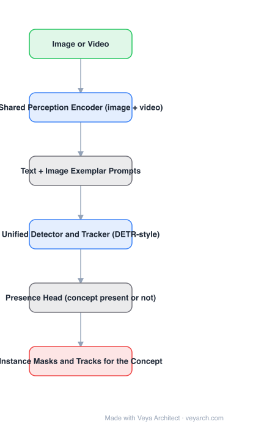

# Architecture: SAM 3

## Motivation

SAM answers "segment this thing" but only for what you point at, and it has no notion of a *category*. Practical use — "find every helmet in this video", "track the dog" — needs a model that takes a **concept** as its prompt and returns **all instances**, across images and video. That requires three things SAM lacks: language/exemplar conditioning, exhaustive instance detection (not one mask per prompt), and presence/absence reasoning.

## Core Idea

Extend promptable segmentation to **promptable concept segmentation (PCS)**: the prompt is a noun phrase and/or an image exemplar, the output is the set of masks for every matching instance, and a **presence head** decides whether the concept appears at all. Keep SAM's visual (point/box/mask) prompts as a sub-case, and run images and video through a **shared encoder** with a **single detector-tracker** so one model handles both.

## Architecture

### Overview

<b>Layer-by-layer (6 nodes)</b>

| # | Layer | Type | Params |
|---|---|---|---|
| 1 | Image or Video | `input` |  |
| 2 | Shared Perception Encoder (image + video) | `conv2d` |  |
| 3 | Text + Image Exemplar Prompts | `custom` |  |
| 4 | Unified Detector and Tracker (DETR-style) | `attention` |  |
| 5 | Presence Head (concept present or not) | `custom` |  |
| 6 | Instance Masks and Tracks for the Concept | `output` |  |

### Components

1. **Shared perception encoder** — one image/video encoder producing tokens for both modalities; sharing it is what keeps the image-only capability intact while adding video.
2. **Prompt conditioning** — text prompts via a text encoder, visual prompts via a dedicated **exemplar encoder**; text and exemplar can be used together (T+I), which is the setting reported to work best.
3. **Unified detector and tracker** — a DETR-style decoder whose object queries produce detections in a frame and are propagated as tracks across frames; detection and association live in one module instead of a detect-then-link pipeline.
4. **Presence head** — scores whether the prompted concept is present in the image/video; this is what makes "find all instances" well-defined (it can answer zero).
5. **Mask output heads** — per-instance masks in images, masklets in video.
6. **SA-Co benchmark** — a concept-segmentation evaluation suite; exhaustive-instance scoring is a different game from SAM's single-mask metrics.
7. **Training** — joint image + video objectives, retaining visual-prompt segmentation while adding concept supervision.

### Data Flow

Image/video → shared encoder → concept conditioning (text and/or exemplar) → detector-tracker queries → presence score + instance masks → tracks across frames.

### State / Memory

Track queries carried across frames are the temporal state (the tracker part); the shared encoder keeps a single set of weights rather than separate image and video models.

## Design Decisions

- **Concept prompts, not just geometry** — text/exemplar conditioning is what turns segmentation into retrieval.
- **Presence head** — an explicit "is it there" decision; without it, open-vocabulary prompts produce spurious masks for absent concepts.
- **One encoder for image and video** — avoids the usual split where a video model loses image-only quality.
- **Unified detector-tracker** — tracking is learned jointly with detection instead of being a post-hoc association stage.
- **Keep visual prompts** — preserves compatibility with SAM/SAM 2 usage.

## Evolution

- **SAM** (predecessor): promptable visual segmentation, one mask per prompt, no categories.
- **SAM 2**: video masklets via a streaming memory bank; still prompt-per-object, not per-concept.
- **SAM 3**: promptable concept segmentation, presence head, unified image/video detector-tracker, SA-Co benchmark.
- **Siblings**: Grounding DINO / OWL-ViT (open-vocabulary *detection*), EfficientSAM (efficiency), SAM-HQ (mask quality).
- **Downstream**: concept tracking, open-vocabulary video segmentation, "Grounded SAM 3" style pipelines.

## Characteristics

| Property | Value |
|---|---|
| Task | promptable concept segmentation (images and video) |
| Prompts | text (noun phrase), image exemplars, or both; visual prompts retained |
| Encoder | shared image/video perception encoder |
| Detector | unified detector-tracker (DETR-style queries) |
| Special head | presence scoring (concept present / absent) |
| Output | masks for all instances + tracks |
| Benchmark | SA-Co |

## Limitations

- Open-vocabulary concept segmentation is far from solved: rare, fine-grained, and compositional concepts are weak.
- Instance-exhaustive output is sensitive to the presence head's threshold; false positives appear for concepts that are visually similar.
- Video tracking under long occlusions and re-identification remains hard.
- Model size and cost are above the efficient SAM variants (MobileSAM, FastSAM) — not an edge solution.

## Implementation Notes

Essentials: (1) shared image/video encoder, (2) separate text and exemplar encoders with a fusion that supports T, I, and T+I prompts, (3) a DETR-style decoder whose queries double as track identities, (4) an explicit presence head trained with positives *and* negatives for absent concepts, (5) keep visual-prompt supervision so point/box behaviour does not regress. Evaluate with exhaustive-instance metrics (SA-Co style), not single-mask IoU.
