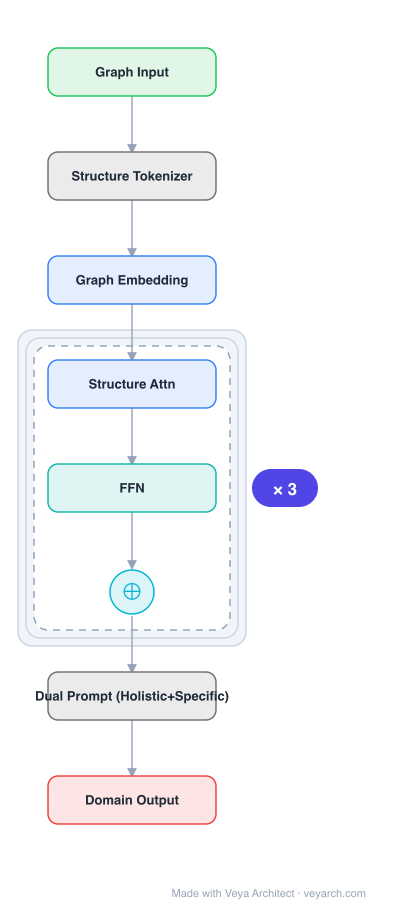

# Architecture: SAMGPT

## Motivation

Graphs model interconnected entities in many online services, raising the question: how can we train a graph foundational model on multiple source domains and adapt to an unseen target domain? A major obstacle is that graphs from different domains exhibit divergent characteristics. Existing approaches either rely on textual descriptions (limiting applicability to text-attributed graphs) or align feature distributions (neglecting structural differences). SAMGPT addresses this by proposing a structure alignment framework for text-free multi-domain graph pre-training and cross-domain adaptation.

## Core Idea

A text-free graph foundation model that learns multi-domain knowledge from graphs originating in multiple source domains and adapts to unseen target domains. SAMGPT introduces structure tokens to harmonize structure-based aggregation across source domains during pre-training, and designs dual prompts (holistic + specific) for cross-domain adaptation to a target domain.

## Architecture

### Overview

<b>Layer-by-layer (8 nodes)</b>

| # | Layer | Type | Params |
|---|---|---|---|
| 1 | Graph Input | `input` |  |
| 2 | Structure Tokenizer | `custom` |  |
| 3 | Graph Embedding | `embed` |  |
| 4 | Structure Attn | `attention` |  |
| 5 | FFN | `ffn` |  |
| 6 | ⊕ | `residual` |  |
| 7 | Dual Prompt (Holistic+Specific) | `custom` |  |
| 8 | Domain Output | `output` |  |

SAMGPT has two phases: multi-domain pre-training and cross-domain adaptation. During pre-training, structure tokens harmonize structure-based aggregation across different source domains. During cross-domain adaptation, dual prompts (holistic prompts for unified multi-domain knowledge, specific prompts for fine-grained domain-specific information) adapt the model to a target domain. The framework is entirely text-free, operating on graph structure and node features.

### Components

1. **Structure Tokens** — Domain harmonization:
   - Introduced to harmonize structure-based aggregation across source domains
   - Learnable tokens that capture structural patterns
   - Enable the model to handle diverse graph structures from different domains
   - Used during pre-training phase

2. **Graph Neural Network Backbone** — Structure-based aggregation:
   - Message passing on graphs
   - Structure tokens integrated into aggregation
   - Learns multi-domain structural knowledge
   - Text-free (no language model dependency)

3. **Holistic Prompts** — Unified multi-domain knowledge:
   - Capture unified structural knowledge from all source domains
   - Used for cross-domain adaptation
   - Provide broad structural priors for the target domain
   - Domain-agnostic structural information

4. **Specific Prompts** — Domain-specific information:
   - Capture fine-grained, domain-specific structural information
   - Used for cross-domain adaptation
   - Provide domain-specific structural details
   - Complement holistic prompts

5. **Dual Prompt Mechanism** — Cross-domain adaptation:
   - Holistic + specific prompts work together
   - Holistic: broad multi-domain knowledge
   - Specific: fine-grained domain-specific information
   - Enables adaptation to unseen target domains

### Data Flow

**Pre-training phase:**
1. **Input**: Graphs from multiple source domains (text-free)
2. **Structure token integration**: Add structure tokens to harmonize aggregation
3. **Multi-domain pre-training**: Learn structural knowledge across domains
4. **Output**: Pre-trained model with multi-domain structural knowledge

**Cross-domain adaptation:**
1. **Input**: Unseen target domain graph
2. **Holistic prompt**: Apply unified multi-domain structural knowledge
3. **Specific prompt**: Apply fine-grained domain-specific information
4. **Adaptation**: Combine dual prompts with target graph features
5. **Output**: Adapted representations for target domain tasks

### State / Memory

- **No explicit memory mechanism**: SAMGPT is a feedforward GNN architecture.
- **Structure tokens**: Learnable tokens that persist across domains (model parameters).
- **Dual prompts**: Learnable prompt parameters for cross-domain adaptation.
- **Pre-trained backbone**: The multi-domain pre-trained model serves as the foundation.

## Design Decisions

1. **Text-free approach** — No language model dependency:
   - Existing approaches use LLMs to align domains via text descriptions
   - Limits applicability to text-attributed graphs
   - SAMGPT operates purely on graph structure and features
   - Applicable to any graph, regardless of text availability

2. **Structure tokens** — Harmonizing structural diversity:
   - Graphs from different domains have different structural characteristics
   - Structure tokens provide a common "language" for structure
   - Enable the model to handle diverse structures during pre-training
   - Learn domain-agnostic structural patterns

3. **Dual prompts** — Holistic + specific:
   - Holistic prompts: capture what's common across domains
   - Specific prompts: capture what's unique to each domain
   - Together they provide both general and specific structural knowledge
   - Enables effective adaptation to unseen domains

4. **Structure alignment (not feature alignment)** — Aligning structures:
   - Previous work aligns feature distributions across domains
   - SAMGPT aligns structural patterns via structure tokens
   - Addresses structural differences, not just feature differences
   - More fundamental for graph data

## Evolution

**Predecessors:**
- **Graph Neural Networks** (GCN, GAT, GraphSAGE) — Single-domain graph learning.
- **Graph pre-training** (GraphCL, DGI) — Self-supervised graph pre-training.
- **Graph prompt learning** (GraphPrompt, GPPT) — Prompting for graph tasks.
- **Text-attributed graph models** — Using LLMs for graph alignment.

**Successors:**
- **Graph foundation models** — General-purpose graph models.
- **Cross-domain graph transfer** — Further development of domain adaptation.
- **Multi-modal graph models** — Combining structure and text features.

## Characteristics

| Property | Value |
|----------|-------|
| Year | 2025 |
| Authors | Yu, Gong, Zhou, Fang, Zhang (SMU, USTC) |
| Category | DL/GNN |
| Source Paper | `SAMGPT_Text_free_Graph_Foundation_Model_for_Multi_domain_Pre_Singapore_Singapore_2025.md` |
| PaperVault Path | `GNN/07-graph-foundation-models/SAMGPT_Text_free_Graph_Foundation_Model_for_Multi_domain_Pre_Singapore_Singapore_2025.md` |

## Limitations

1. **Domain gap** — Large structural differences between source and target domains may limit adaptation.
2. **Prompt design** — The effectiveness of dual prompts depends on the quality of pre-training domains.
3. **Scalability** — Multi-domain pre-training can be computationally expensive.
4. **Structure-only** — Ignoring text features may limit performance on text-rich graphs.
5. **Limited domains** — Pre-training on a fixed set of source domains; truly universal graph foundation models need more domains.
6. **Evaluation** — Cross-domain adaptation is hard to evaluate; results may be domain-pair-dependent.

## Implementation Notes

See `implementation/` for a minimal runnable implementation. Key details:
- Text-free: operates on graph structure and node features (no LLM)
- Structure tokens: harmonize structure-based aggregation across source domains
- Dual prompts: holistic (unified multi-domain) + specific (domain-specific)
- Pre-training: multiple source domains (Cora, Citeseer, Pubmed, Photo, Computers, Facebook)
- Cross-domain adaptation: unseen target domain
- Tasks: one-shot graph classification, node classification
- Baselines: GCN, GAT, DGI, GraphCL, GraphPrompt, GPF, GCOPE
- SAMGPT outperforms all baselines on most target domains
- Code: available on GitHub
- Framework: structure alignment for text-free multi-domain graph pre-training

## Information Layers

- **Evidence:** Source paper available in `references/papers/` (Yu et al., 2025, "SAMGPT: Text-free Graph Foundation Model for Multi-domain Pre-training and Cross-domain Adaptation")
- **Analysis:** SAMGPT's key insight is that text-free graphs need structure alignment (not just feature alignment) for cross-domain transfer. The structure tokens provide a novel mechanism for harmonizing diverse structural patterns — they act as a "structural vocabulary" that can describe patterns from any domain. The dual prompt design is elegant: holistic prompts capture transferable structural knowledge, while specific prompts capture domain-unique patterns. The text-free approach is crucial for general applicability — many real-world graphs (molecular, biological, infrastructure) don't have text attributes. The strong performance against text-based baselines suggests that structural information alone can be sufficient for cross-domain transfer.
- **Hypothesis:** Structure tokens may become a standard component of graph foundation models, analogous to positional encodings in transformers. The dual prompt framework may generalize to other foundation model settings (vision, language) where both general and domain-specific knowledge are needed. The text-free approach may be particularly valuable for scientific and engineering graphs where text descriptions are unavailable. The structure alignment paradigm may reveal that structural patterns are more transferable across domains than feature distributions.
