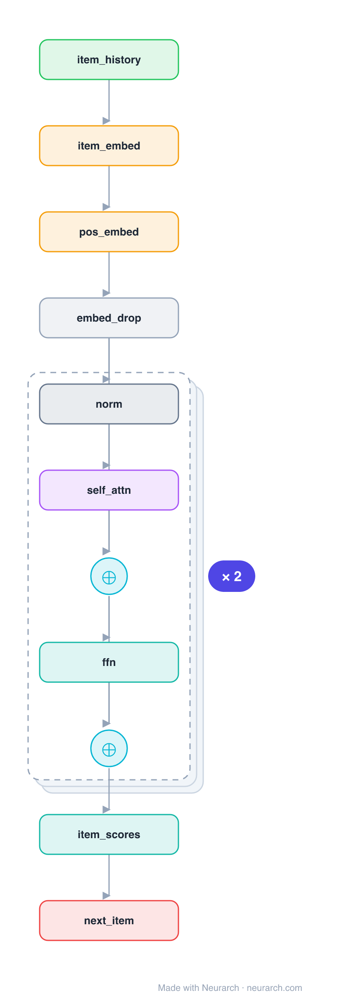

# Architecture: SASRec

## Motivation

Self-Attentive Sequential Recommendation: a causal Transformer over the user's item history that predicts the next item, GPT for recommendation. One of the most-cited and most-reimplemented sequential-recsys baselines.

## Core Idea

Self-Attentive Sequential Recommendation: a causal Transformer over the user's item history that predicts the next item, GPT for recommendation.

## Architecture

### Overview

*Identical repeated blocks are folded into one representative block with a `× N` badge, so the whole architecture fits on screen. `model.json` keeps all 16 nodes (open it in Neurarch to see and edit every layer). Vector: [diagram.svg](assets/diagram.svg).*

| Hyperparameter | Value |
|---|---|
| Type | Sequential recommendation |
| Embedding | Item + learned positional |
| Backbone | Causal (left-to-right) self-attention blocks |
| Objective | Next-item prediction |
| Key idea | Self-attention over history, GPT-style |

`model.json` is the full graph, hand-built against the official config.json.

### Design Notes

- Causal self-attention means position t attends only to items up to t, exactly like a language-model decoder.
- Adaptively weights which past items matter for the next click, instead of the fixed recency bias of an RNN.
- Pairs with [bert4rec](../bert4rec/): same item-sequence setup, causal (SASRec) vs bidirectional masked (BERT4Rec).

### Parameter Check

Neurarch's per-layer parameter estimate over this graph: **6.5M**.

## Design Decisions

> **Analysis** — Observations derived from studying the architecture.

- Causal self-attention means position t attends only to items up to t, exactly like a language-model decoder.
- Adaptively weights which past items matter for the next click, instead of the fixed recency bias of an RNN.
- Pairs with [bert4rec](../bert4rec/): same item-sequence setup, causal (SASRec) vs bidirectional masked (BERT4Rec).

## Implementation Notes

- `model.json` contains the full structural graph with real dimensions and parameters.
- Open in [Neurarch](https://www.neurarch.com/) to visualize, edit, or export training code.
- Diagrams fold repeated identical blocks with a `× N` badge; `model.json` holds all nodes at real dimensions.

## Limitations

- This package focuses on the architectural structure. Training pipelines, 
dataset preparation, and production optimizations are out of scope.

## Evolution

> See `references/related/` for predecessor and successor architectures.

