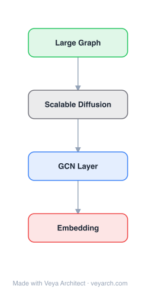

# Architecture: SDGE (Deep Gaussian Embedding)

## Motivation

Network embedding methods that learn low-dimensional node representations underpin many graph analysis tasks such as link prediction, node classification, community detection, and visualization. Prior approaches (DeepWalk, node2vec, LINE, SDNE, GraRep) all represent each node as a single point vector in a continuous space. This point representation has a crucial limitation: it provides no information about the uncertainty of the embedding. Yet uncertainty is inherent when summarizing a complex node by a single point — for example, a node whose different information sources conflict (pointing to different communities, or revealing contradicting patterns) should reflect that discrepancy as higher uncertainty in its representation.

Existing methods are also overwhelmingly transductive: they cannot generate embeddings for previously unseen nodes without retraining, because they learn one parameter per node. Additionally, many methods only exploit network structure and ignore node attributes that could complement a sparse graph, and most capture only first- or second-order proximity rather than the broader multi-hop ordering imposed by the network.

Graph2Gauss (G2G) was proposed to address all three gaps: (1) it embeds each node as a Gaussian distribution to capture uncertainty; (2 it is inductive — it learns an encoder from attributes to embeddings so unseen nodes can be embedded without retraining; (3) it leverages a personalized ranking loss that exploits the natural ordering of nodes at multiple hops, going beyond first/second-order proximity.

## Core Idea

Graph embedding using deep Gaussian process for unsupervised inductive learning.

## Architecture

### Overview

<b>Layer-by-layer (4 nodes)</b>

| # | Layer | Type | Params |
|---|---|---|---|
| 1 | Large Graph | `input` |  |
| 2 | Scalable Diffusion | `custom` |  |
| 3 | GCN Layer | `gcn_conv` |  |
| 4 | Embedding | `output` |  |

Graph2Gauss (G2G) embeds each node as a multivariate Gaussian distribution N(μᵢ, Σᵢ) in a low-dimensional space, rather than as a point. The method has two stages: (i) a deep neural network encoder maps each node's attribute vector xᵢ to the parameters (mean μᵢ and diagonal covariance Σᵢ) of its Gaussian embedding; (ii) an unsupervised personalized ranking loss exploits the natural ordering of nodes imposed by network structure — nodes in the immediate neighborhood should be closest in embedding space, nodes two hops away should be farther, and so on, with dissimilarity measured between Gaussian distributions.

The method is applicable to plain or attributed, directed or undirected graphs. When attributes are available, the learned encoder generalizes inductively to unseen nodes (generate μ/Σ directly from their attributes). The ranking loss uses the KL-divergence-based expected likelihood / ranking measure between Gaussians, and the natural ordering is derived from the shortest-path hop distance between nodes.

### Components

1. **Deep Encoder (Attribute → Gaussian parameters)**:
   - A multi-layer perceptron (deep neural network) that takes the D-dimensional attribute vector xᵢ as input
   - Outputs the mean μᵢ ∈ R^L and (diagonal) covariance Σᵢ ∈ R^{L×L} of the node's Gaussian embedding
   - Two output heads: one for the mean, one for the (log-)variance to ensure positivity
   - Enables inductive learning: embeddings for unseen nodes are produced by a single forward pass

2. **Gaussian Embedding (per node)**:
   - Each node i is represented as hᵢ = N(μᵢ, Σᵢ) with L ≪ N, D
   - The mean encodes the node's position; the variance encodes uncertainty
   - Diagonal covariance for tractability; captures how confidently the node is placed

3. **Personalized Ranking Loss**:
   - From each node's perspective, a personalized ranking over all other nodes
   - Nodes at hop distance k should be ranked as more distant than nodes at hop distance k−1
   - Implemented via a ranking objective (BPR-style / pairwise) on the dissimilarity between Gaussian embeddings
   - Dissimilarity measured via the expected likelihood / KL-derived ranking measure between distributions
   - Exploits the natural ordering imposed by network structure at multiple scales (not just 1st/2nd-order proximity)

4. **Hop-distance Ordering (structure signal)**:
   - For each node, other nodes are grouped by their shortest-path hop distance (0-hop = self, 1-hop = neighbors, 2-hop, …, P-hop)
   - The ranking loss enforces: closer hops → smaller embedding dissimilarity
   - Captures multi-scale structure beyond immediate neighbors

5. **Sampling Strategy**:
   - To avoid O(N²) all-pairs computation, samples pairs/triples of nodes from different hop-distance buckets
   - Scales to large graphs via negative sampling over the ranking objective

### Data Flow

1. **Input**: Attributed graph G = (A, X) — adjacency matrix A ∈ R^{N×N} and attribute matrix X ∈ R^{N×D}
2. **Encoder forward pass**: For each node i, xᵢ → deep MLP → (μᵢ, Σᵢ) parameters of N(μᵢ, Σᵢ)
3. **Hop-distance computation**: Precompute (or approximate) shortest-path hop distances from each node to derive ranking supervision
4. **Pair/triple sampling**: Sample nodes from different hop-distance buckets relative to an anchor node
5. **Dissimilarity computation**: Compute pairwise dissimilarity between the sampled nodes' Gaussian embeddings (expected-likelihood / KL-based measure)
6. **Ranking loss**: Enforce that nodes at smaller hop distance have smaller embedding dissimilarity than nodes at larger hop distance (personalized ranking objective)
7. **Backprop**: Update encoder weights via gradient descent
8. **Inference (inductive)**: For a new unseen node, run its attributes through the trained encoder → obtain its Gaussian embedding directly

### State / Memory

- **No recurrent state**: The encoder is a feedforward deep network; there is no temporal or recurrent memory across nodes.
- **Persistent parameters**: The weights of the deep encoder (MLP) are the learned, persistent parameters. Once trained, they define the mapping from any attribute vector to a Gaussian embedding.
- **Per-node embeddings are derived, not stored**: Unlike transductive methods that store one embedding vector per node, G2G's embeddings are computed on-the-fly from the encoder. For training, the current (μᵢ, Σᵢ) for all nodes are transient (recomputed each forward pass).
- **Hop-distance structure**: The shortest-path / hop-distance ordering is precomputed from the graph and serves as the (fixed) supervision signal — it is structure memory, not learned state.

## Design Decisions

1. **Gaussian distributions over point vectors** — Captures uncertainty:
   - A node whose information sources conflict (multiple communities, contradicting patterns) gets a high-variance embedding
   - Uncertainty analysis reveals neighborhood diversity and the intrinsic latent dimensionality of the graph
   - Builds on the Gaussian word embedding idea (Vilnis & McCallum, 2014) but adapts it to unsupervised graph embedding with attributes

2. **Inductive encoder (attributes → embeddings)** — Generalizes to unseen nodes:
   - Learning an encoder rather than one parameter per node means new nodes are embedded via a forward pass
   - Significant advantage over transductive methods (DeepWalk, node2vec, LINE, SDNE) that require retraining
   - Requires node attributes; for plain graphs, identity/one-hot attributes reduce to a transductive-like setting

3. **Personalized ranking loss with hop-distance ordering** — Exploits multi-scale structure:
   - From each node's perspective, enforces a full ranking of other nodes by hop distance
   - Goes beyond first- and second-order proximity used by LINE/SDNE
   - The natural ordering imposed by network structure is a richer supervisory signal than pairwise edges alone

4. **Diagonal covariance** — Tractability:
   - Full covariance would require O(L²) parameters per node and more expensive dissimilarity computation
   - Diagonal covariance keeps the embedding compact and the ranking loss computationally feasible at scale

5. **Expected-likelihood / KL-based dissimilarity** — Principled distribution distance:
   - Provides a closed-form dissimilarity between two Gaussians suitable for the ranking objective
   - Enables pairwise/triple-based sampling for scalability

6. **Applicability to plain/attributed, directed/undirected graphs** — Generality:
   - The encoder + ranking formulation does not assume a specific graph type
   - For plain graphs, attributes can be derived (e.g., identity features) so the method still applies

## Evolution

**Predecessors:**
- **DeepWalk** (Perozzi et al., 2014) & **node2vec** (Grover & Leskovec, 2016) — Random-walk + Skip-Gram based point embeddings; transductive; plain graphs.
- **LINE** (Tang et al., 2015) — First- and second-order proximity; point embeddings; transductive.
- **SDNE** (Wang et al., 2016) — Deep autoencoder preserving first/second-order proximity; point embeddings.
- **GraRep** (Cao et al., 2015) — Factorization-based with local + global structure.
- **TADW** (Yang et al., 2015) — Text-associated DeepWalk via matrix factorization; incorporates attributes but transductive.
- **GraphSAGE** (Hamilton et al., 2017) — Inductive embedding via neighborhood aggregation, but supervised and requires edges of new nodes.
- **Gaussian word embeddings** (Vilnis & McCallum, 2014) — Introduced distributional embeddings for words; inspiration for uncertainty modeling.
- **Graph Autoencoder (GAE)** (Kipf & Welling, 2016) — Unsupervised graph embedding via variational autoencoder.

**Successors:**
- **DVNE** (Zhu et al., 2018) — Deep variational network embedding in Wasserstein space; extends Gaussian embedding with 2-Wasserstein distance to preserve transitivity.
- **Graph Convolutional Networks** (Kipf & Welling; Defferrard et al.) — Spectral/aggregate approaches that can be seen as learning implicit embeddings.
- **Uncertainty-aware graph representation learning** — Subsequent work on probabilistic/heteroscedastic graph embeddings builds on the Gaussian-embedding paradigm.

## Characteristics

| Property | Value |
|----------|-------|
| Year | 2017 |
| Authors | Aleksandar Bojchevski, Stephan Günnemann (Technical University of Munich) |
| Category | GNN/Embedding |
| Source Paper | `Deep_Gaussian_Embedding_of_Graphs_Unsupervised_Inductive_Lea_Ranking_2017.md` |
| PaperVault Path | `GNN/02-network-embedding/Deep_Gaussian_Embedding_of_Graphs_Unsupervised_Inductive_Lea_Ranking_2017.md` |

## Limitations

1. **Requires node attributes for inductiveness** — The inductive property depends on having meaningful node attributes. For plain graphs (attributes unavailable), the encoder degenerates and the method loses its inductive advantage.
2. **Diagonal covariance restricts uncertainty modeling** — Only axis-aligned variance is captured; correlations between embedding dimensions are not represented, which can understate uncertainty for some nodes.
3. **Hop-distance computation cost** — Deriving the full shortest-path ordering for all nodes is expensive on very large graphs; the method relies on sampling/approximation to mitigate this, but the supervision signal is still derived from global structure.
4. **KL-based dissimilarity does not preserve transitivity** — The expected-likelihood/KL measure is not a true metric (asymmetric, no triangle inequality), so transitivity of proximity in the network is not guaranteed in the embedding space. DVNE later addresses this with the 2-Wasserstein distance.
5. **Scalability of all-pairs ranking** — Although sampling reduces cost, the ranking formulation is more complex than simple negative-sampling point methods, incurring overhead.
6. **No explicit edge formation model** — The method embeds nodes and measures dissimilarity, but does not directly model edge formation probability as some generative approaches do.

## Implementation Notes

See `implementation/` for a minimal runnable implementation. Key details:
- Each node embedded as a Gaussian N(μᵢ, Σᵢ) with diagonal covariance
- Deep MLP encoder maps attribute vector xᵢ → (μᵢ, log σ²ᵢ)
- Personalized ranking loss: nodes at hop k should be more distant (in Gaussian dissimilarity) than nodes at hop k−1
- Dissimilarity: expected-likelihood / KL-derived measure between Gaussians
- Applicable to plain/attributed, directed/undirected graphs
- Inductive: embeddings for unseen nodes produced via encoder forward pass
- Hop-distance ordering precomputed from graph structure
- Pairwise/triple sampling for scalability
- Outperforms DeepWalk, node2vec, LINE, SDNE, GraRep, TADW on link prediction and node classification
- Uncertainty analysis reveals neighborhood diversity and intrinsic latent dimensionality

## Information Layers

- **Evidence:** Source paper available in `references/papers/` (Bojchevski & Günnemann, 2017, "Deep Gaussian Embedding of Graphs: Unsupervised Inductive Learning via Ranking", arXiv:1707.03815)
- **Analysis:** Graph2Gauss's central insight is that representing nodes as distributions rather than points unlocks both uncertainty quantification and inductive generalization. The Gaussian embedding lets a node "express" conflicting evidence through its variance, and the attribute-to-embedding encoder means the model learns a function rather than a lookup table. The personalized ranking loss is the key structural signal: by enforcing a full hop-distance ordering from each node's perspective, the method captures multi-scale structure that first/second-order proximity methods miss. The combination of these three ideas — distributional embeddings, an inductive encoder, and a multi-hop ranking loss — is what distinguishes G2G from its contemporaries. Empirically it outperforms state-of-the-art embedding methods on link prediction and node classification, and the learned uncertainty correlates with neighborhood diversity and the graph's intrinsic dimensionality.
- **Hypothesis:** The success of Graph2Gauss suggests that uncertainty is not a nuisance to be minimized but a first-class signal in graph representation learning — nodes with high embedding uncertainty often correspond to structurally ambiguous or multi-community positions, and modeling that ambiguity improves downstream tasks. The inductive encoder formulation implies that the right abstraction for network embedding is a learned mapping from node features to positions, not a per-node parameter. A limitation is that the KL-based dissimilarity breaks transitivity, motivating the later shift to Wasserstein distance in DVNE.
