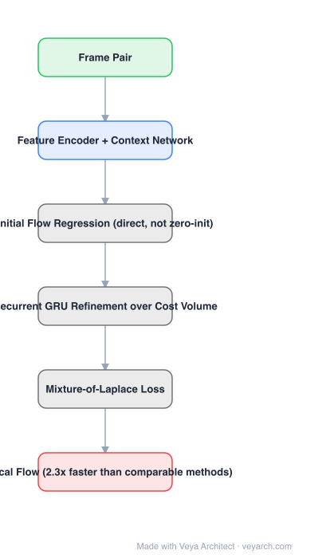

# Architecture: SEA-RAFT

## Motivation

RAFT's structure — cost volume, recurrent GRU refinement, convex upsampling — works, and most follow-ups tried to replace it. SEA-RAFT goes the other way: keep the structure and ask which *training and initialization* choices are actually responsible for accuracy and convergence speed. Three answers: the loss, the initial flow, and pretraining.

## Core Idea

Three changes to RAFT: (1) a **mixture-of-Laplace loss** in place of the standard L1; (2) **regress an initial flow directly** instead of starting refinement from zero, so fewer iterations are needed; (3) **rigid-motion pretraining** for cross-dataset generalization. The topology is untouched.

## Architecture

### Overview

<b>Layer-by-layer (6 nodes)</b>

| # | Layer | Type | Params |
|---|---|---|---|
| 1 | Frame Pair | `input` |  |
| 2 | Feature Encoder + Context Network | `conv2d` |  |
| 3 | Initial Flow Regression (direct, not zero-init) | `custom` |  |
| 4 | Recurrent GRU Refinement over Cost Volume | `custom` |  |
| 5 | Mixture-of-Laplace Loss | `custom` |  |
| 6 | Optical Flow (2.3x faster than comparable methods) | `output` |  |

### Components

1. **Feature encoder + context network** — unchanged from RAFT: per-frame features plus a context map.
2. **Cost volume** — all-pairs correlation, looked up locally during refinement.
3. **Initial flow regression** — the model predicts an initial flow field instead of initializing at zero; this is the main efficiency lever because refinement then converges in fewer steps.
4. **Recurrent GRU refinement** — unchanged in structure from RAFT; iterates the flow residual.
5. **Mixture-of-Laplace loss** — replaces L1 over the sequence of flow predictions, better fitting the heavy-tailed error distribution.
6. **Rigid-motion pretraining** — synthetic rigid-motion data before the main training, targeting cross-dataset generalization.
7. **Convex upsampling** — retained.

### Data Flow

Frame pair → features + cost volume → direct initial flow → recurrent GRU refinement (fewer iterations) → convex upsampling → optical flow; mixture-of-Laplace loss supervises all iterations.

### State / Memory

The recurrent hidden state and current flow estimate, unchanged from RAFT. No new stateful structure — the changes are in the objective and the initialization.

## Design Decisions

- **Do not restructure the model** — the premise is that RAFT's topology was fine and the gains were elsewhere.
- **Initialize the flow rather than start from zero** — a better starting point converts directly into fewer refinement iterations, hence speed.
- **Change the loss** — L1 mis-modelled flow error; the mixture of Laplace is the replacement.
- **Pretrain on rigid motion** — generalization, not accuracy on the training domain, was the weak spot.
- **Optimize the accuracy-efficiency frontier explicitly** — 2.3× faster at comparable accuracy is the reported target.

## Evolution

- **RAFT (2020)** (predecessor): the recurrent refinement baseline.
- **GMA / FlowFormer / GMFlow** (siblings): restructure the cost volume or matching.
- **SEA-RAFT (2024)**: keep RAFT, fix loss + initialization + pretraining.
- **Contrast with FlowFormer**: FlowFormer changes *how* the cost volume is represented; SEA-RAFT changes *how the model is trained and initialized*.

## Characteristics

| Property | Value |
|---|---|
| Task | optical flow |
| Structure | RAFT (cost volume + GRU + convex upsampling), unchanged |
| Loss | mixture of Laplace (replaces L1) |
| Initialization | direct initial flow regression |
| Pretraining | rigid-motion |
| Reported | Spring SOTA 3.686 EPE / 0.363 1px; ≥2.3× faster; smallest model 21 fps |

## Limitations

- Still iterative: latency depends on the refinement count chosen at deployment.
- Cross-dataset generalization improves but is not solved; domain gap to real-world video remains.
- No temporal context — two frames only.
- Improvement is incremental over RAFT rather than structural: systems needing a different cost representation should look at FlowFormer/GMFlow instead.

## Implementation Notes

Essentials: (1) start from an exact RAFT implementation and change one thing at a time — the paper's claim is about the *changes*, so they must be ablatable, (2) add the direct initial-flow head and verify iteration count drops for the same accuracy, (3) swap L1 for the mixture-of-Laplace loss over all supervised iterations, (4) add rigid-motion pretraining before the standard schedule, (5) report the accuracy-vs-latency frontier, not only EPE — speed at matched accuracy is the whole point.
