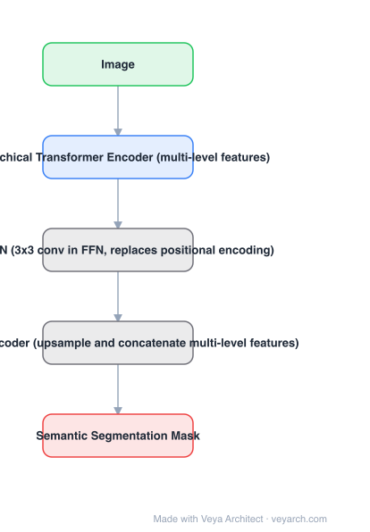

# Architecture: SegFormer

## Motivation

Applying ViT to segmentation imports two mismatches. First, ViT's positional encoding is fixed-resolution: interpolating positional codes to a test resolution different from training **decreases performance**, which is unacceptable for dense prediction where input sizes vary. Second, transformer segmentation decoders had become complex. SegFormer keeps only what dense prediction needs.

## Core Idea

A **hierarchically structured transformer encoder** that emits multi-scale features and uses **no positional encoding** (a 3×3 convolution inside the FFN — Mix-FFN — supplies the positional leak), plus an **all-MLP decoder** that just upsamples and concatenates the multi-level features.

## Architecture

### Overview

<b>Layer-by-layer (5 nodes)</b>

| # | Layer | Type | Params |
|---|---|---|---|
| 1 | Image | `input` |  |
| 2 | Hierarchical Transformer Encoder (multi-level features) | `attention` |  |
| 3 | Mix-FFN (3x3 conv in FFN, replaces positional encoding) | `custom` |  |
| 4 | All-MLP Decoder (upsample and concatenate multi-level features) | `custom` |  |
| 5 | Semantic Segmentation Mask | `output` |  |

### Components

1. **Hierarchical transformer encoder** — stages producing multi-scale features at decreasing resolution, as dense prediction requires.
2. **Mix-FFN** — a 3×3 convolution inside the feed-forward network; this is what removes positional encoding and therefore the interpolation failure at new test resolutions.
3. **All-MLP decoder** — no attention: it upsamples the multi-level encoder features and concatenates them, which combines local attention (from high-resolution levels) and global attention (from low-resolution levels).
4. **Model family** — SegFormer-B0 to B5 by scaling the encoder.

### Data Flow

Image → hierarchical transformer encoder (multi-level features, Mix-FFN, no positional codes) → all-MLP decoder (upsample + concat) → semantic segmentation mask.

### State / Memory

No recurrent state. The set of multi-level encoder features is what the decoder consumes — there is no single-resolution token map.

## Design Decisions

- **Drop positional encoding** — the direct fix for the test-resolution sensitivity; the 3×3 conv in the FFN provides positional information without a fixed codebook.
- **Hierarchical, multi-scale output** — dense prediction needs resolution levels, which a plain ViT does not provide.
- **All-MLP decoder** — the claim is that decoder complexity was not buying accuracy; the encoder representation plus cheap aggregation is enough.
- **Efficiency as the headline** — 5× smaller and 2.2% better than the prior best is the argument, not just an accuracy number.

## Evolution

- **FCN (2015)** and **DeepLab / PSPNet** (predecessors): convolutional, context modules.
- **SETR / ViT-based segmentation**: first transformer encoder attempts, inheriting fixed positional encoding.
- **SegFormer (2021)**: hierarchical encoder without positional encoding + all-MLP decoder.
- **Siblings**: Mask2Former (mask classification, transformer decoder), OneFormer (task-conditioned), MaskFormer.
- **Successors**: SegNeXt, InternImage segmentation variants; the "simple encoder + light decoder" pattern persisted.

## Characteristics

| Property | Value |
|---|---|
| Task | semantic segmentation |
| Encoder | hierarchical transformer, multi-scale output |
| Positional encoding | none (Mix-FFN 3×3 conv instead) |
| Decoder | all-MLP (upsample + concatenate) |
| Family | B0–B5 |
| Results | B4: 50.3% mIoU ADE20K @64M params; B5: 84.0% mIoU Cityscapes val |

## Limitations

- Semantic segmentation only — no instance or panoptic output without a mask-classification head (Mask2Former/OneFormer address this).
- Fixed-resolution training data still required; the gain is robustness to *test* resolution, not arbitrary training sizes.
- No explicit object-level reasoning, so instance boundaries come from segmentation quality alone.
- Superseded on raw accuracy by later mask-classification models at similar compute.

## Implementation Notes

Essentials: (1) build the encoder to emit multiple resolution levels, not one, (2) replace positional encoding with the 3×3 conv inside the FFN and verify accuracy holds when test resolution differs from training — that is the property being claimed, (3) keep the decoder to MLPs: upsample each level to a common resolution and concatenate, (4) scale via encoder width/depth for the B0–B5 family, (5) report params and FLOPs alongside mIoU, since efficiency is the paper's central claim.
