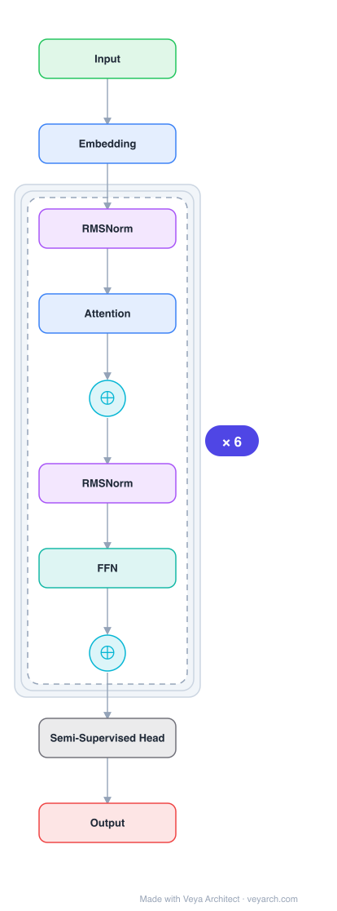

# Architecture: Semi-GPT-4 (Architecture Analysis)

## Motivation

OpenAI has kept the architecture of GPT-4 closed, not because of existential risk but because the solution is replicable. Dense transformer models will not scale further — scaling from GPT-3 to GPT-4 required 100× more parameters, but a dense transformer at that scale would be prohibitively expensive to train and infer. The engineering challenge is to scale model capacity 10× while keeping costs reasonable.

## Core Idea

GPT-4 is a Mixture-of-Experts (MoE) model with ~1.8 trillion total parameters across 120 layers, using 16 experts (~111B parameters each for MLP), with 2 experts routed to per forward pass. This achieves ~280B active parameters per forward pass (vs. ~1.8T for a dense model), dramatically reducing both training and inference costs while maintaining quality.

## Architecture

### Overview

<b>Layer-by-layer (10 nodes)</b>

| # | Layer | Type | Params |
|---|---|---|---|
| 1 | Input | `input` |  |
| 2 | Embedding | `embed` |  |
| 3 | RMSNorm | `rmsnorm` |  |
| 4 | Attention | `attention` |  |
| 5 | ⊕ | `residual` |  |
| 6 | RMSNorm | `rmsnorm` |  |
| 7 | FFN | `ffn` |  |
| 8 | ⊕ | `residual` |  |
| 9 | Semi-Supervised Head | `custom` |  |
| 10 | Output | `output` |  |

GPT-4 uses a Mixture-of-Experts (MoE) architecture to scale model capacity while keeping inference costs manageable. The model has ~1.8T total parameters but only ~280B are active per forward pass. The MoE is applied to the MLP layers, with 16 experts and top-2 routing. Attention layers (~55B parameters) are shared across all tokens.

### Components

1. **MoE MLP Layers** — 16 experts, each ~111B parameters for MLP:
   - Top-2 routing: 2 experts selected per token per forward pass
   - Simple routing algorithm (not advanced)
   - Only ~222B parameters active per forward pass (2 × 111B)

2. **Shared Attention Layers** — ~55B shared parameters for attention:
   - All tokens go through the same attention layers
   - No expert routing for attention

3. **120 Transformer Layers** — Deep stack of transformer blocks:
   - Each layer has shared attention + MoE MLP
   - Total: ~1.8T parameters across 120 layers

4. **Vision Encoder** — Multimodal capability:
   - Separate vision encoder for image inputs
   - Cross-attention with text representations

### Data Flow

1. **Input**: Text tokens (+ optional images via vision encoder)
2. **Per layer (×120)**:
   - Shared attention: all tokens through same attention layer (~55B shared)
   - MoE MLP: route each token to top-2 of 16 experts (~222B active)
3. **Output**: Next token prediction

**Parameter accounting per forward pass:**
- Shared attention: ~55B
- Active MoE MLP: ~222B (2 experts × ~111B)
- Other (embeddings, layer norm, etc.): ~3B
- Total active: ~280B parameters, ~560 TFLOPs
- vs. Dense model: ~1.8T parameters, ~3,700 TFLOPs

### State / Memory

- **KV cache**: Standard transformer KV cache for attention, shared across all tokens.
- **Expert routing state**: Per-token routing decisions (which 2 of 16 experts) are transient.
- **No recurrent state**: Feedforward architecture with standard transformer memory.

## Design Decisions

1. **MoE over dense** — Scaling 100× with a dense model would be prohibitively expensive (~3,700 TFLOPs per forward pass). MoE reduces this to ~560 TFLOPs (6.6× reduction).

2. **16 experts, top-2 routing** — This configuration balances:
   - Capacity: 16 experts provide 16× capacity over dense
   - Cost: top-2 routing means only 2/16 experts active per token
   - Quality: 2 experts provide sufficient capacity per token

3. **Simple routing** — Allegedly simple routing algorithm rather than advanced approaches, suggesting that routing complexity is not necessary at scale.

4. **MoE on MLP only** — Experts are applied to MLP layers, not attention. This is because:
   - MLPs consume the majority of parameters (~111B per expert)
   - Attention can be shared efficiently
   - MoE on attention would complicate KV cache management

5. **120 layers** — Deep model with many layers, enabling complex hierarchical representations.

## Evolution

**Predecessors:**
- **GPT-3** (Brown et al., 2020) — 175B dense transformer.
- **GPT-2** (Radford et al., 2019) — 1.5B decoder-only transformer.
- **Switch Transformer** (Fedus et al., 2022) — Prior MoE for language.
- **GShard** (Lepikhin et al., 2021) — MoE infrastructure.

**Successors:**
- **GPT-4o** — Improved multimodal version.
- **GPT-4 Turbo** — Faster inference variant.
- Future MoE models with more experts, better routing.

## Characteristics

| Property | Value |
|----------|-------|
| Year | 2023 |
| Authors | OpenAI (analysis by Patel & Wong, SemiAnalysis) |
| Category | DL/Transformer |
| Source Paper | `SEMI_GPT_4_Architecture_Infrastructure_Training_Dataset_Infrastructure_Training_2023.md` |
| PaperVault Path | `DL-Architectures/01-transformers/SEMI_GPT_4_Architecture_Infrastructure_Training_Dataset_Infrastructure_Training_2023.md` |

## Limitations

1. **Information source** — This is a third-party analysis (SemiAnalysis), not an official OpenAI publication; details are based on sources and inference, not official confirmation.
2. **MoE overhead** — While inference is cheaper, training MoE models is complex (load balancing, expert collapse, communication overhead).
3. **Expert utilization** — Top-2 routing may not always select the optimal experts; some experts may be underutilized.
4. **Memory requirements** — All 1.8T parameters must be loaded in memory, even if only 280B are active per forward pass.
5. **Routing simplicity** — Simple routing may be suboptimal; more advanced routing could improve quality.
6. **Replicability concern** — The analysis suggests the architecture is replicable, but training such a model requires massive compute and data.

## Implementation Notes

See `implementation/` for a minimal runnable implementation. Key details:
- Total parameters: ~1.8T (across 120 layers)
- MoE: 16 experts, ~111B parameters each (MLP only)
- Routing: top-2, simple algorithm
- Active per forward pass: ~280B parameters, ~560 TFLOPs
- Shared attention: ~55B parameters
- Training data: ~13T tokens (2 epochs text, 4 epochs code)
- Vision: separate vision encoder + cross-attention
- Inference: 6.6× cheaper than equivalent dense model
- Training cost: ~$63M on A100s (estimated)
- Note: This is a third-party analysis, not official OpenAI documentation

## Information Layers

- **Evidence:** Source paper available in `references/papers/` (Patel & Wong, 2023, "GPT-4 Architecture, Infrastructure, Training Dataset, Costs, Vision, MoE" — SemiAnalysis)
- **Analysis:** The key insight from this analysis is that GPT-4's scalability comes from MoE, not from architectural innovation. The MoE approach allows 6.6× inference cost reduction while maintaining 10× capacity increase. The simple routing algorithm suggests that at sufficient scale, routing complexity becomes less important. The 120-layer depth is notable — deeper than most models, suggesting hierarchical representations are important. The ~13T token training dataset (with multiple epochs) indicates that high-quality data is a bottleneck, not just model size.
- **Hypothesis:** The MoE approach may be the standard for future large models, as dense models hit cost walls. The simple routing suggests that the model learns to route effectively through training, not through complex routing algorithms. The gap between total (1.8T) and active (280B) parameters suggests that most parameters are rarely used, supporting the sparsity hypothesis in neural networks.
