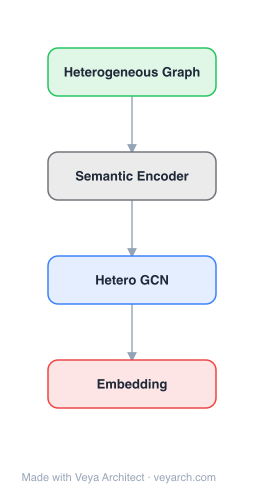

# Architecture: Semantic Hypergraphs

## Motivation

The paper addresses **natural language understanding (NLU) and knowledge representation** for computational social science (CSS) and text analysis. Existing NLP approaches fall into a double dichotomy: **open/opaque** (whether internal rules are inspectable) vs. **strict/adaptive** (whether rules are fixed or learned). Symbolic methods are open-strict (inspectable but rigid), while ML methods (especially deep neural networks) are opaque-adaptive (powerful but inscrutable). The **open-adaptive** quadrant — methods that are both inspectable and adaptable — is largely unexplored but highly desirable for interdisciplinary research where NLP is a scientific instrument requiring transparency.

Existing text mining methods (TF-IDF, LDA, sentiment analysis, NER) operate at the word or topic level, providing limited support for detecting sophisticated claim patterns, recurring statements about actors/actions, and qualitative relationships among actors and concepts across large text corpora. Traditional knowledge bases and semantic graphs are open but limited in their ability to handle the hierarchical richness and ambiguity of natural language.

The Semantic Hypergraph (SH) model fills this gap as a novel knowledge representation that is **intrinsically recursive**, accommodates the natural hierarchical richness of language, and is hybrid in two senses: it combines ML and symbolic approaches, and it is a formal language representation that reduces but tolerates ambiguity and structural variability.

## Core Idea

Semantic hypergraph representation for modeling n-ary relational knowledge.

## Architecture

### Overview

<b>Layer-by-layer (4 nodes)</b>

| # | Layer | Type | Params |
|---|---|---|---|
| 1 | Heterogeneous Graph | `input` |  |
| 2 | Semantic Encoder | `custom` |  |
| 3 | Hetero GCN | `gcn_conv` |  |
| 4 | Embedding | `output` |  |

The Semantic Hypergraph (SH) is a knowledge representation model where nodes and hyperedges encode semantic units at multiple levels of granularity (from individual tokens to complex clauses and claims). A hyperedge can connect an arbitrary number of nodes, enabling the representation of n-ary relations that capture the full relational structure of natural language (e.g., a claim involving a subject, action, object, and qualifiers). The SH is intrinsically recursive — hyperedges can contain other hyperedges, encoding the hierarchical structure of language. The framework includes: (1) a parser that converts natural language text to SH representations using ML building blocks (NER, POS tagging, dependency parsing) combined with a random forest classifier and search tree; (2) a pattern language representable in SH itself for pattern detection; (3) a process for discovering knowledge inference rules.

### Components

- **Semantic Hypergraph data structure:** A hypergraph where nodes represent semantic units (tokens, entities, concepts) and hyperedges represent n-ary relations among them. The recursive structure allows hyperedges to be nodes in higher-level hyperedges, encoding hierarchical language structure (e.g., a clause can be a node in a sentence-level relation).
- **NL-to-SH parser:** Converts natural language text into SH representations. Uses modern ML-based NLP building blocks (NER, POS tagging, semantic role labeling, dependency parsing) combined with a random forest classifier and a simple search tree. Achieves high precision across diverse text categories.
- **Pattern language:** A query/pattern language that is itself representable in SH, enabling pattern detection over SH-encoded text. This allows users to search for specific relational structures (e.g., "find all claims where actor X does action Y to actor Z").
- **Inference rule discovery:** A process to discover knowledge inference rules from SH-encoded corpora, enabling automated reasoning over the represented knowledge.
- **Ambiguity tolerance:** The SH representation reduces but tolerates ambiguity and structural variability in language, providing a semantically deep starting point for further algorithms.

### Data Flow

1. **Input:** Natural language text (e.g., news articles, social media posts).
2. **Parsing:** The NL-to-SH parser uses ML building blocks (NER, POS, dependency parsing) + random forest classifier + search tree to convert text into SH representations.
3. **SH encoding:** Text is encoded as a recursive hypergraph with nodes as semantic units and hyperedges as n-ary relations, preserving hierarchical structure and relational semantics.
4. **Pattern detection:** Users query the SH using the SH-native pattern language to detect specific relational structures (e.g., claim patterns, actor-action-object triples with qualifiers).
5. **Inference:** Discovered inference rules enable automated reasoning over the SH-encoded knowledge.
6. **Output:** Structured representations of claims, relationships, and patterns suitable for further analysis (e.g., claim and conflict analysis, concept taxonomy inference, co-reference resolution).

### State / Memory

The SH is a static knowledge representation (not a neural network with learned parameters). The parser uses ML models (random forest, NLP building blocks) that have trained parameters, but the SH data structure itself is stateless once constructed. Inference rules are discovered and stored as part of the knowledge base. There is no recurrent or dynamic memory in the SH representation itself.

## Design Decisions

- **Open-adaptive design (hybrid ML + symbolic):** The SH combines ML (for parsing) with symbolic representation (for the hypergraph structure), achieving the open-adaptive quadrant that is largely unexplored. This makes the model inspectable (open) while still adaptable to diverse text.
- **Recursive hypergraph structure:** Natural language is inherently hierarchical (tokens → phrases → clauses → sentences → documents). The recursive SH structure (hyperedges containing hyperedges) naturally encodes this hierarchy, unlike flat graph or bag-of-words representations.
- **N-ary relations over binary:** Many linguistic relations involve more than two entities (e.g., "X gave Y to Z at time T"). Hyperedges naturally represent n-ary relations, while binary graphs lose this structure.
- **Ambiguity tolerance:** Rather than forcing a single parse (strict symbolic) or accepting opaque outputs (deep ML), SH reduces ambiguity where possible but tolerates residual ambiguity, providing a practical compromise for real-world text.
- **SH-native pattern language:** Defining the pattern/query language in SH itself enables self-referential pattern matching and keeps the system internally consistent.

## Evolution

**Predecessors:**
- Traditional symbolic NLP (rule-based parsers, recursive descent) — open but strict; cannot handle language diversity.
- Deep neural network NLP (BERT, transformer models) — adaptive but opaque.
- Knowledge bases and semantic graphs — open but limited to binary relations and rigid structure.
- Text mining methods (TF-IDF, LDA, NER, sentiment analysis) — operate at word/topic level, limited relational depth.

**Successors:**
- Hypergraph-based knowledge representation frameworks for multi-relational reasoning.
- Neuro-symbolic approaches combining learned parsing with symbolic hypergraph reasoning.
- Open information extraction systems building on the SH pattern language paradigm.

## Characteristics

| Property | Value |
|----------|-------|
| Year | 2021 |
| Authors | Menezes & Roth |
| Category | GNN/Hypergraph |
| Source Paper | `Semantic_Hypergraphs_Unknown_2021.md` |
| PaperVault Path | `GNN/05-hypergraphs-topology/Semantic_Hypergraphs_Unknown_2021.md` |

## Limitations

- **Parser precision ceiling:** The NL-to-SH parser relies on ML building blocks (NER, dependency parsing) whose precision limits the SH encoding quality; errors propagate into the hypergraph.
- **Domain-specific tuning:** The parser and pattern language may require adaptation for different text categories (news, social media, scientific), limiting out-of-domain generalization.
- **Scalability of recursive hypergraphs:** Deeply nested recursive structures can become computationally expensive to query and maintain for very large corpora.
- **No learned representations:** The SH is a symbolic representation; it does not learn dense embeddings, limiting its use in downstream ML tasks that require vectorized inputs.
- **Manual pattern design:** While the pattern language is expressive, designing effective patterns requires domain expertise and manual effort.

## Implementation Notes

See `implementation/` for a minimal runnable implementation.

## Information Layers

- **Evidence:** Source paper available in `references/papers/`
- **Analysis:** The SH model's contribution is conceptual and representational — it occupies the under-explored open-adaptive quadrant of NLP by combining ML parsing with symbolic hypergraph representation. The recursive n-ary hyperedge structure is a natural fit for the hierarchical, multi-entity nature of language. The SH-native pattern language enables transparent, inspectable pattern detection that opaque deep models cannot provide.
- **Hypothesis:** The lack of learned dense representations limits integration with modern ML pipelines; hybrid approaches that learn embeddings over SH structures could bridge this gap. The parser's reliance on traditional NLP building blocks could be enhanced with modern pre-trained language models for improved parsing precision. The manual pattern design bottleneck could be addressed with automated pattern discovery from SH-encoded corpora.
