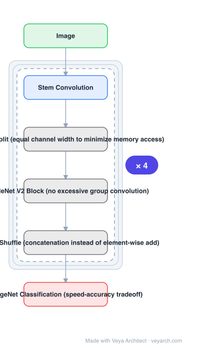

# Architecture: ShuffleNet V2

## Motivation

Architecture design was guided by an **indirect** metric: FLOPs. But the direct metric — speed — also depends on **memory access cost and platform characteristics**. The paper demonstrates the gap: MobileNet v2 is much faster than NASNET-A although FLOPs are comparable, and networks with similar FLOPs measurably differ in speed. Using FLOPs as the only metric is therefore insufficient and can lead to sub-optimal design.

## Core Idea

Evaluate the **direct metric on the target platform**, derive **practical guidelines for efficient network design** from a series of controlled experiments, and build a new architecture — ShuffleNet V2 — that follows them. The architecture is the *output* of the guideline derivation, not the starting point.

## Architecture

### Overview

<b>Layer-by-layer (6 nodes)</b>

| # | Layer | Type | Params |
|---|---|---|---|
| 1 | Image | `input` |  |
| 2 | Stem Convolution | `conv2d` |  |
| 3 | Channel Split (equal channel width to minimize memory access) | `custom` |  |
| 4 | ShuffleNet V2 Block (no excessive group convolution) | `custom` |  |
| 5 | Channel Shuffle (concatenation instead of element-wise add) | `custom` |  |
| 6 | ImageNet Classification (speed-accuracy tradeoff) | `output` |  |

### Components

1. **Controlled experiments** — the method: measure speed on the target platform instead of inferring it from FLOPs.
2. **Practical design guidelines** — derived from those experiments; the network follows them.
3. **Channel split** — the block splits channels so that equal channel width is maintained, minimizing memory access cost.
4. **ShuffleNet V2 block** — avoids excessive group convolution, since group convolution increases memory access cost.
5. **Channel shuffle after concatenation** — element-wise addition is replaced by concatenation plus shuffle, keeping channel count high without the add's cost.
6. **ShuffleNet V2 network** — the resulting architecture, reported state-of-the-art in speed/accuracy tradeoff.

### Data Flow

Image → stem convolution → stacked ShuffleNet V2 blocks (channel split → one branch convolved, the other passed through → concatenate instead of element-wise add → channel shuffle) → classification head.

### State / Memory

No recurrent state. The whole design is governed by memory *access* cost — that is the quantity the guidelines minimize, and the reason FLOPs is an inadequate proxy.

## Design Decisions

- **Direct metric on the target platform** — the framing contribution; FLOPs alone is called insufficient and potentially sub-optimal.
- **Guidelines from controlled experiments** — the paper derives rather than asserts them.
- **Equal channel width** — minimizes memory access cost, unlike heavily bottlenecked designs.
- **No excessive group convolution** — group convolution raises memory access cost even as it lowers FLOPs.
- **Concatenation instead of element-wise add** — element-wise operations cost memory traffic for little benefit.

## Evolution

- **Xception, MobileNet, MobileNetV2, ShuffleNet, CondenseNet** (predecessors): group and depthwise convolution as the efficiency tool.
- **NASNET-A** (contrast): comparable FLOPs to MobileNet v2 but much slower.
- **ShuffleNet V2 (2018)**: guidelines-driven architecture, direct-metric validated.
- **Siblings**: GhostNet, MobileNetV3, MobileNetV4, FasterNet.
- **Successors**: FasterNet (2023) quantifies the same discrepancy as FLOPS.

## Characteristics

| Property | Value |
|---|---|
| Task | efficient image classification |
| Core block | ShuffleNet V2 block with channel split and shuffle |
| Metric | direct speed on the target platform, not FLOPs |
| Guidelines | derived from controlled experiments |
| Key choices | equal channel width, no excessive group conv, concat instead of add |
| Result | state-of-the-art speed/accuracy tradeoff |

## Limitations

- Guidelines are platform-specific: conclusions drawn on one target may not transfer to another.
- Group convolution and depthwise convolution remain useful; the guidance is to avoid *excessive* use, which requires judgement per design.
- Classification-centric evaluation.
- The guidelines constrain but do not determine a design — they do not replace search or empirical tuning.

## Implementation Notes

Essentials: (1) measure the direct metric — speed/latency on the actual target platform — and do not treat FLOPs as the objective, (2) keep channel widths equal through the block rather than heavily bottlenecked, since unequal widths raise memory access cost, (3) limit group convolution instead of maximizing it; the FLOPs saving is offset by memory traffic, (4) use concatenation with channel shuffle instead of element-wise addition, (5) when comparing against baselines, match FLOPs *and* report measured speed — the comparison the paper makes against NASNET-A is only visible in the speed column.
