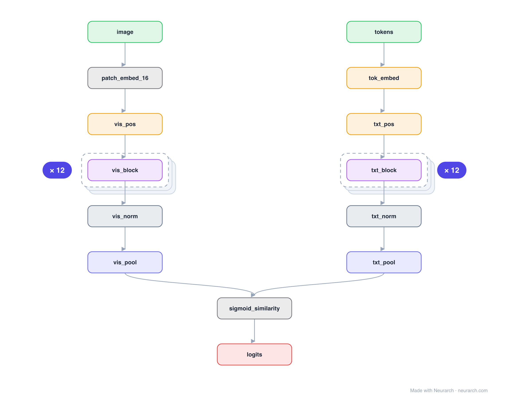

# Architecture: SigLIP base

## Motivation

CLIP with one change that matters: a pairwise sigmoid loss instead of the softmax-contrastive one. Dropping the batch-global normalization lets it train well at any batch size, and its vision tower is the encoder many 2024+ multimodal LLMs (including PaliGemma) build on.

## Core Idea

CLIP with one change that matters: a pairwise sigmoid loss instead of the softmax-contrastive one.

## Architecture

### Overview

*Identical repeated blocks are folded into one representative block with a `× N` badge, so the whole architecture fits on screen. `model.json` uses NAXS block templates + `repeat` directives and expands back to all 36 nodes (open it in Neurarch to see and edit every layer). Vector: [diagram.svg](assets/diagram.svg).*

| Hyperparameter | Value |
|---|---|
| Type | Contrastive image-text dual encoder |
| Parameters | 203M |
| Vision tower | ViT-B/16: 12 blocks, 768 hidden, 12 heads |
| Text tower | 12 blocks, 768 hidden (no causal mask) |
| Loss | Pairwise sigmoid (not softmax contrastive) |
| Pooling | Attention/mean pool per tower |

`model.json` is the full graph, hand-built against the official config.json.

### Design Notes

- The architecture is a CLIP-style dual encoder; the contribution is the sigmoid loss, which treats every image-text pair as an independent binary problem.
- No softmax over the batch means no need for the huge batches CLIP relied on, and the text tower drops the causal mask CLIP inherited from GPT.
- Compare with [clip-vit-b32](../clip-vit-b32/): same two-tower shape, different objective.

### Parameter Check

Neurarch's per-layer parameter estimate over this graph: **195.3M**.

## Design Decisions

> **Analysis** — Observations derived from studying the architecture.

- The architecture is a CLIP-style dual encoder; the contribution is the sigmoid loss, which treats every image-text pair as an independent binary problem.
- No softmax over the batch means no need for the huge batches CLIP relied on, and the text tower drops the causal mask CLIP inherited from GPT.
- Compare with [clip-vit-b32](../clip-vit-b32/): same two-tower shape, different objective.

## Implementation Notes

- `model.json` contains the full structural graph with real dimensions and parameters, using NAXS block templates + `repeat` for repeated units.
- Open in [Neurarch](https://www.neurarch.com/) to visualize, edit, or export training code.
- Diagrams fold repeated identical blocks with a `× N` badge; `model.json` defines each repeated unit once at real dimensions and expands to all nodes.

## Limitations

- This package focuses on the architectural structure. Training pipelines, 
dataset preparation, and production optimizations are out of scope.

## Evolution

> See `references/related/` for predecessor and successor architectures.

