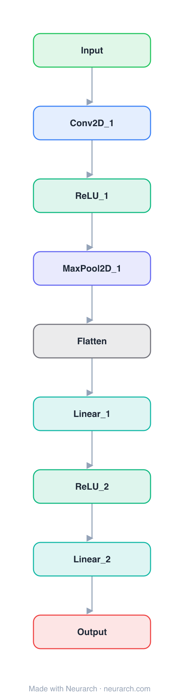

# Architecture: Simple CNN

## Motivation

A LeNet-style starter CNN for image classification: conv-pool stacks into a dense head. The "hello world" graph of computer vision.

## Core Idea

A LeNet-style starter CNN for image classification: conv-pool stacks into a dense head.

## Architecture

### Overview

<b>Layer-by-layer (9 nodes)</b>

| # | Layer | Type | Params |
|---|---|---|---|
| 1 | Input | `input` | shape: [1, 28, 28] |
| 2 | Conv2D_1 | `conv2d` | outChannels: 32, kernelSize: 3, stride: 1, padding: 1, inChannels: 1 |
| 3 | ReLU_1 | `relu` |   |
| 4 | MaxPool2D_1 | `maxpool2d` | kernelSize: 2, stride: 2 |
| 5 | Flatten | `flatten` |   |
| 6 | Linear_1 | `linear` | outFeatures: 128, inFeatures: 6272 |
| 7 | ReLU_2 | `relu` |   |
| 8 | Linear_2 | `linear` | outFeatures: 10, inFeatures: 128 |
| 9 | Output | `output` |   |

This graph ships in Neurarch's in-app template library; the copy here passes shape propagation with zero errors.

### Design Notes

- The pattern (convolution for local features, pooling for downsampling, dense layers for classification) is unchanged since 1998.
- Good first graph for watching shape propagation catch kernel/stride mistakes.

## Design Decisions

> **Analysis** — Observations derived from studying the architecture.

- The pattern (convolution for local features, pooling for downsampling, dense layers for classification) is unchanged since 1998.
- Good first graph for watching shape propagation catch kernel/stride mistakes.

## Implementation Notes

- `model.json` contains the full structural graph with real dimensions and parameters.
- Open in [Neurarch](https://www.neurarch.com/) to visualize, edit, or export training code.
- Diagrams fold repeated identical blocks with a `× N` badge; `model.json` holds all nodes at real dimensions.

## Limitations

- This package focuses on the architectural structure. Training pipelines, 
dataset preparation, and production optimizations are out of scope.

## Evolution

> See `references/related/` for predecessor and successor architectures.

