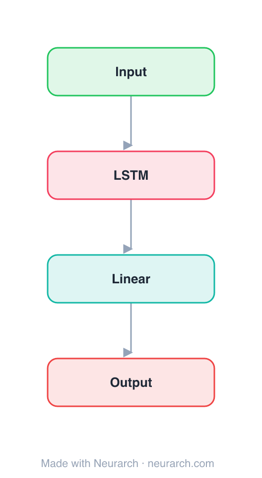

# Architecture: Simple RNN

## Motivation

A minimal Elman-style recurrent network for sequence processing. Four nodes: the smallest sequential model in the zoo, kept as a teaching baseline.

## Core Idea

A minimal Elman-style recurrent network for sequence processing.

## Architecture

### Overview

<b>Layer-by-layer (4 nodes)</b>

| # | Layer | Type | Params |
|---|---|---|---|
| 1 | Input | `input` | shape: [128, 300] |
| 2 | LSTM | `lstm` | hiddenSize: 256, numLayers: 2 |
| 3 | Linear | `linear` | outFeatures: 10, inFeatures: 256 |
| 4 | Output | `output` |   |

This graph ships in Neurarch's in-app template library; the copy here passes shape propagation with zero errors.

### Design Notes

- The architecture every LSTM, GRU, and ultimately attention mechanism was reacting to.
- Useful as a first graph for learning the canvas: add layers, watch shapes propagate.

## Design Decisions

> **Analysis** — Observations derived from studying the architecture.

- The architecture every LSTM, GRU, and ultimately attention mechanism was reacting to.
- Useful as a first graph for learning the canvas: add layers, watch shapes propagate.

## Implementation Notes

- `model.json` contains the full structural graph with real dimensions and parameters.
- Open in [Neurarch](https://www.neurarch.com/) to visualize, edit, or export training code.
- Diagrams fold repeated identical blocks with a `× N` badge; `model.json` holds all nodes at real dimensions.

## Limitations

- This package focuses on the architectural structure. Training pipelines, 
dataset preparation, and production optimizations are out of scope.

## Evolution

> See `references/related/` for predecessor and successor architectures.

