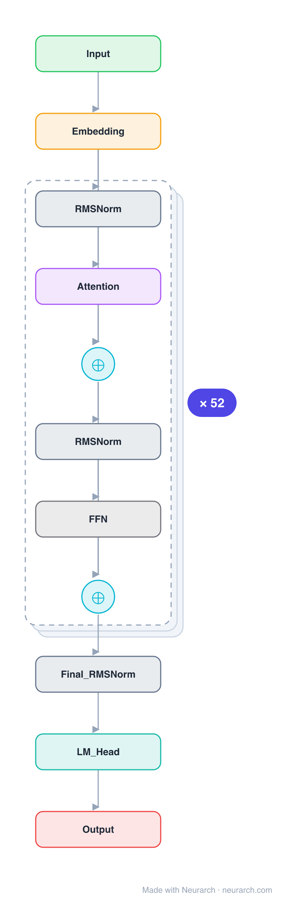

# Architecture: Skywork-13B

## Motivation

Kunlun Tech's 13B bilingual base model, notable for an explicitly ablated deep-and-thin layout (52 layers) and a thorough public tech report on its 3.2T-token training run.

## Core Idea

Kunlun Tech's 13B bilingual base model, notable for an explicitly ablated deep-and-thin layout (52 layers) and a thorough public tech report on its 3.

## Architecture

### Overview

*Identical repeated blocks are folded into one representative block with a `× N` badge, so the whole architecture fits on screen. `model.json` uses a NAXS block template + `repeat` directive: the identical repeated layers are defined once and expand to all 317 nodes (open it in Neurarch to see and edit every layer). Vector: [diagram.svg](assets/diagram.svg).*

| Hyperparameter | Value |
|---|---|
| Type | Decoder-only transformer (causal LM) |
| Parameters | 13.8B |
| Layers | 52 |
| Hidden size | 4608 |
| Attention | Multi-head: 36 heads |
| Head dim | 128 |
| FFN | SwiGLU, intermediate size 12,288 |
| Normalization | RMSNorm, pre-norm |
| Positions | RoPE (rotary dim 128) |
| Vocabulary | 65,519 |
| Max context | 4,096 |

`model.json` is the full 52-layer graph (the repeated layers expressed via a NAXS block template + `repeat`), produced with the same import path the Neurarch app uses for "load from Hugging Face", with all hyperparameters from the official `config.json`.

### Design Notes

- Deliberately deep-and-thin at 13B scale: 52 layers at 4608 hidden, versus Llama-2-13B's 40 layers at 5120. The tech report (arXiv 2310.19341) ablates this choice directly.
- Plain multi-head attention (36 heads), RoPE, RMSNorm, SwiGLU; the FFN ratio is a modest 2.67x.
- 65519-token vocabulary balanced for Chinese and English; trained on 3.2T tokens.
- Ships with a clean tech report and intermediate checkpoints, making it a good reference for training-dynamics work.

### Parameter Check

Neurarch's per-layer parameter estimate over this graph: **13.85B**.
Deviation from the authoritative count (13.85B): **+0.0%**.

## Design Decisions

> **Analysis** — Observations derived from studying the architecture.

- Deliberately deep-and-thin at 13B scale: 52 layers at 4608 hidden, versus Llama-2-13B's 40 layers at 5120. The tech report (arXiv 2310.19341) ablates this choice directly.
- Plain multi-head attention (36 heads), RoPE, RMSNorm, SwiGLU; the FFN ratio is a modest 2.67x.
- 65519-token vocabulary balanced for Chinese and English; trained on 3.2T tokens.
- Ships with a clean tech report and intermediate checkpoints, making it a good reference for training-dynamics work.

## Implementation Notes

- `model.json` contains the full structural graph with real dimensions and parameters, using a NAXS block template + `repeat` for the identical repeated layers.
- Open in [Neurarch](https://www.neurarch.com/) to visualize, edit, or export training code.
- Diagrams fold repeated identical blocks with a `× N` badge; `model.json` defines each repeated layer once at real dimensions and expands to all nodes.

## Limitations

- This package focuses on the architectural structure. Training pipelines, 
dataset preparation, and production optimizations are out of scope.

## Evolution

> See `references/related/` for predecessor and successor architectures.

