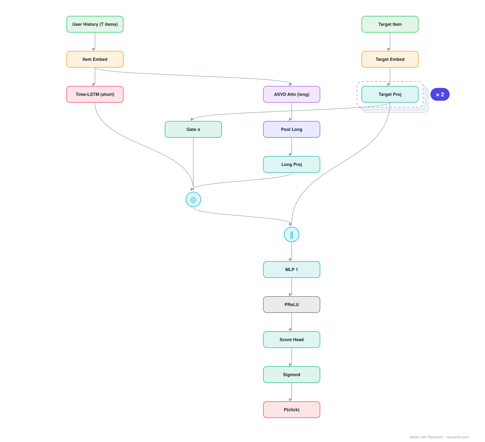

# Architecture: SLi-Rec

## Motivation

Short- and Long-term interest Recommender: a Time-aware LSTM models the evolving short-term interest while an attentive ASVD component captures stable long-term preference, fused adaptively.

## Core Idea

Short- and Long-term interest Recommender: a Time-aware LSTM models the evolving short-term interest while an attentive ASVD component captures stable long-term preference, fused adaptively.

## Architecture

### Overview

<b>Layer-by-layer (18 nodes)</b>

| # | Layer | Type | Params |
|---|---|---|---|
| 1 | User History (T items) | `input` | shape: [50] |
| 2 | Item Embed | `embedding` | vocabSize: 1000000, embeddingDim: 32 |
| 3 | Time-LSTM (short) | `lstm` | inFeatures: 32, hiddenSize: 64, numLayers: 1, returnSequences: false |
| 4 | ASVD Attn (long) | `selfAttention` | dModel: 32, numHeads: 4 |
| 5 | Pool Long | `globalAvgPool1d` |   |
| 6 | Long Proj | `linear` | inFeatures: 32, outFeatures: 64 |
| 7 | Target Item | `input` | shape: [1] |
| 8 | Target Embed | `embedding` | vocabSize: 1000000, embeddingDim: 32 |
| 9 | Target Proj | `linear` | inFeatures: 32, outFeatures: 64 |
| 10 | Fusion Gate σ(W·[s;l;t]) | `linear` | inFeatures: 192, outFeatures: 64 |
| 11 | Gate σ | `sigmoid` |   |
| 12 | α·short + (1−α)·long | `add` | numInputs: 2 |
| 13 | Concat [user, target] | `concatenate` | dim: -1, numInputs: 2 |
| 14 | MLP 1 | `linear` | inFeatures: 128, outFeatures: 64 |
| 15 | PReLU | `prelu` |   |
| 16 | Score Head | `linear` | inFeatures: 64, outFeatures: 1 |
| 17 | Sigmoid | `sigmoid` |   |
| 18 | P(click) | `output` |   |

This graph ships in Neurarch's in-app template library; the copy here passes shape propagation with zero errors.

### Design Notes

- Time-aware LSTM gates take the irregular gaps between user actions as input, not just the order.
- The adaptive fusion learns per-user, per-moment weighting between the long- and short-term signals.

## Design Decisions

> **Analysis** — Observations derived from studying the architecture.

- Time-aware LSTM gates take the irregular gaps between user actions as input, not just the order.
- The adaptive fusion learns per-user, per-moment weighting between the long- and short-term signals.

## Implementation Notes

- `model.json` contains the full structural graph with real dimensions and parameters.
- Open in [Neurarch](https://www.neurarch.com/) to visualize, edit, or export training code.
- Diagrams fold repeated identical blocks with a `× N` badge; `model.json` holds all nodes at real dimensions.

## Limitations

- This package focuses on the architectural structure. Training pipelines, 
dataset preparation, and production optimizations are out of scope.

## Evolution

> See `references/related/` for predecessor and successor architectures.

