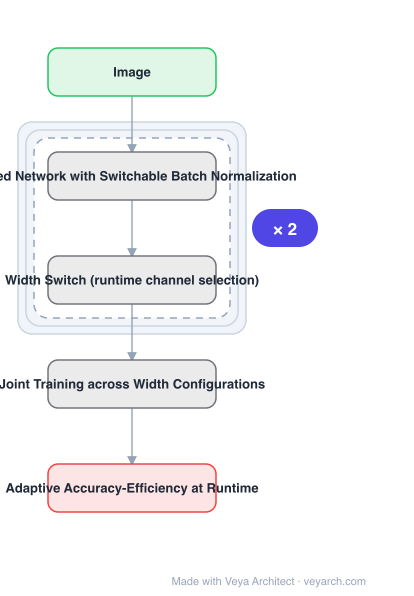

# Architecture: Slimmable Neural Networks

## Motivation

Mobile phones, augmented reality devices and autonomous cars need short response times. Manually designed lightweight networks help, and NAS methods integrate on-device latency into the search objective by running models on a specific phone. But **at runtime these networks are not re-configurable** to adapt across devices given the same response time budget. With over **24,000 unique Android devices in 2015** having drastically different runtimes for the same network, high-end phones could run larger models for higher accuracy while low-end phones must sacrifice accuracy.

## Core Idea

Train a **single neural network executable at different widths** — width being the number of channels in a layer — permitting **instant and adaptive accuracy-efficiency trade-offs at runtime**. Instead of training individual networks per width configuration, train a **shared network with switchable batch normalization**. At runtime the network adjusts its width **on the fly** according to on-device benchmarks and resource constraints.

## Architecture

### Overview

<b>Layer-by-layer (5 nodes)</b>

| # | Layer | Type | Params |
|---|---|---|---|
| 1 | Image | `input` |  |
| 2 | Shared Network with Switchable Batch Normalization | `custom` |  |
| 3 | Width Switch (runtime channel selection) | `custom` |  |
| 4 | Joint Training across Width Configurations | `custom` |  |
| 5 | Adaptive Accuracy-Efficiency at Runtime | `output` |  |

### Components

1. **Shared network** — one set of weights serving all width configurations, instead of separate models per width.
2. **Switchable batch normalization** — the enabling mechanism; separate BN statistics per width configuration, so a shared network can behave correctly at any of them.
3. **Width switch** — selects how many channels are active at runtime.
4. **Joint training across width configurations** — the network is trained to perform at every supported width, not just the largest.
5. **Runtime adaptation** — width chosen from on-device benchmarks and the resource constraint.

### Data Flow

Image → shared network with switchable batch normalization → only the channels up to the currently selected width are active → prediction. At runtime the width is chosen per device from on-device benchmarks and the response-time budget.

### State / Memory

No recurrent state. The point is that all width configurations live in **one** set of weights — no separate models to download or offload.

## Design Decisions

- **Share weights across widths** — the alternative (individual networks per width) is the baseline being replaced.
- **Switchable batch normalization is the key mechanism** — without per-width BN statistics a shared network cannot serve all widths correctly.
- **Train jointly for all widths** — so each width performs as well as, or better than, an individually trained model.
- **Runtime, not design-time, adaptation** — the network reconfigures on the fly rather than requiring a different model download.
- **Demonstrate beyond classification** — detection, instance segmentation and keypoint detection, without hyper-parameter tuning.

## Evolution

- **Manually designed lightweight networks** (predecessors): MobileNet v1/v2, ShuffleNet — low complexity but not reconfigurable.
- **NAS with on-device latency** (predecessor): integrates latency into the objective but produces one fixed model.
- **Slimmable (2018)**: one shared network, switchable BN, runtime width selection.
- **Siblings**: Once-for-All, BranchyNet.
- **Contrast**: individually trained models at each width — matched and often beaten.

## Characteristics

| Property | Value |
|---|---|
| Task | runtime-adaptive efficient inference |
| Mechanism | shared network with switchable batch normalization |
| Adaptivity | width (channel count) selected at runtime |
| Benefit | no model download or offload across devices |
| ImageNet | similar or better than individually trained MobileNet v1/v2, ShuffleNet, ResNet-50 at each width |
| Beyond classification | COCO detection, instance segmentation, person keypoints, no hyper-parameter tuning |

## Limitations

- Width is coarse-grained adaptation; depth and resolution are not adjustable in this formulation.
- The set of supported widths must be decided before training.
- Switchable BN adds parameters and bookkeeping per width configuration.
- Matching individually trained models requires joint training to be well-tuned; a poorly balanced setup favours the largest width.

## Implementation Notes

Essentials: (1) use **switchable batch normalization** — one shared set of weights cannot serve multiple widths correctly without per-width BN statistics, and this is the enabling mechanism, (2) train **jointly across all width configurations**, not sequentially; performance at every width is the goal, and training only the full width leaves narrow widths untrained, (3) select width **at runtime from on-device benchmarks**; if the width is fixed at design time, the reconfigurability rationale disappears, (4) compare against **individually trained models at the same width** rather than against a single baseline, since the claim is parity or better at each width, (5) evaluate on detection/segmentation/keypoints without re-tuning hyper-parameters — that transfer is part of the reported result.
