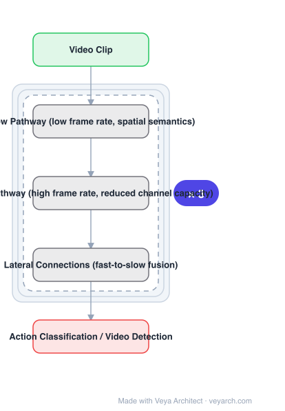

# Architecture: SlowFast Networks

## Motivation

In image recognition the two spatial dimensions are treated symmetrically, justified by natural images being roughly isotropic and shift-invariant. Video is different. Motion is the spatiotemporal counterpart of orientation, but **all spatiotemporal orientations are not equally likely** — slow motions are more likely than fast ones, which has been exploited in Bayesian accounts of motion perception. If they are not equally likely, there is **no reason to treat space and time symmetrically**, as spatiotemporal convolution approaches implicitly do. The architecture should instead be **factored**.

## Core Idea

Two pathways. A **Slow pathway** at low frame rate captures **spatial semantics**, which evolve slowly — waving hands stay "hands"; a person is always a "person" whether walking or running. A **Fast pathway** at high frame rate captures **motion at fine temporal resolution**. The Fast pathway can be made **very lightweight by reducing its channel capacity**, yet still learns useful temporal information.

## Architecture

### Overview

<b>Layer-by-layer (5 nodes)</b>

| # | Layer | Type | Params |
|---|---|---|---|
| 1 | Video Clip | `input` |  |
| 2 | Slow Pathway (low frame rate, spatial semantics) | `custom` |  |
| 3 | Fast Pathway (high frame rate, reduced channel capacity) | `custom` |  |
| 4 | Lateral Connections (fast-to-slow fusion) | `custom` |  |
| 5 | Action Classification / Video Detection | `output` |  |

### Components

1. **Slow pathway** — low frame rate, capturing spatial semantics; refreshed relatively slowly because categorical semantics evolve slowly.
2. **Fast pathway** — high frame rate, capturing motion at fine temporal resolution; motion evolves much faster than subject identity.
3. **Reduced channel capacity in the Fast pathway** — the mechanism that keeps the high-frame-rate branch cheap.
4. **Lateral connections** — fuse the Fast pathway's motion information into the Slow pathway.
5. **Per-pathway heads** — for action classification and video detection.

### Data Flow

Video clip → two pathways in parallel: Slow (few frames, wide channels) and Fast (many frames, narrow channels) → lateral connections fuse Fast into Slow → per-pathway outputs → action classification or detection head.

### State / Memory

No recurrent state. The design's efficiency comes from asymmetry: the expensive spatial-semantic processing runs on few frames, while the cheap, narrow Fast pathway absorbs the high frame rate.

## Design Decisions

- **Factor space and time rather than treat them symmetrically** — the core argument, grounded in the statistics of natural video (slow motions are more likely).
- **Two frame rates, not one** — the direct expression of the factorisation.
- **Make Fast narrow rather than shallow** — reducing channel capacity is the stated way to keep it lightweight while still learning useful temporal information.
- **Fuse laterally, not only at the end** — unlike two-stream networks which fused at the end.
- **Validate on classification and detection** — the paper pin-points large improvements as contributions of the SlowFast concept.

## Evolution

- **Two-stream networks** (predecessor): RGB and optical flow processed independently, fused at the end.
- **Spatiotemporal 3D CNNs** (predecessor): treat space and time symmetrically; significantly more computation.
- **Factorised / grouped 3D convolutions** (predecessor): factorise across spatial and temporal dimensions for efficiency.
- **SlowFast (2018)**: asymmetric two-pathway factorisation by frame rate.
- **Siblings**: TimeSformer, ViViT, UniFormer, VideoMAE.
- **Contrast**: spatiotemporal convolution approaches, against which the paper argues directly.

## Characteristics

| Property | Value |
|---|---|
| Task | action classification / video detection |
| Pathway 1 | Slow — low frame rate, spatial semantics |
| Pathway 2 | Fast — high frame rate, fine temporal resolution, low channel capacity |
| Fusion | lateral connections, Fast into Slow |
| Argument | not all spatiotemporal orientations are equally likely |
| Benchmarks | Kinetics, Charades, AVA (state of the art) |

## Limitations

- The frame-rate ratio and channel-capacity ratio are design choices requiring tuning.
- Two pathways mean two sets of parameters and a fusion design, adding complexity.
- The argument rests on natural-video statistics; domains with fast-dominant motion may not benefit.
- Sampling at high frame rate still costs memory even with narrow channels.

## Implementation Notes

Essentials: (1) run the two pathways at **different frame rates** — one pathway at a single frame rate is not SlowFast, since the factorisation by temporal rate is the whole argument, (2) keep the Fast pathway **narrow in channels** rather than merely shallow; reducing channel capacity is the stated way to make it lightweight while still learning useful temporal information, (3) add **lateral connections** fusing Fast into Slow, not just a late fusion — end-only fusion is the two-stream design this improves on, (4) size the Slow pathway for spatial semantics and the Fast for motion; the split is justified by categorical semantics evolving slowly while motion evolves fast, (5) evaluate on both action classification and detection, since the reported improvements are attributed to the SlowFast concept across both.
