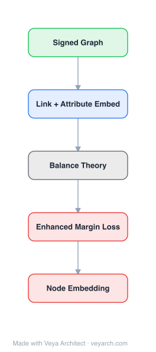

# Architecture: Enhanced Network Embedding

## Motivation

Neural network techniques are widely used in network embedding, boosting results for node classification, link prediction, and visualization. All state-of-the-art algorithms put effort into neighborhood information and try to make full use of it. However, it is hard to recognize core-periphery structures simply based on neighborhood information.

The paper discusses the influence of random-walk-based sampling strategies on embedding results. Theoretical and experimental evidence shows that random-walk-based sampling strategies fail to fully capture structural equivalence—the property that nodes with similar structural positions (e.g., core, peripheral, hub nodes) should have similar embeddings. Most algorithms only concern densely connected nodes, ignoring the complementary structural equivalence perspective.

The paper proposes SNS, a framework that performs network embeddings using structural information (graphlets) to enhance quality. SNS effectively utilizes both neighbor information and local-subgraph similarity, being the first framework to combine these two aspects.

## Core Idea

Network embedding quality enhancement using structural similarity constraints.

## Architecture

### Overview

<b>Layer-by-layer (5 nodes)</b>

| # | Layer | Type | Params |
|---|---|---|---|
| 1 | Signed Graph | `input` |  |
| 2 | Link + Attribute Embed | `embed` |  |
| 3 | Balance Theory | `custom` |  |
| 4 | Enhanced Margin Loss | `loss` |  |
| 5 | Node Embedding | `output` |  |

SNS (Structural and Neighborhood Similarity) is a general framework that enhances existing word2vec-based network embedding algorithms by incorporating structural similarity information via graphlets. The key insight is that two types of node similarity—neighborhood-based (densely connected nodes) and structural equivalence-based (nodes with similar network positions)—are complementary and should both be captured.

SNS uses Graphlet Degree Vectors (GDV) to capture local-subgraph structural similarity. The GDV of a node counts the occurrences of different graphlets (small subgraph patterns) centered at that node, providing a structural fingerprint. SNS combines this structural information with the neighborhood information from random-walk-based embeddings to produce enhanced node representations.

### Components

- **Graphlet Degree Vector (GDV)**: For each node, counts the occurrences of different graphlets (small subgraph patterns of 2-5 nodes) centered at that node. The GDV serves as a structural fingerprint capturing the node's local structural role (core, peripheral, hub, etc.).

- **Random-walk-based embedding module**: Any word2vec-based network embedding algorithm (DeepWalk, node2vec, etc.) that generates node embeddings from random walks. SNS can refine all such algorithms.

- **Structural similarity integration**: Combines the neighborhood-based embedding (from random walks) with the structural similarity (from GDV) to produce enhanced embeddings. The integration can be through concatenation, joint optimization, or refinement of the random-walk embeddings using structural information.

- **Graphlet feature analysis**: The paper investigates which types of local-subgraph features matter most for node classification, enabling further improvement of embedding quality.

### Data Flow

1. **Input**: Network graph G = (V, E) with nodes and edges.
2. **Graphlet computation**: For each node, compute the Graphlet Degree Vector (GDV) by counting occurrences of different graphlet patterns centered at the node.
3. **Random-walk embedding**: Apply any word2vec-based embedding algorithm (e.g., DeepWalk) to generate neighborhood-based node embeddings.
4. **Structural similarity integration**: Combine the GDV structural features with the random-walk embeddings, producing enhanced representations that capture both neighborhood and structural equivalence.
5. **Feature selection**: Optionally analyze which graphlet features are most informative for the downstream task.
6. **Output**: Enhanced node embeddings that capture both densely connected patterns and structural position similarity.
7. **Downstream tasks**: Use enhanced embeddings for node classification, link prediction, and visualization.

### State / Memory

Stateless—SNS produces fixed embeddings through a feed-forward process. The GDV computation and random-walk embedding are independent processes that are combined to produce the final embeddings. No recurrent state or memory mechanism is used.

## Design Decisions

- **Graphlet Degree Vectors for structural similarity**: Chosen because graphlets capture local structural patterns that are independent of neighborhood connectivity. Two nodes can have identical structural roles (e.g., both are hubs) without being directly connected.

- **Framework design (refinement, not replacement)**: SNS is designed to refine existing word2vec-based algorithms rather than replace them, making it a general-purpose enhancement that can be applied to any random-walk-based embedding method.

- **Combining two similarity types**: The key design decision is that neighborhood similarity and structural equivalence are complementary, not competing. Each captures different aspects of node similarity that are useful for different tasks.

- **Graphlet feature investigation**: The paper analyzes which graphlet features matter most for node classification, enabling targeted feature selection rather than using all graphlet dimensions uniformly.

## Evolution

**Predecessors:**
- DeepWalk (Perozzi et al., 2014) — random walk + word2vec for network embedding
- node2vec (Grover & Leskovec, 2016) — biased random walks
- LINE (Tang et al., 2015) — first/second-order proximity
- struc2vec (Ribeiro et al., 2017) — structural identity-based embedding
- Graphlet counting (Pržulj, 2007) — graphlet degree vectors for structural analysis
- IsoMap, LLE, Laplacian Eigenmaps — classic dimensionality reduction

**Successors:**
- SNS inspired subsequent work on combining structural and neighborhood information in graph learning
- The graphlet-based structural feature paradigm influenced structural attention mechanisms in GNNs

## Characteristics

| Property | Value |
|----------|-------|
| Year | 2017 |
| Authors | Lyu et al. |
| Category | GNN/Embedding |
| Source Paper | `Enhancing_the_network_embedding_quality_with_structural_simi_Lyu_Zhang_Zhang_2017.md` |
| PaperVault Path | `GNN/02-network-embedding/Enhancing_the_network_embedding_quality_with_structural_simi_Lyu_Zhang_Zhang_2017.md` |

## Limitations

- Graphlet computation is computationally expensive, especially for large graphs, as it requires enumerating all small subgraph patterns.
- The number of graphlet types grows exponentially with graphlet size, leading to high-dimensional GDV vectors.
- The framework is limited to word2vec-based algorithms; enhancing GCN-based or matrix factorization methods is not addressed.
- The theoretical analysis of random-walk sampling limitations focuses on overestimation of structural similarity, but other biases may exist.
- The optimal way to combine neighborhood and structural information (concatenation, joint optimization, etc.) may vary by task and dataset.
- The graphlet feature investigation is limited to node classification; importance of features may differ for other tasks.

## Implementation Notes

See `implementation/` for a minimal runnable implementation.

## Information Layers

- **Evidence:** Source paper available in `references/papers/`
- **Analysis:** SNS's key insight is that random-walk-based sampling has a fundamental limitation: it cannot capture structural equivalence because walks are biased toward densely connected regions. By explicitly incorporating graphlet-based structural features, the framework addresses a blind spot in all word2vec-based methods.
- **Hypothesis:** The complementarity of neighborhood and structural similarity suggests that different downstream tasks may rely on different types of similarity. Node classification may benefit more from neighborhood similarity (birds of a feather), while role mining tasks may benefit more from structural equivalence.
