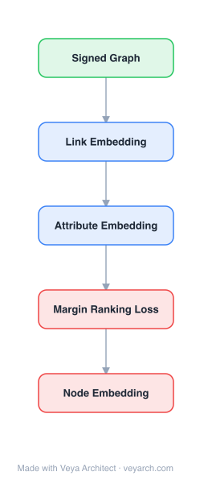

# Architecture: SNE (Signed Network Embedding)

## Motivation

Most network embedding algorithms are designed for **unsigned** social networks (only positive links). However, many real-world social networks contain both **positive and negative links** — Epinions has trust/distrust, Slashdot has friend/foe, and signed networks can be constructed from positive/negative user interactions. The availability of negative links causes fundamental problems: homophily effects and social influence principles used for unsigned networks are not directly applicable to signed networks, because negative links denote distrust or enmity rather than similarity. Existing unsigned methods (spectral analysis, t-SNE, DeepWalk, SDNE, TADW) all rely on the assumption that linked nodes should be similar — an assumption violated by negative links. Additionally, **node attributes** (user profiles, interests) provide complementary information to network structure and have proven effective for unsigned network embedding, but their utility for signed networks was unexplored. SNEA fills this gap by jointly modeling signed links and node attributes in a unified framework, leveraging both structural and attribute information for signed network embedding.

## Core Idea

Embedding for signed networks with positive and negative links using balance theory.

## Architecture

### Overview

<b>Layer-by-layer (5 nodes)</b>

| # | Layer | Type | Params |
|---|---|---|---|
| 1 | Signed Graph | `input` |  |
| 2 | Link Embedding | `embed` |  |
| 3 | Attribute Embedding | `embed` |  |
| 4 | Margin Ranking Loss | `loss` |  |
| 5 | Node Embedding | `output` |  |

SNEA (Signed Network Embedding with Attributes) is a unified framework that jointly models signed network structure and node attributes for learning low-dimensional node representations. The architecture is built on two key empirical findings from the paper: (1) users connected by positive links tend to have more similar attributes than those connected by negative links, and (2) attribute similarity follows a consistent ordering: positive-linked > unlinked > negative-linked. SNEA leverages these findings by embedding both signed links and attributes into a shared low-dimensional space where: (a) nodes connected by positive links are pulled together, (b) nodes connected by negative links are pushed apart, and (c) nodes with similar attributes are pulled together. The framework uses an energy-based embedding objective with margin-based ranking constraints derived from signed social theory (balance theory), optimized via gradient descent.

### Components

1. **Link Embedding Component** — Models signed link structure:
   - For each node pair (i, j) with a positive link: minimize ‖x_i − x_j‖² (pull together)
   - For each node pair (i, j) with a negative link: maximize ‖x_i − x_j‖² (push apart)
   - Uses margin-based ranking: positive-linked pairs should be closer than negative-linked pairs by a margin
   - Encodes structural balance theory: a friend's friend is a friend, a friend's enemy is an enemy

2. **Attribute Embedding Component** — Models node attribute similarity:
   - Node attributes (user profiles, interests) are encoded as feature vectors
   - Nodes with similar attributes should have similar embeddings
   - Attribute similarity is modeled via a transformation of attribute features into the embedding space
   - Provides complementary information when links are sparse or noisy

3. **Unified Embedding Objective** — Joint optimization:
   - Combines link-based and attribute-based objectives:
   - L = L_link + λ · L_attribute
   - L_link: margin-based loss enforcing signed link constraints (positive pairs closer than negative pairs)
   - L_attribute: loss enforcing attribute similarity in embedding space
   - λ balances the contribution of structure vs. attributes
   - Optimized via stochastic gradient descent

4. **Balance Theory Constraints** — Theoretical foundation:
   - Based on structural balance theory: in balanced signed networks, triangles with an odd number of negative edges are unstable
   - "A friend's friend is a friend; a friend's enemy is an enemy; an enemy's enemy is a friend"
   - These constraints are encoded as margin-based ranking constraints in the embedding objective
   - Ensures the learned embeddings respect signed social theory

### Data Flow

1. **Input:** Signed network G = (V, E+, E−) with positive links E+ and negative links E−, and node attribute matrix A ∈ ℝ^(N×D)
2. **Attribute Processing:** Transform node attributes into initial embedding features (e.g., via a linear or neural transform)
3. **Link Constraint Application:** For each positive link (i,j), enforce ‖x_i − x_j‖² < m_pos; for each negative link, enforce ‖x_i − x_j‖² > m_neg (margins)
4. **Attribute Constraint Application:** For each node pair with similar attributes, enforce embedding proximity
5. **Joint Optimization:** Minimize the unified loss L = L_link + λ · L_attribute via SGD, updating node embeddings to satisfy both link and attribute constraints
6. **Output:** Low-dimensional node embeddings X ∈ ℝ^(N×d) where positive-linked nodes are close, negative-linked nodes are far apart, and attribute-similar nodes are close

### State / Memory

- **No recurrent state:** SNEA is a feedforward embedding model trained via SGD; no temporal memory mechanism.
- **Learned parameters:** The node embedding matrix X ∈ ℝ^(N×d) and the attribute transform parameters are the persistent learned state.
- **Transductive:** Embeddings are learned per-node; new nodes require retraining (no inductive mapping function).

## Design Decisions

1. **Margin-based ranking for signed links** — Rather than using a simple distance-based loss, SNEA uses margin-based constraints: positive-linked pairs must be closer than a margin, negative-linked pairs must be farther than a different margin. This directly encodes the signed nature of links and is more principled than treating negative links as simple repulsion.

2. **Joint attribute and link modeling** — SNEA jointly optimizes link-based and attribute-based objectives in a unified framework, rather than using a two-stage pipeline (embed then incorporate attributes). This allows the two information sources to mutually reinforce: attributes help disambiguate when link structure is ambiguous, and links help calibrate attribute-based similarity.

3. **Balance theory foundation** — The link constraints are grounded in structural balance theory, providing a principled theoretical basis rather than ad-hoc heuristics. This ensures the embeddings respect the known properties of signed social networks.

4. **Empirical attribute-link relationship** — The framework is motivated by empirical analysis showing that attribute similarity follows a consistent ordering (positive > unlinked > negative). This data-driven justification ensures the attribute component is grounded in observed network properties, not just assumed.

5. **Transductive embedding** — Like most NRL methods of its era, SNEA learns per-node embeddings directly. This is simpler than learning a mapping function but limits generalization to new nodes.

## Evolution

**Predecessors:**
- **DeepWalk** (Perozzi et al., 2014) — Skip-gram on random walks; unsigned only, cannot handle negative links.
- **LINE** (Tang et al., 2015) — First/second-order proximity; unsigned only.
- **Spectral clustering** (Tang & Liu, 2011) — Laplacian eigenvectors; unsigned, relies on homophily.
- **SDNE** (Wang et al., 2016) — Deep autoencoder for network embedding; unsigned only.
- **TADW** (Yang et al., 2015) — Text-attributed DeepWalk; unsigned, shallow attribute incorporation.
- **Signed network analysis** (Leskovec et al., 2010; Kunegis et al., 2009) — Balance theory and signed link properties; not embedding.

**Successors:**
- **SIDE** (Kim et al., 2018) — Signed network embedding via directed random walks.
- **SGCN** (Li et al., 2020) — Signed graph convolutional networks extending GCN to signed graphs.
- **SIGNet** (Kim et al., 2020) — Scalable signed network embedding with feature learning.
- **SNEA-inspired attributed signed embedding** — Various extensions incorporating richer attribute types and deeper models.

## Characteristics

| Property | Value |
|----------|-------|
| Year | 2017 |
| Authors | Wang, Aggarwal, Tang, Liu (Arizona State University, IBM Research, Michigan State University) |
| Category | GNN/Embedding |
| Source Paper | `A_ributed_Signed_Network_Embedding_Wang_Aggarwal_Tang_etal_2017.md` |
| PaperVault Path | `GNN/02-network-embedding/A_ributed_Signed_Network_Embedding_Wang_Aggarwal_Tang_etal_2017.md` |

## Limitations

1. **Transductive** — SNEA learns per-node embeddings and cannot generate embeddings for unseen nodes without retraining. New nodes joining the network require full re-optimization.
2. **Margin hyperparameter sensitivity** — The margin-based loss requires tuning the positive and negative margins (m_pos, m_neg), which may vary across datasets and require cross-validation.
3. **Attribute quality dependence** — The attribute component assumes that attributes are correlated with link signs (homophily). If attributes are noisy or uncorrelated with link polarity, the attribute component may not help or may introduce noise.
4. **Scalability** — The margin-based ranking constraints require processing all positive and negative link pairs, which can be expensive for large networks with many links.
5. **No deep architecture** — SNEA uses a shallow embedding model (direct vector optimization), not a deep neural network. It cannot capture complex nonlinear relationships between attributes and links that deep models (e.g., autoencoders) might.
6. **Balance theory assumption** — The framework assumes structural balance theory holds. Real-world signed networks may violate balance theory (e.g., unbalanced triangles are common), potentially limiting the approach's effectiveness.

## Implementation Notes

See `implementation/` for a minimal runnable implementation.

## Information Layers

- **Evidence:** Source paper available in `references/papers/` (Wang, Aggarwal, Tang, Liu, 2017, "Attributed Signed Network Embedding," CIKM '17)
- **Analysis:** SNEA's key contribution is being among the first to jointly model signed links and node attributes for network embedding. The empirical analysis of attribute-link relationships (positive > unlinked > negative similarity) provides a data-driven foundation that justifies the attribute component. The margin-based ranking approach is a principled way to encode signed link constraints, directly grounded in structural balance theory. The main limitation is the shallow architecture — the joint optimization is a direct vector embedding, not a learned mapping function, which limits expressiveness and inductive capability. Later signed network methods (SGCN, SIGNet) would incorporate deeper architectures and GNN frameworks, but SNEA's core insight — that attributes and signed links should be jointly modeled with balance-theoretic constraints — remains influential.
- **Hypothesis:** The effectiveness of attribute incorporation in signed networks implies that attributes serve as a "bridge" for understanding link polarity — users with similar interests are more likely to trust each other, and dissimilar interests may predict distrust. This suggests that signed network structure is not purely topological but is deeply connected to node-level properties. The balance theory assumption's partial success (improvements but not perfect) suggests that real-world signed networks exist in a "mostly balanced" regime with a non-trivial fraction of unbalanced structures — a property that future methods could exploit by modeling balance violations explicitly.
