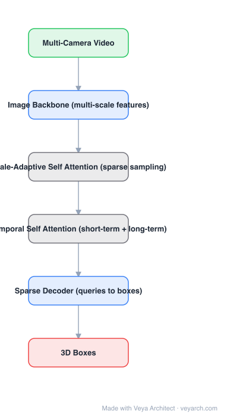

# Architecture: SparseBEV

## Motivation

BEV-based multi-camera 3D detectors build a dense bird's-eye feature grid — most of which is empty road — and pay for all of it: view transformation, depth estimation, and temporal accumulation all happen over the grid. SparseBEV asks whether the whole pipeline can be **fully sparse**: let queries sample the few 3D locations that matter and fuse across scales and time there.

## Core Idea

**Fully sparse detection**: a set of queries samples sparse points in 3D space, projects them onto multi-scale image features, and aggregates them with **scale-adaptive self attention**; a **temporal self attention** module fuses short-term and long-term history from the same sampled locations. A depth distribution is predicted only to tell the sampler *where* informative features are.

## Architecture

### Overview

<b>Layer-by-layer (6 nodes)</b>

| # | Layer | Type | Params |
|---|---|---|---|
| 1 | Multi-Camera Video | `input` |  |
| 2 | Image Backbone (multi-scale features) | `conv2d` |  |
| 3 | Scale-Adaptive Self Attention (sparse sampling) | `custom` |  |
| 4 | Temporal Self Attention (short-term + long-term) | `custom` |  |
| 5 | Sparse Decoder (queries to boxes) | `attention` |  |
| 6 | 3D Boxes | `output` |  |

### Components

1. **Image backbone (multi-scale)** — standard CNN features from all cameras; no view transformation into a dense BEV map.
2. **Scale-adaptive self attention** — each query learns its own sampling offsets and scale weights, so multi-scale aggregation happens at a handful of sampled points rather than exhaustively.
3. **Temporal self attention** — two streams: **short-term** (adjacent frames, motion detail) and **long-term** (distant history, context), both sampled sparsely.
4. **Depth-distribution guidance** — a depth branch predicts where surfaces are, concentrating samples on informative locations instead of empty space.
5. **Sparse decoder** — queries are refined over layers into 3D boxes and classes.
6. **Sampling-based fusion** — throughout, features are gathered from sampled locations; nothing dense is materialized.

### Data Flow

Multi-camera video → multi-scale image features → queries sample 3D points (guided by depth distribution) → scale-adaptive self attention → temporal self attention (short + long term) → sparse decoder → 3D boxes.

### State / Memory

Sampled features from previous frames (short-term and long-term buffers) are the temporal state; they are stored per-query, not as a grid.

## Design Decisions

- **Sparse everywhere** — no dense BEV feature, no dense depth volume; the cost scales with queries and samples.
- **Adaptive sampling instead of fixed grids** — learnable offsets per query replace exhaustive multi-scale search.
- **Split temporal streams** — short-term gives motion, long-term gives context; fusing them explicitly beats a single history window.
- **Depth as a sampling prior** — predict depth only to decide where to look, not to build geometry.

## Evolution

- **LSS / BEVDepth / BEVFormer** (predecessors/contrast): dense view transformation into BEV.
- **DETR3D / PETR** (query-based, sparse-ish): sampling-based detection, weaker temporal modeling.
- **SparseBEV (2023)**: fully sparse + scale-adaptive and temporal self attention.
- **Siblings**: StreamPETR (object-query memory queue), Sparse4D (recurrent sparse sampling).
- **Trend**: the field moved from dense BEV grids to query/space sampling.

## Characteristics

| Property | Value |
|---|---|
| Task | multi-camera 3D object detection |
| Feature space | none dense — queries sample 3D points |
| Attention | scale-adaptive self attention + temporal self attention |
| Temporal | short-term + long-term streams |
| Depth | predicted distribution used to guide sampling |
| Output | 3D boxes |

## Limitations

- Sparse sampling can miss small or distant objects if the sampler puts no points on them.
- Depth-distribution guidance is itself learned and can be wrong, which biases sampling.
- Accuracy on nuScenes-class benchmarks is competitive but generally below the best dense methods at the highest compute budgets.
- Temporal buffers still cost memory per query when many historical frames are kept.

## Implementation Notes

Essentials: (1) do not materialize a BEV grid anywhere in the pipeline — that is the identity of the method, (2) implement per-query adaptive sampling offsets over multi-scale features, (3) keep separate short-term and long-term feature buffers and fuse them in temporal self attention, (4) train a depth distribution head only as a sampling prior, (5) tune the number of sampled points per query: it is the accuracy/latency knob that replaces BEV resolution.
