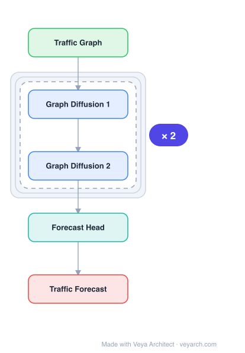

# Architecture: ST-GDN

## Motivation

The paper addresses **citywide traffic flow forecasting** — predicting future traffic volume (inflow and outflow) across geographical regions of a city from past observations. Two key limitations exist in prior spatio-temporal forecasting models: (1) **Local-only spatial modeling** — most methods (CNN+RNN combinations) capture only correlations among spatially adjacent regions, ignoring global cross-region dependencies. For example, two areas with similar urban functions (e.g., shopping zones, transportation hubs) may be highly correlated in traffic distribution despite being geographically distant. (2) **Single-resolution temporal modeling** — traffic patterns are multi-periodic (hourly, daily, weekly) and current recurrent neural network approaches capture only short-term, smooth dynamics, struggling with high-order multi-dimensional time horizons.

ST-GDN fills this gap with a **hierarchically structured graph neural architecture** that learns both local geographical dependencies and global spatial semantics jointly, combined with a **multi-scale attention network** that captures multi-level temporal dynamics across different time resolutions.

## Core Idea

Spatio-temporal graph diffusion network for traffic forecasting with dynamic graph learning.

## Architecture

### Overview

<b>Layer-by-layer (5 nodes)</b>

| # | Layer | Type | Params |
|---|---|---|---|
| 1 | Traffic Graph | `input` |  |
| 2 | Graph Diffusion 1 | `gcn_conv` |  |
| 3 | Graph Diffusion 2 | `gcn_conv` |  |
| 4 | Forecast Head | `linear` |  |
| 5 | Traffic Forecast | `output` |  |

ST-GDN (Spatial-Temporal Graph Diffusion Network) is a hierarchical spatio-temporal framework. On the temporal side, a **multi-scale self-attention network** encodes traffic variation patterns at multiple resolutions (hourly, daily, weekly) into resolution-aware latent representations, which are then fused by a **temporal hierarchy aggregation layer**. On the spatial side, a **hierarchical graph neural network** combines a graph attention network (for local region-wise dependencies) with a convolution-based graph diffusion mechanism (for global cross-region dependencies), capturing spatial semantics from local to global perspectives.

### Components

- **Multi-scale self-attention network (temporal):** For each temporal resolution `p ∈ {hour, day, week}`, generates resolution-aware traffic series and encodes them using scaled dot-product attention with learned query/key/value matrices. This captures multi-grained temporal dynamics that are complementary across resolutions.
- **Temporal hierarchy aggregation layer:** Fuses the multi-resolution temporal representations by modeling underlying dependencies across different granularity levels, producing a unified temporal embedding per region that encodes multi-level contextual signals.
- **Hierarchical graph neural network (spatial):** Combines two mechanisms:
  - **Graph attention network (GAT):** Captures local region-wise geographical dependencies by learning attention weights over spatially adjacent neighbors.
  - **Convolution-based graph diffusion mechanism:** Captures global cross-region dependencies by propagating information through a diffusion process over the graph, reaching distant regions that share functional similarity even without geographical proximity.
- **Region embeddings:** Each region is initialized with a learnable embedding, enabling the attention and graph modules to distinguish regions by their functional and spatial characteristics.

### Data Flow

1. **Input:** Traffic flow tensors `X^α, X^β ∈ R^(I×J×T)` for incoming and outgoing traffic across a city grid of `I×J` regions over T time slots.
2. **Multi-resolution temporal encoding:** For each resolution `p`, generate resolution-aware series and encode via self-attention, producing resolution-aware hidden representations `Y^p` for each region.
3. **Temporal hierarchy aggregation:** Fuse multi-resolution representations into unified temporal embeddings per region.
4. **Hierarchical graph diffusion (spatial):** Apply GAT for local neighborhood dependencies and graph diffusion for global cross-region dependencies over the region graph.
5. **Output:** A predictive function infers future traffic volume for each region.

### State / Memory

Stateless at inference. The region embeddings and attention/graph parameters are learned state. There is no recurrent hidden state; temporal dynamics are captured via the self-attention mechanism and multi-resolution sampling rather than sequential recurrence. The multi-scale design encodes temporal memory implicitly through different resolution views of the same history.

## Design Decisions

- **Local + global spatial modeling:** Combining GAT (local) with graph diffusion (global) addresses the limitation of prior methods that only model geographically adjacent regions, enabling the model to capture functionally similar but spatially distant correlations.
- **Multi-resolution temporal attention:** Using separate self-attention networks for hourly, daily, and weekly resolutions captures the multi-periodic nature of traffic patterns that single-resolution RNNs miss. The aggregation layer ensures complementary information is fused.
- **Self-attention over RNN for temporal modeling:** Chosen because RNNs struggle with long-range and multi-dimensional temporal dynamics; attention can directly access any historical time step across resolutions.
- **Grid-based region partition:** The city is partitioned into a regular `I×J` grid, providing a uniform spatial unit for both inflow and outflow prediction.

## Evolution

**Predecessors:**
- STGCN (Yu et al., 2017) — spatio-temporal GCN for traffic; local spatial only.
- DCRNN (Li et al., 2018) — diffusion convolutional RNN; local spatial.
- Graph WaveNet (Wu et al., 2019) — adaptive adjacency + dilated convolution.
- MTGNN (Wu et al., 2020) — learned graph + temporal convolution.

**Successors:**
- Further hierarchical spatio-temporal graph models incorporating multi-scale temporal and global-local spatial paradigms.
- Models integrating semantic/functional region similarity into graph structure learning.

## Characteristics

| Property | Value |
|----------|-------|
| Year | 2021 |
| Authors | Zhang et al. |
| Category | GNN/TimeSeries |
| Source Paper | `ST_GDN_Zhang_Huang_Xu_etal_2021.md` |
| PaperVault Path | `GNN/06-gnn-for-time-series/ST_GDN_Zhang_Huang_Xu_etal_2021.md` |

## Limitations

- **Grid-based partition rigidity:** The fixed `I×J` grid partition may not align with natural traffic zones or functional boundaries, potentially splitting or merging semantically distinct areas.
- **Multi-resolution requires domain knowledge:** Selecting appropriate temporal resolutions (hourly, daily, weekly) requires domain expertise and may not generalize to non-traffic domains.
- **Computational cost of hierarchical graph modules:** Running both GAT and graph diffusion adds overhead, especially for large city grids.
- **Static region embeddings:** Region embeddings are learned but fixed after training, not adapting to urban environment changes (e.g., new infrastructure, zoning changes).

## Implementation Notes

See `implementation/` for a minimal runnable implementation.

## Information Layers

- **Evidence:** Source paper available in `references/papers/`
- **Analysis:** ST-GDN's contribution is the explicit modeling of both local and global spatial dependencies alongside multi-resolution temporal dynamics. The insight that functionally similar but geographically distant regions are correlated — and that traffic patterns are inherently multi-periodic — motivates the hierarchical design. Combining GAT (local attention) with graph diffusion (global propagation) is a principled way to span both spatial scales.
- **Hypothesis:** The grid-based partition may be suboptimal compared to data-driven region delineation (e.g., from GPS traces or POI distributions). The fixed set of temporal resolutions may miss intermediate or domain-specific periodicities. Dynamic adaptation of the region graph to reflect changing urban semantics could improve long-term deployment robustness.
