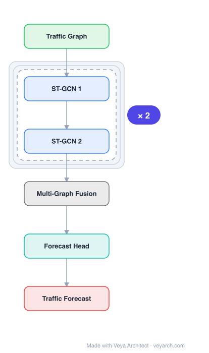

# Architecture: ST-MGCN

## Motivation

The paper addresses **region-level ride-hailing demand forecasting** — predicting future demand across regions of a city from historical observations, a task essential for vehicle dispatching, utilization improvement, and congestion mitigation. Prior deep learning approaches (CNN+RNN combinations) focus on modeling **Euclidean correlations among spatially adjacent regions** but overlook **non-Euclidean pair-wise correlations** among possibly distant regions that are critical for accurate forecasting. For example, a region near schools and hospitals may correlate with a distant region that also has schools and hospitals (functional similarity), and regions connected by highways may have direct traffic dependencies regardless of distance. Additionally, existing RNN-based temporal models process each region independently or with only local information, missing the value of **global contextual information** (e.g., a city-wide demand increase signaling an event affecting future demand).

ST-MGCN fills this gap by encoding non-Euclidean pair-wise correlations among regions into **multiple semantic graphs** and explicitly modeling them via multi-graph convolution, combined with a **contextual gated recurrent neural network (CGRNN)** that augments RNNs with a global-context-aware gating mechanism.

## Core Idea

Spatio-temporal multi-graph convolutional network for ride-hailing demand forecasting.

## Architecture

### Overview

<b>Layer-by-layer (6 nodes)</b>

| # | Layer | Type | Params |
|---|---|---|---|
| 1 | Traffic Graph | `input` |  |
| 2 | ST-GCN 1 | `gcn_conv` |  |
| 3 | ST-GCN 2 | `gcn_conv` |  |
| 4 | Multi-Graph Fusion | `custom` |  |
| 5 | Forecast Head | `linear` |  |
| 6 | Traffic Forecast | `output` |  |

ST-MGCN (Spatiotemporal Multi-Graph Convolution Network) is a two-branch spatio-temporal architecture. The spatial branch encodes non-Euclidean pair-wise region correlations into multiple graphs (neighborhood, functionality, transportation connectivity) and applies **multi-graph convolution** to aggregate information from related regions across all graph views simultaneously. The temporal branch uses a **contextual gated RNN (CGRNN)** that augments a standard RNN with a gating mechanism computed from summarized global information, re-weighting historical observations based on global context. The two branches are combined for final demand prediction.

### Components

- **Multi-graph encoding:** Three types of non-Euclidean correlations are encoded as separate graphs:
  - **Neighbor graph:** Geographic proximity (spatially adjacent regions).
  - **Functionality graph:** Regions sharing similar contextual environments (e.g., both near schools, hospitals, shopping zones).
  - **Transportation connectivity graph:** Regions connected via transportation infrastructure (e.g., highways, transit lines).
- **Multi-graph convolution:** Applies graph convolution over each graph view and fuses the results, explicitly aggregating features from related regions across all correlation types. Unlike graph-embedding approaches that use graph structure only as constant features, multi-graph convolution uses demand values from related regions directly.
- **Contextual Gated RNN (CGRNN):** Augments a standard RNN with a gating mechanism. The gate is computed from a summary of global information (e.g., aggregated demand across all regions), and re-weights historical observations at different timestamps — allowing the model to emphasize or de-emphasize past observations based on the current global context.
- **Fusion layer:** Combines the spatial (multi-graph convolution) and temporal (CGRNN) representations for final prediction.

### Data Flow

1. **Input:** Historical ride-hailing demand across regions over T time slots.
2. **Multi-graph construction:** Build neighborhood, functionality, and transportation connectivity graphs encoding different non-Euclidean pair-wise correlations.
3. **Multi-graph convolution (spatial):** For each time step, apply graph convolution over all three graphs and fuse the aggregated features, capturing cross-region dependencies from multiple perspectives.
4. **CGRNN (temporal):** Process the spatially-aggregated sequence through a gated RNN where gates are computed from global context summaries, re-weighting historical observations.
5. **Output:** A fusion layer combines spatial and temporal features to predict future demand per region.

### State / Memory

The CGRNN maintains a recurrent hidden state across time steps, augmented by the contextual gate computed from global information at each step. The multi-graph structures are pre-computed and fixed (not learned during training). The recurrent state provides temporal memory; the global context gate provides adaptive modulation of that memory.

## Design Decisions

- **Multiple semantic graphs over a single graph:** Different types of region correlations (geographic, functional, transportation) are captured by separate graphs, allowing the model to distinguish and combine different relationship types rather than conflating them.
- **Multi-graph convolution over graph embedding:** Unlike DMVST-Net (Yao et al., 2018) which uses graph structure only as constant external features, ST-MGCN uses graph convolution to aggregate actual demand values from related regions — a more expressive use of relational structure.
- **Contextual gating in RNN:** Standard RNNs process each region independently; the contextual gate injects global information (e.g., city-wide demand trends) to re-weight historical observations, addressing the limitation of local-only temporal modeling.
- **Non-Euclidean structure for region-based prediction:** Even though regions form a grid (Euclidean), the pair-wise relationships are non-Euclidean (functional similarity, transportation connectivity), making graph convolution more appropriate than CNN.

## Evolution

**Predecessors:**
- STGCN (Yu et al., 2017), DCRNN (Li et al., 2018) — spatio-temporal GCN/RNN for traffic; single graph, Euclidean focus.
- DMVST-Net (Yao et al., 2018) — graph embedding as external features for taxi demand; does not use graph convolution.
- FCL-ConvLSTM (Shi et al., 2015) — CNN+RNN for precipitation; Euclidean spatial.

**Successors:**
- MTGNN (Wu et al., 2020) — learned adjacency + multi-module framework.
- Models incorporating multi-view graph structures and contextual gating for spatio-temporal forecasting.
- Graph attention-based approaches that learn dynamic edge weights for multi-graph fusion.

## Characteristics

| Property | Value |
|----------|-------|
| Year | 2019 |
| Authors | Geng et al. |
| Category | GNN/TimeSeries |
| Source Paper | `ST_MGCN_Geng_Zhang_Yang_etal_2019.md` |
| PaperVault Path | `GNN/06-gnn-for-time-series/ST_MGCN_Geng_Zhang_Yang_etal_2019.md` |

## Limitations

- **Pre-defined graphs:** The three graph types (neighborhood, functionality, transportation) are constructed from domain knowledge, not learned from data; this limits adaptability to domains where the relevant correlation types are unknown.
- **Fixed graph fusion:** The multi-graph convolution fuses graph views with fixed or simply-learned weights, not dynamically attending to which correlation type is most relevant at each time step.
- **CGRNN still inherits RNN limitations:** The contextual gate helps but the underlying RNN still faces gradient issues on very long sequences.
- **Domain-specific graph construction:** The functionality and transportation graphs require external data (POI distributions, road networks) that may not be available in all cities or domains.

## Implementation Notes

See `implementation/` for a minimal runnable implementation.

## Information Layers

- **Evidence:** Source paper available in `references/papers/`
- **Analysis:** ST-MGCN's key insight is that ride-hailing demand correlations are inherently non-Euclidean — regions relate through functional similarity and transportation connectivity, not just geographic distance. Encoding these as multiple graphs and applying graph convolution (rather than mere embedding) is a principled way to capture and aggregate cross-region dependencies. The contextual gated RNN addresses a real limitation of independent per-region temporal modeling.
- **Hypothesis:** The pre-defined graph types may miss latent correlation structures that data-driven graph learning (as in MTGNN) could discover. Dynamic, attention-based multi-graph fusion could improve over fixed fusion by adapting which correlation type matters at different times. The reliance on domain-specific external data for graph construction limits transferability.
