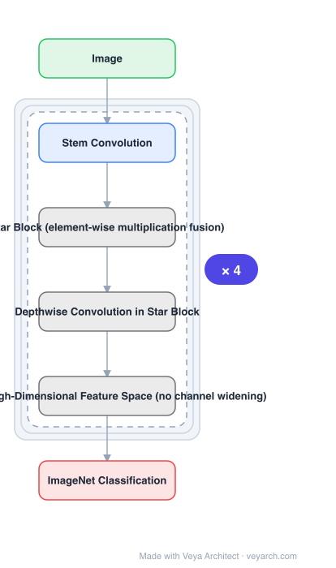

# Architecture: StarNet

## Motivation

Networks using **star operations** (element-wise multiplication) had been showing strong performance, but the explanations offered were intuitive or high-level. Without knowing *why* the operation works, it cannot be applied deliberately — and in particular it was unclear whether it helps efficient networks or only large ones.

## Core Idea

Rewrite and reformulate the star operation to show what it does: it maps inputs into an **exceedingly high-dimensional, non-linear feature space**, behaving like a **polynomial kernel** that multiplies features across distinct channels. A single star operation yields roughly (d/√2)² linearly independent dimensions, and stacked layers increase implicit dimensionality exponentially — so a **compact** feature space behaves as if it were very wide. StarNet is the deliberately plain proof-of-concept network built on that insight.

## Architecture

### Overview

<b>Layer-by-layer (6 nodes)</b>

| # | Layer | Type | Params |
|---|---|---|---|
| 1 | Image | `input` |  |
| 2 | Stem Convolution | `conv2d` |  |
| 3 | Star Block (element-wise multiplication fusion) | `custom` |  |
| 4 | Depthwise Convolution in Star Block | `custom` |  |
| 5 | Implicit High-Dimensional Feature Space (no channel widening) | `custom` |  |
| 6 | ImageNet Classification | `output` |  |

### Components

1. **Star operation analysis** — the theoretical contribution: rewriting the operation to expose the high-dimensional implicit feature space, and showing it is distinct from simply increasing network width (channel number), and analogous to polynomial kernels.
2. **Layer-wise exponential growth** — each stacked layer contributes an exponential increase in implicit dimensional complexity; a few layers reach nearly infinite dimensions within a compact feature space.
3. **StarNet** — the proof-of-concept network: concise, no sophisticated designs, no fine-tuned hyper-parameters.
4. **Star block** — the network's building block, combining the star operation with depthwise convolution.

### Data Flow

Image → stem convolution → stacked star blocks (depthwise convolution, then element-wise multiplication of two branches) → classification head. The multiplication is what lifts the representation into the implicit high-dimensional space.

### State / Memory

No recurrent state. The implicit high-dimensional space is a property of the activation, not a stored tensor — the network stays compact in memory.

## Design Decisions

- **Explain before designing** — the paper's order is: analyze the star operation, *then* infer it should suit compact networks, *then* build StarNet to validate.
- **Keep the network deliberately plain** — no sophisticated designs or tuned hyper-parameters, so the measured gain is attributable to the operation.
- **Implicit width instead of explicit width** — the mechanism is meant to replace increasing channel count, which is the standard way to add capacity.
- **Compare against carefully designed efficient models** — MobileNetV3, EdgeViT, FasterNet — to show a simple network can beat searched/tuned ones.

## Evolution

- **Kernel methods** (the conceptual predecessor): polynomial kernels, pairwise feature multiplication.
- **MobileNetV3, EdgeViT, FasterNet** (contrast): efficient models that StarNet is benchmarked against.
- **StarNet (2024)**: star operation as implicit high-dimensional mapping, validated on a minimal network.
- **Siblings**: MobileNetV4, RepViT, EfficientViT.
- **Contrast**: networks that gain capacity by increasing channel width.

## Characteristics

| Property | Value |
|---|---|
| Task | efficient image classification |
| Core operation | star operation (element-wise multiplication) |
| Mechanism | implicit high-dimensional non-linear feature space, kernel-like |
| Implicit dims | ≈(d/√2)² linearly independent dims per operation |
| Design | deliberately plain, no tuned hyper-parameters |
| Result | StarNet-S4 beats EdgeViT-XS by 0.9% top-1, 3× faster on iPhone13/CPU, 2× on GPU |

## Limitations

- Proof-of-concept scale: the network is intentionally minimal, so absolute accuracy is below heavily engineered models.
- The analysis is for the star operation in general; how it composes with attention or other mechanisms is not the subject.
- Benefits are argued to favour compact over large models, so gains may not transfer to large-scale backbones.
- Evaluated mainly on ImageNet-1K classification.

## Implementation Notes

Essentials: (1) implement the element-wise multiplication of two branches as the core of the block — do not replace it with concatenation plus convolution, which loses the mechanism, (2) keep width compact: the point is implicit dimensionality at small channel counts, and widening defeats the efficiency argument, (3) do not add architectural complexity or tuned hyper-parameters when reproducing; the comparison against searched models is only meaningful if StarNet stays plain, (4) stack several star blocks, since the exponential dimensional growth comes from layer stacking, (5) measure on-device (iPhone13, CPU, GPU) rather than FLOPs — the speedup claim is about real latency.
