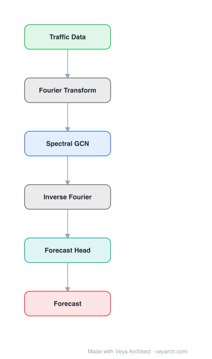

# Architecture: StemGNN

## Motivation

The paper addresses **multivariate time series forecasting**, where both intra-series temporal patterns (how a single series evolves over time) and inter-series correlations (how different series relate to each other) must be modeled jointly. Prior approaches face two key shortcomings: (1) they capture temporal correlations only in the **time domain** (e.g., LSTM, GRU, TCN), missing the cleaner patterns available in the frequency/spectral domain; (2) they rely on **pre-defined inter-series relationship topologies** (e.g., adjacency from road networks), which are unavailable for most multivariate time series and may not reflect true dependencies.

StemGNN fills this gap by proposing the first model that represents **both intra-series and inter-series correlations jointly in the spectral domain**. It combines Graph Fourier Transform (GFT) — which models inter-series structural correlations — with Discrete Fourier Transform (DFT) — which models temporal dependencies — within a single end-to-end framework. The intuition is that after applying GFT and DFT, spectral representations hold clearer, more separable patterns that can be predicted more effectively by convolution and sequential learning modules. Additionally, a latent correlation layer learns the inter-series graph automatically from data, eliminating the need for pre-defined priors.

## Core Idea

Spatio-temporal GNN using spectral graph convolution + temporal learning for multivariate forecasting.

## Architecture

### Overview

<b>Layer-by-layer (6 nodes)</b>

| # | Layer | Type | Params |
|---|---|---|---|
| 1 | Traffic Data | `input` |  |
| 2 | Fourier Transform | `custom` |  |
| 3 | Spectral GCN | `gcn_conv` |  |
| 4 | Inverse Fourier | `custom` |  |
| 5 | Forecast Head | `linear` |  |
| 6 | Forecast | `output` |  |

StemGNN (Spectral Temporal Graph Neural Network) processes multivariate time series entirely in the spectral domain. The pipeline consists of: (1) a **latent correlation layer** that learns the inter-series adjacency matrix from data; (2) **StemGNN blocks** — the core technical contribution — each of which applies Graph Fourier Transform (GFT) to decompose multivariate inputs into orthogonal inter-series components, then Discrete Fourier Transform (DFT) to convert each resulting univariate series into the frequency domain, applies convolution and sequential learning (Spe-Seq Cell) in the spectral domain, and inverts both transforms (IDFT, IGFT) to return to the time/series domain; (3) **forecast and backcast output modules** with a shared encoder. Multiple StemGNN blocks can be stacked with residual connections.

### Components

- **Latent correlation layer:** Learns the inter-series adjacency matrix `W` automatically from the input data using a self-attention mechanism over learned node embeddings, without requiring a pre-defined topology. The learned graph has been shown to be interpretable and to outperform human-defined structures.
- **Graph Fourier Transform (GFT):** Given the learned adjacency, computes the graph Laplacian and its eigendecomposition. GFT transforms the multivariate input `X ∈ R^(N×T)` from the node (series) domain into the graph spectral domain, decomposing it into orthogonal inter-series components. This separates different trend directions among the series.
- **Discrete Fourier Transform (DFT):** Applied to each univariate spectral-series component after GFT, converting temporal patterns into the frequency domain. This exposes periodic and frequency-based structures that are harder to model in the time domain.
- **Spe-Seq Cell (spectral sequential cell):** A GLU-gated 1D convolution + sequential learning module operating in the spectral (frequency) domain. It captures patterns in the frequency representation using convolution and gating, then IDFT converts back to the time domain.
- **Inverse GFT (IGFT):** Maps the processed spectral representations back to the node domain, reconstructing the multivariate output.
- **Forecast and backcast modules:** Inspired by N-BEATS, the shared encoder produces both a forecast (future prediction) and a backcast (reconstruction of the input). The backcast residual is passed to the next StemGNN block, enabling hierarchical decomposition.

### Data Flow

1. **Input:** Multivariate time series `X ∈ R^(N×T)` where N is the number of series and T is the time window.
2. **Latent correlation layer:** Learns adjacency `W ∈ R^(N×N)` from the input via attention over embeddings.
3. **GFT:** Transforms `X` into the graph spectral domain using eigenvectors of the learned graph Laplacian, yielding orthogonal inter-series components.
4. **DFT:** Converts each spectral component from the time domain to the frequency domain.
5. **Spe-Seq Cell:** Applies GLU-gated 1D convolution and sequential modeling in the frequency domain to capture spectral patterns.
6. **IDFT:** Converts the processed frequency representation back to the time domain.
7. **IGFT:** Maps back from the graph spectral domain to the node (series) domain.
8. **Output:** The forecast module produces future predictions; the backcast module reconstructs the input, and its residual feeds the next StemGNN block.
9. **Training:** End-to-end with combined forecast loss and backcast loss across stacked blocks.

### State / Memory

Stateless at inference. The learned adjacency matrix is recomputed from the latent correlation layer at each forward pass. There is no recurrent hidden state; the Spe-Seq Cell uses gated convolutions rather than memory-augmented recurrence. The stacked block structure with backcast residuals provides a form of progressive decomposition rather than stateful memory.

## Design Decisions

- **Joint spectral domain modeling (GFT + DFT):** The key insight is that inter-series and intra-series patterns both have clearer structure in the spectral domain. Applying GFT first separates inter-series trends, then DFT exposes temporal frequency components — making patterns more predictable than in the time domain alone.
- **Data-driven graph learning (no pre-defined topology):** The latent correlation layer eliminates the need for prior domain knowledge, making StemGNN general for all multivariate time series. Experiments showed the learned graph is interpretable and outperforms human-defined structures.
- **Backcast + forecast with shared encoder (N-BEATS-inspired):** The backcast reconstructs the input and its residual is passed forward, enabling each block to focus on patterns not captured by previous blocks — a hierarchical decomposition strategy.
- **GLU gating in the Spe-Seq Cell:** Gated linear units provide a learnable non-linearity that selectively passes frequency components, improving the model's ability to focus on predictive spectral features.

## Evolution

**Predecessors:**
- LSTNet (Lai et al., 2018) — CNN+RNN for multivariate time series; temporal only in time domain.
- DCRNN (Li et al., 2018) — diffusion convolutional RNN; requires pre-defined graph.
- Graph WaveNet (Wu et al., 2019) — adaptive adjacency + dilated causal convolution; temporal in time domain.
- N-BEATS (Oreshkin et al., 2019) — deep stack with backcast/forecast decomposition for univariate forecasting.
- SFM (State Frequency Memory, Zhang et al., 2017) — combines DFT with LSTM for stock prediction; univariate only.

**Successors:**
- MTGNN (Wu et al., 2020) — learned adjacency + mix-hop propagation + dilated inception; temporal in time domain.
- ST-GDN (Zhang et al., 2021) — hierarchical graph diffusion with multi-scale attention.
- Subsequent spectral-domain time series models built on the GFT+DFT decomposition paradigm.

## Characteristics

| Property | Value |
|----------|-------|
| Year | 2020 |
| Authors | Cao et al. |
| Category | GNN/TimeSeries |
| Source Paper | `StemGNN_NeurIPS_Cao_Wang_Duan_etal_2020.md` |
| PaperVault Path | `GNN/06-gnn-for-time-series/StemGNN_NeurIPS_Cao_Wang_Duan_etal_2020.md` |

## Limitations

- **Eigendecomposition cost:** GFT requires eigendecomposition of the graph Laplacian, which is `O(N³)` in the number of series, limiting scalability to very high-dimensional multivariate data.
- **Fixed learned graph:** The adjacency is learned per dataset and may not adapt to non-stationary inter-series relationships that change over time.
- **Spectral domain assumption:** The benefit of spectral representations assumes that temporal and inter-series patterns have clear frequency structure; for purely non-periodic or highly irregular patterns, the advantage may diminish.
- **Backcast overhead:** The backcast module adds computational cost and the residual stacking requires careful tuning of the number of blocks.
- **Limited to undirected graphs:** The GFT framework operates on symmetric Laplacians, restricting the model to undirected inter-series relationships.

## Implementation Notes

See `implementation/` for a minimal runnable implementation.

## Information Layers

- **Evidence:** Source paper available in `references/papers/`
- **Analysis:** StemGNN's elegance lies in moving both spatial and temporal modeling into the spectral domain, where patterns become more separable and predictable. The combination of GFT (inter-series) and DFT (intra-series) is a principled decomposition that leverages the complementary strengths of graph spectral theory and classical Fourier analysis. The data-driven latent correlation layer makes the model broadly applicable.
- **Hypothesis:** The eigendecomposition bottleneck may limit real-time or very-large-scale deployment. Approximate spectral methods (e.g., Chebyshev polynomial approximation) could reduce cost while retaining most of the benefit. The assumption that spectral representations are inherently more predictable may not hold for chaotic or regime-switching time series where no stable frequency structure exists.
