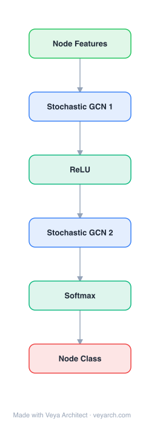

# Architecture: Stochastic GCN

## Motivation

Graph convolutional networks (GCNs, Kipf & Welling 2017) generalize CNNs to graph-structured data by applying the same linear transformation to all neighbors of a node, followed by mean pooling and a nonlinearity. Stacking multiple layers lets a node gather information from distant neighbors, but it also makes the receptive field of a single node grow exponentially with the number of layers — for a 2-layer GCN on the NELL dataset this already touches ~2.4% of all nodes for a single node's gradient. Because of this, the original GCN is trained by a batch algorithm that computes representations for all nodes at once, which is slow to converge and requires the entire graph to fit in GPU memory, ruling out large-scale datasets.

Neighbor sampling (NS, Hamilton et al. 2017a / GraphSAGE) is the initial attempt at stochastic GCN training: subsample `D(l)` neighbors at layer `l` to shrink the receptive field to `∏ D(l)`. But NS has no convergence guarantee (the gradient is biased due to the nonlinearity after the aggregation, unless `D(l)→∞`), and the receptive field is still in the hundreds (`D(1)D(2)=250` for the recommended settings) — far larger than an MLP's receptive field of 1. Importance sampling (FastGCN, Chen et al. 2018) subsamples the receptive field per layer but also only guarantees convergence as the sample size goes to infinity, and empirically works worse than NS because it can assign many neighbors to one node and none to another.

Stochastic GCN targets exactly this gap: a stochastic training algorithm with (i) a provable convergence guarantee to a local GCN optimum regardless of the neighbor sample size, (ii) exact zero-variance predictions at test time, and (iii) the ability to use an arbitrarily small sample size (the paper uses `D(l)=2`) while retaining model quality — bringing the per-epoch cost of GCN training down to that of an MLP.

## Core Idea

Stochastic training of GCNs with variance reduction for scalable large-graph learning.

## Architecture

### Overview

<b>Layer-by-layer (6 nodes)</b>

| # | Layer | Type | Params |
|---|---|---|---|
| 1 | Node Features | `input` |  |
| 2 | Stochastic GCN 1 | `gcn_conv` | sampling: controlled_variance |
| 3 | ReLU | `relu` |  |
| 4 | Stochastic GCN 2 | `gcn_conv` | sampling: controlled_variance |
| 5 | Softmax | `softmax` |  |
| 6 | Node Class | `output` |  |

Stochastic GCN is not a new network topology but a *training algorithm* for GCNs (and other neighbor-averaging models like GraphSAGE). It keeps the standard graph convolution layer `Z^(l+1) = P H^(l) W^(l)`, `H^(l+1) = σ(Z^(l+1))` intact, but replaces the exact neighbor averaging `(PH^(l))_u = Σ_{v∈n(u)} P_uv h_v^(l)` with a **control-variate (CV) estimator** that uses historical activations to drastically reduce the variance of the stochastic gradient.

The core idea: maintain a history `h̄_v^(l)` for each node `v` at each layer `l`. Decompose `h_v = Δh_v + h̄_v` where `Δh_v = h_v − h̄_v`. Apply Monte-Carlo (neighbor subsampling) only to the small `Δh_v` term, and compute the `h̄_v` term exactly (it does not need recursive evaluation). Because `Δh_v` is small when model weights change slowly, the CV estimator's variance is much smaller than NS's. As training converges, `h̄_v → h_v`, so `Δh_v → 0` and the variance vanishes — "variance elimination" rather than just reduction.

Two estimators are presented: **CV** (for models without dropout) and **CVD** (control variate for dropout, for models with dropout, which separates the mean and variance of the activation and maintains a historical *mean* `μ̄_v` rather than a historical activation). A preprocessing strategy (`PP`) computes `U^(0) = PX` once so the first graph convolution becomes a plain fully-connected layer, roughly halving the receptive field for the typical 2-layer GCN.

### Components

- **GCN backbone** — Standard graph convolution layers `Z^(l+1) = P H^(l) W^(l)`, `H^(l+1) = σ(Z^(l+1))`, where `P` is the normalized propagation matrix, `H^(0)=X` is the input feature matrix, and `W^(l)` are trainable weights. The algorithm is model-agnostic and also applies to GraphSAGE and other neighbor-averaging models.
- **Historical activation store `H̄^(l)`** — A persistent per-node, per-layer cache of recent activations `h̄_v^(l)` (or, for CVD, recent *mean* activations `μ̄_v^(l)`). This is the control variate. It is updated at the end of each iteration for every node in the current receptive field, and scanned across all nodes once per epoch so every node's history is refreshed.
- **CV estimator (Eq. 6)** — `Z^(l+1) = P̂^(l)(H^(l) − H̄^(l)) W^(l) + P H̄^(l) W^(l)`. The first term applies Monte-Carlo neighbor subsampling only to the residual `Δh`; the second term is computed exactly (no recursion needed).
- **CVD estimator** — Extends CV to handle dropout by separating each activation into a mean `μ_v` (computed by a parallel no-dropout copy of the model, the "CVD network") and a zero-mean residual `h̊_v = h_v − μ_v`. Maintains historical means `μ̄_v` and residuals `Δμ_v = μ_v − μ̄_v`. Unbiased and eventually has correct variance (both the dropout variance `VD` and the neighbor-sampling variance `VNS`, with `VNS → 0` as training converges).
- **Receptive field builder** — Constructs the per-minibatch computation graph: starting from `r^(L) = V_B`, recursively add `D(l)` random neighbors for each node in `r^(l+1)` to form `r^(l)`. Each node is always selected as a neighbor of itself.
- **Preprocessing (PP) strategy** — Precompute `U^(0) = P X` and use it as the new input, turning the first graph convolution into a plain fully-connected layer. For the typical 2-layer GCN this halves the receptive field and speeds up computation significantly.
- **Exact-testing routine** — At test time, with weights fixed, run CV forward propagation for `L` epochs; Theorem 1 guarantees the activations become exact (zero-variance) after `L` epochs, without loading the entire graph into memory.

### Data Flow

1. **Minibatch selection** — Randomly select a minibatch `V_B ⊂ V_L` of labeled nodes.
2. **Build receptive field** — From `r^(L) = V_B`, recursively add `D(l)` random neighbors per node to form `r^(l)` at each layer (each node always selected as its own neighbor). The result defines which `h_v^(l)` and `h̄_v^(l)` are needed for this minibatch.
3. **Forward (CV, Eq. 6)** — `Z^(l+1) = P̂^(l)(H^(l) − H̄^(l)) W^(l) + P H̄^(l) W^(l)`. The residual `(H − H̄)` is computed only for nodes in the receptive field via sampled neighbors; the `P H̄` term is computed exactly (no recursion). For CVD, additionally run a parallel no-dropout copy of the model to obtain mean activations `μ_v`, and use the three-term decomposition `h̊_v + Δμ_v + μ̄_v`.
4. **Predictions** — Forward propagation yields predictions `z_v^(L)` for the minibatch.
5. **Backward + SGD** — Backprop computes gradients; parameters updated by SGD with step size `γ = min{1/ρ, 1/√N}`. The framework (TensorFlow) handles steps 3–4 automatically.
6. **Update history** — For each `v ∈ r^(l)`, update `h̄_v^(l) ← h_v^(l)` (or `μ̄_v ← μ_v` for CVD). Each epoch scans all nodes (not just training nodes) so every node's history is refreshed at least once.
7. **Testing** — With weights fixed, run CV forward propagation for `L` epochs to obtain exact (zero-variance) predictions without loading the full graph into memory.

### State / Memory

Stochastic GCN is explicitly stateful — the historical activation store is the heart of the method.

- **Historical activations `H̄^(l)`** — A persistent per-node, per-layer cache. For CV it stores recent activations `h̄_v^(l)`; for CVD it stores recent *mean* activations `μ̄_v^(l)` (computed by a parallel no-dropout copy of the model). This cache is the control variate that makes the residual `Δh_v = h_v − h̄_v` small, and it is the mechanism by which variance vanishes as training converges (`Δh_v → 0`).
- **Per-epoch full scan** — In each epoch the vertex set is partitioned into minibatches, and *all* nodes (not just training nodes) are scanned so that every node's history is updated at least once per epoch. This is required for the convergence guarantee.
- **CVD network (parallel no-dropout model)** — For models with dropout, a separate copy of the model runs without dropout to produce mean activations `μ_v`; this is an additional stateful component maintained alongside the main model.
- **No recurrence within a forward pass** — The GCN layers themselves remain feed-forward; the "memory" is across training iterations, not within a single forward pass.

## Design Decisions

- **Control-variate formulation instead of plain neighbor sampling.** The key decision: maintain a historical activation `h̄_v` per node and apply Monte-Carlo subsampling only to the residual `Δh_v = h_v − h̄_v`. This decouples the estimator's variance from the activation magnitude (NS's dependence) and ties it to the *change* in activation, which vanishes as training converges. This is what enables `D(l)=2` to suffice.
- **Exact computation of the history term.** `Σ_{v∈n(u)} P_uv h̄_v` is computed exactly because `h̄_v` does not need recursive evaluation — only the residual is subsampled. This is the structural reason the estimator can be both cheap and low-variance.
- **Two estimators (CV and CVD).** CV assumes no dropout and uses `h̄_v` directly; CVD handles dropout by separating mean and variance, maintaining a historical *mean* `μ̄_v` and a parallel no-dropout model copy to produce `μ_v`. This split is necessary because with dropout `Δh_v` is not necessarily small even if `h̄_v` and `h_v` have the same distribution.
- **Preprocessing (PP) strategy.** Precompute `U^(0) = PX` so the first graph convolution becomes a fully-connected layer, reducing the effective number of graph convolution layers by one. For the typical 2-layer GCN this roughly halves the receptive field and is a significant speedup at almost no accuracy cost.
- **Dropout after neighbor averaging.** The authors adopt `Z^(l+1) = Dropout(P H^(l) W^(l))` rather than Kipf & Welling's `Z^(l+1) = P Dropout(H^(l)) W^(l)`. The two perform similarly, but the former enables the preprocessing strategy.
- **Full-node scan per epoch.** All nodes (not just training nodes) are scanned each epoch to keep every node's history fresh — a cost paid to secure the convergence guarantee.
- **Theoretical guarantees as a design target.** The algorithm is explicitly designed so that (i) at test time with fixed weights, CV produces exact predictions after `L` epochs (Theorem 1); (ii) at training time, SGD with the CV gradient converges to a local optimum regardless of `D(l)` (Theorem 2). These guarantees justify the otherwise aggressive choice `D(l)=2`.

## Evolution

**Predecessors:**
- **GCN** (Kipf & Welling, 2017) — the base model whose batch training is the scalability bottleneck Stochastic GCN targets. The original GCN computes all node representations at once, which is slow and memory-bound.
- **Neighbor Sampling / GraphSAGE** (Hamilton et al., 2017a) — the first stochastic GCN training attempt; subsamples `D(l)` neighbors per layer. No convergence guarantee; receptive field still in the hundreds (`D(1)D(2)=250`). Stochastic GCN provides the missing guarantee and shrinks `D(l)` to 2.
- **FastGCN / Importance Sampling** (Chen et al., 2018) — another sampling-based algorithm that subsamples the receptive field per layer with an importance distribution. Only converges as sample size → ∞; empirically worse than NS because it can leave nodes with no selected neighbors.
- **CNNs** (LeCun et al., 1995) — the convolutional antecedent GCNs generalize.
- **Dropout** (Srivastava et al., 2014) — the feature-randomness source that necessitates the CVD estimator and the weight-scaling procedure.
- **Control variates** (Ripley, 2009, Ch. 5) — the Monte-Carlo variance-reduction technique the CV estimator is built on.

**Contemporaries / successors:**
- **GraphSAGE** (Hamilton et al., 2017a) — the model used for the PPI and Reddit experiments; Stochastic GCN is applicable to any neighbor-averaging model, GraphSAGE included.
- **GAT** (Veličković et al., 2017) and **R-GCN** (Schlichtkrull et al., 2017) — other GCN variants the algorithm is applicable to (via the "average activation of neighbors" abstraction).
- The paper positions its control-variate idea as a general technique for stochastic training of GCN-like models, suggesting it as a foundation for scalable graph representation learning.

## Characteristics

| Property | Value |
|----------|-------|
| Year | 2018 |
| Authors | Song et al. |
| Category | GNN/Architecture |
| Source Paper | `Stochastic_Training_of_Graph_Convolutional_Networks_with_Var_Song_2018.md` |
| PaperVault Path | `GNN/03-gnn-architectures/Stochastic_Training_of_Graph_Convolutional_Networks_with_Var_Song_2018.md` |

## Limitations

- **Full-node scan per epoch.** To keep every node's history fresh, all nodes (not just training nodes) must be scanned each epoch, which adds overhead — necessary for the convergence guarantee but a cost nonetheless.
- **Memory for historical activations.** The method maintains a per-node, per-layer cache of historical activations (or, for CVD, historical means plus a parallel no-dropout model copy), which scales with `|V| × L × feature_dim` and can be non-trivial for very large graphs.
- **CVD's uncorrelated-activation assumption.** The variance analysis for CVD assumes node activations are uncorrelated (`Cov[h_{v1}, h_{v2}] = 0` for `v1 ≠ v2`). The authors report empirical correlations in the appendix, but this assumption is an approximation, not a guarantee, and may not hold on all graphs.
- **`D(l)=2` is a practical, not theoretical, floor.** The convergence theorem holds for any `D(l)`, but `D(l)=1` is disallowed for GraphSAGE because it needs both the node itself and a neighbor average. So the minimum practical sample size is 2.
- **Convergence to a *local* optimum only.** Theorem 2 guarantees convergence to a local optimum of the GCN loss as iterations → ∞, not a global optimum — the standard limitation of non-convex SGD.
- **Assumes slowly-changing weights.** The CV estimator's low variance depends on `h_v` and `h̄_v` being close, which assumes model weights do not change too fast during training. Very high learning rates or unstable training could violate this and increase variance.
- **Two-layer-GCN-centric evaluation.** Most experiments use 2-layer GCNs; the preprocessing strategy explicitly reduces the effective layer count by one, which is a large fraction of the benefit for shallow models. The benefit for deeper GCNs is less clear.

## Implementation Notes

See `implementation/` for a minimal runnable implementation.

## Information Layers

- **Evidence:** Source paper available in `references/papers/`
- **Analysis:** Stochastic GCN's central insight is to move the Monte-Carlo approximation from the full activation to the *residual* `Δh_v = h_v − h̄_v`, where `h̄_v` is a cached historical activation. This converts the variance from a function of activation magnitude (NS) to a function of activation *change*, which vanishes as training converges — a rare case of "variance elimination" rather than mere reduction. The two theoretical guarantees (exact test-time prediction after `L` epochs; convergence to a local optimum regardless of `D(l)`) are what justify the aggressive `D(l)=2` setting that brings per-epoch cost down to MLP levels. The preprocessing strategy is a simple but effective complement: by precomputing `PX`, the first graph convolution becomes a plain FC layer, which for the dominant 2-layer-GCN case removes a full layer of receptive-field growth. Empirically, CVD+PP is ~7× faster than the exact baseline on Reddit with no accuracy loss, and is the only algorithm that matches the exact baseline on all datasets when dropout is present.
- **Hypothesis:** The full-node-scan-per-epoch requirement is the main scalability tax and could be relaxed with a staleness budget (accept slightly stale histories for high-degree nodes) without breaking the asymptotic guarantee. The assumption of uncorrelated activations in CVD's variance analysis likely breaks for graphs with strong community structure, which may explain dataset-specific deviations. The control-variate idea should generalize to any message-passing GNN whose aggregation is a sum over neighbors, but the benefit may shrink for models (e.g., attention-based ones) where the per-neighbor contribution is not a simple linear term.
