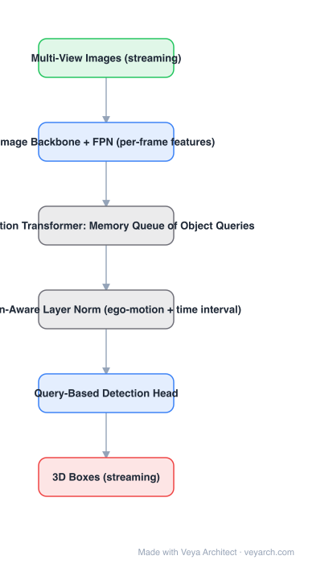

# Architecture: StreamPETR

## Motivation

Multi-view 3D detection uses temporal information by building structures — BEV feature grids, cost volumes, warped feature maps — and then fusing them. That is expensive: temporal fusion happens over a dense grid, whether or not anything is there. StreamPETR's observation: the thing that persists across frames is the **object**, not the grid. Carry object queries forward and fuse there.

## Core Idea

**Object-centric temporal modeling**: maintain a **memory queue of object queries** from previous frames; propagate them into the current frame and align them with **motion-aware layer normalization** that conditions on ego-motion and the relative time interval. No BEV feature map, no cost volume, no explicit feature warping.

## Architecture

### Overview

<b>Layer-by-layer (6 nodes)</b>

| # | Layer | Type | Params |
|---|---|---|---|
| 1 | Multi-View Images (streaming) | `input` |  |
| 2 | Image Backbone + FPN (per-frame features) | `conv2d` |  |
| 3 | Propagation Transformer: Memory Queue of Object Queries | `custom` |  |
| 4 | Motion-Aware Layer Norm (ego-motion + time interval) | `custom` |  |
| 5 | Query-Based Detection Head | `attention` |  |
| 6 | 3D Boxes (streaming) | `output` |  |

### Components

1. **Image backbone + FPN** — per-frame multi-view features; these are *not* accumulated into a BEV grid.
2. **Propagation transformer (memory queue)** — object queries from the last few frames are stored in a queue and concatenated/fed with the current queries; the queue carries the temporal information.
3. **Motion-aware layer normalization** — query features are modulated by the ego-motion transform and the time interval between the stored frame and now, which is how old queries are put into the current coordinate frame.
4. **Query-based detection head** — PETR-style 3D-aware queries decoded into boxes and classes.
5. **Relative time interval encoding** — the age of each queued query is an explicit input.
6. **Streaming inference** — one pass per frame; only a few past frames are needed (the paper reports using ~4).

### Data Flow

Multi-view images → backbone/FPN features → current object queries + memory-queue queries (aligned by motion-aware LN) → propagation transformer → updated queries → detection head → 3D boxes; the queries are pushed back into the queue.

### State / Memory

The **memory queue of object queries** is the model's state — a small, fixed-size FIFO over recent frames. This is the structural difference from BEV methods, whose state is a dense feature map.

## Design Decisions

- **Objects as the temporal carrier** — fuse where the content is, not over the whole grid.
- **Alignment by conditioning, not warping** — motion-aware layer norm moves queries into the current frame without resampling features.
- **Explicit time gap** — queries of different ages are treated differently, which matters when frames are dropped or spacing is irregular.
- **Drop BEV and cost volumes** — the efficiency claim is structural, not just constant-factor.

## Evolution

- **DETR3D / PETR** (predecessors): query-based multi-view 3D detection, single frame.
- **BEVFormer / BEVDepth** (contrast): temporal fusion over dense BEV grids.
- **StreamPETR (2023)**: object queries in a memory queue with motion-aware alignment.
- **Successors**: **StreamPETR-v2** (better temporal/object-centric modelling), Sparse4D-style recurrent query methods.
- **Siblings**: SparseBEV (fully sparse sampling), Sparse4D.

## Characteristics

| Property | Value |
|---|---|
| Task | streaming multi-view 3D object detection |
| Backbone | image CNN + FPN (per-frame) |
| Temporal state | memory queue of object queries |
| Alignment | motion-aware layer normalization (ego-motion + time interval) |
| BEV / cost volume | none |
| Queue length | a few frames (≈4 as reported) |

## Limitations

- Objects that appear for the first time have no history, so single-frame quality still bounds recall.
- Long-term occlusion and re-identification are limited by queue length and by how well motion alignment holds.
- Query propagation depends on ego-motion accuracy; bad odometry degrades alignment.
- Still needs an image backbone per frame — the saving is in temporal fusion, not in feature extraction.

## Implementation Notes

Essentials: (1) keep a fixed-length FIFO of past object queries with their timestamps, (2) condition query features on the ego-motion transform between the stored frame and the current frame plus the normalized time gap (motion-aware LN), (3) let the propagation transformer mix queued and current queries, (4) push the updated queries back into the queue, (5) benchmark against a BEV-temporal baseline at the *same* backbone — the advantage is the removal of the grid, so it must show up in both FPS and memory.
