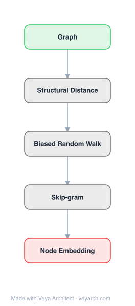

# Architecture: struc2vec

## Motivation

Most network embedding methods (DeepWalk, node2vec, LINE) learn representations based on node proximity — nodes that are close in the network or share neighbors get similar embeddings. This captures homophily but fails to capture structural identity: two nodes with identical local structures (e.g., same degree, same number of triangles, same role) but located far apart in the network will receive dissimilar embeddings because their neighborhoods do not overlap. Structural identity — the concept of identifying nodes by their structural role in the network independent of labels or position — is critical for tasks like role discovery, structural classification, and anomaly detection. struc2vec fills this gap by learning representations that capture structural equivalence rather than (or in addition to) network proximity.

## Core Idea

Node embedding from structural identity via structural context and degree sequences, independent of node labels.

## Architecture

### Overview

<b>Layer-by-layer (5 nodes)</b>

| # | Layer | Type | Params |
|---|---|---|---|
| 1 | Graph | `input` |  |
| 2 | Structural Distance | `custom` |  |
| 3 | Biased Random Walk | `custom` |  |
| 4 | Skip-gram | `custom` |  |
| 5 | Node Embedding | `output` |  |

struc2vec constructs a multilayer weighted graph that encodes structural similarities between nodes at different scales. Each layer corresponds to a different notion of structural similarity — from degree-based (coarsest) to full-neighborhood-based (finest). Nodes are connected across layers and within layers based on structural similarity. Biased random walks on this multilayer graph generate sequences of structurally similar nodes, which are then fed to a skip-gram model to learn structural embeddings. The entire process is independent of node labels and network position, capturing pure structural identity.

### Components

1. **Structural Similarity Measurement** — A hierarchy of distance metrics between node pairs:
   - **k-hop degree sequences**: For each node, collect the ordered degree sequence of its k-hop neighbors
   - **Distance function dₖ(u,v)**: Compares the degree sequences of nodes u and v at hop k, using a modified DTW (Dynamic Time Warping) or sorted-degree comparison
   - **Hierarchy**: At k=1, similarity depends only on immediate neighbors' degrees; at k=2, on 2-hop neighborhood structure; increasing k gives progressively more global structural context
   - Independent of node labels and edge attributes

2. **Multilayer Graph Construction** — A weighted graph with L layers:
   - **Layer k** contains all |V| nodes, with edge weights wₖ(u,v) = exp(-dₖ(u,v))
   - **Cross-layer edges**: Each node u in layer k is connected to itself in layer k+1 (and k-1), allowing the random walk to move between layers
   - **Layer transition weights**: γ (stay in current layer) vs 1-γ (move to adjacent layer)
   - The multilayer graph encodes structural context at multiple scales

3. **Biased Random Walk** — Generates structural context sequences:
   - Walks traverse the multilayer graph, not the original network
   - Walks tend to visit structurally similar nodes within a layer
   - Walks can move up/down layers to adjust the scale of structural comparison
   - The walk length and number of walks per node control the amount of structural context generated

4. **Skip-Gram Model** — Standard word2vec skip-gram applied to structural context:
   - Treats each random walk sequence as a "sentence" of structurally similar nodes
   - Learns d-dimensional embeddings that place structurally similar nodes close together
   - Uses negative sampling for efficient training
   - The learned embeddings encode structural identity independent of network position

### Data Flow

1. **Input**: Unweighted, undirected graph G = (V, E)
2. **Degree Sequence Computation**: For each node u and each k = 1, ..., L, compute the ordered degree sequence of k-hop neighbors
3. **Pairwise Distance**: For each pair (u,v) and each k, compute dₖ(u,v) using DTW on degree sequences
4. **Multilayer Graph**: Build L-layer weighted graph with intra-layer edges (exp(-dₖ)) and inter-layer edges
5. **Random Walks**: Perform biased random walks on the multilayer graph to generate structural context sequences
6. **Skip-Gram Training**: Feed sequences to skip-gram with negative sampling → d-dimensional embeddings
7. **Output**: |V| × d matrix of structural embeddings

### State / Memory

- **Degree sequences**: For each node at each layer k, the ordered degree sequence of its k-hop neighborhood — stored as sorted lists, O(|V| × L × avg_degree) memory.
- **Distance matrix**: Pairwise distances dₖ(u,v) for all node pairs at each layer — O(L × |V|²) memory, the main bottleneck for large graphs.
- **Multilayer graph**: Edge weights for L layers plus cross-layer edges — O(L × |V|²) in the worst case.
- **Random walk sequences**: Transient, generated on-the-fly during skip-gram training.
- **Final embeddings**: Persistent |V| × d output matrix.

## Design Decisions

1. **Degree sequences over direct neighborhood comparison** — Using ordered degree sequences as the structural signature:
   - Captures the structural role of a node through its neighborhood's degree distribution
   - Independent of node identity — two nodes with the same degree sequence are structurally equivalent
   - More robust than raw neighborhood comparison which depends on node labels

2. **Dynamic Time Warping (DTW)** for distance computation:
   - Handles degree sequences of different lengths
   - Aligns sequences optimally, capturing structural similarity even when neighborhoods differ in size
   - Alternative: faster ordered comparison with a penalty function, trading accuracy for speed

3. **Multilayer graph** rather than flattening structural similarity:
   - Allows the random walk to dynamically choose the scale of comparison
   - Nodes can be compared at coarse (degree-only) or fine (full neighborhood) levels
   - The hierarchy avoids forcing a single notion of structural similarity

4. **Independence from node labels and attributes**:
   - struc2vec uses only the graph topology, not node features
   - Enables cross-network structural comparison (nodes in different connected components)
   - Does not require the network to be connected

5. **Skip-gram reuse** — Applying the same skip-gram model as DeepWalk/node2vec:
   - Leverages the proven effectiveness of word2vec for representation learning
   - The innovation is in the context generation (structural walks), not the embedding model
   - Enables direct comparison with prior methods using the same downstream pipeline

## Evolution

**Predecessors:**
- **DeepWalk** (Perozzi et al., 2014) — Random walk + skip-gram for network embedding; struc2vec adopts the skip-gram but changes the walk strategy.
- **node2vec** (Grover & Leskovec, 2016) — Flexible biased random walks; struc2vec generalizes the bias to structural similarity.
- **RolX** (Henderson et al., 2012) — Structural role discovery via matrix factorization; struc2vec provides a learned alternative.
- **Kleinberg's HITS** (1999) — Hubs and authorities; early structural identity concept in web graphs.

**Successors:**
- **GraphSAGE** (Hamilton et al., 2017) — Inductive representation learning; can incorporate structural features.
- **GNN/GCN** frameworks — General graph neural networks that can be designed to capture structural equivalence.
- **GraphWave** (Donnat et al., 2018) — Spectral approach to structural role embedding.

## Characteristics

| Property | Value |
|----------|-------|
| Year | 2017 |
| Authors | Ribeiro, Saverese, Figueiredo |
| Category | GNN/Embedding |
| Source Paper | `struc2vec_Learning_Node_Representations_from_Structural_Iden_Identity_Ribeiro_Saverese_etal_2017.md` |
| PaperVault Path | `GNN/02-network-embedding/struc2vec_Learning_Node_Representations_from_Structural_Iden_Identity_Ribeiro_Saverese_etal_2017.md` |

## Limitations

1. **Quadratic distance computation** — Computing pairwise structural distances dₖ(u,v) for all node pairs is O(|V|²) per layer, limiting scalability to large graphs.
2. **DTW computational cost** — Dynamic time warping on degree sequences has O(n²) complexity per pair, where n is the sequence length; the OPT optimization reduces this but remains expensive.
3. **Degree-only structural signature** — Using degree sequences as the structural fingerprint ignores other structural properties (e.g., motif counts, clustering coefficients) that may better capture structural identity.
4. **No node attributes** — struc2vec ignores node features entirely; incorporating attributes could improve embeddings for attributed graphs.
5. **Fixed number of layers** — The depth L of the multilayer graph is a hyperparameter; choosing it requires domain knowledge about the relevant scale of structural comparison.
6. **Transductive only** — Cannot generate embeddings for unseen nodes without recomputing the entire multilayer graph.

## Implementation Notes

See `implementation/` for a minimal runnable implementation. Key details:
- Input: unweighted, undirected graph
- Compute k-hop degree sequences for each node (k = 1, ..., L)
- Compute pairwise distances using DTW (or faster approximation)
- Build multilayer weighted graph with exp(-dₖ) edge weights
- Perform biased random walks (controlling layer transitions with parameter q)
- Train skip-gram with negative sampling on walk sequences
- Typical parameters: L = 3–4 layers, walk length 80, 10 walks per node, d = 128
- Evaluated on toy structural equivalence examples, air-traffic networks (classification by airport activity), and noise robustness
- Outperforms DeepWalk, node2vec, and RolX on structural identity tasks
- Optimizations: degree sorting, OPT (order-preserving trick) for faster DTW, and edge weight thresholding

## Information Layers

- **Evidence:** Source paper available in `references/papers/` (Ribeiro, Saverese, Figueiredo, 2017, "struc2vec: Learning Node Representations from Structural Identity," KDD 2017)
- **Analysis:** struc2vec's central contribution is decoupling structural identity from network proximity. By constructing a multilayer graph where edges encode structural similarity (not network adjacency), and generating random walks on this auxiliary graph, struc2vec ensures that structurally equivalent nodes — regardless of their distance in the original network — appear in similar contexts and thus receive similar embeddings. The hierarchy of degree-sequence comparisons provides a principled, multi-scale notion of structural similarity. The approach is orthogonal to homophily-based methods: DeepWalk and node2vec excel when node labels correlate with proximity, while struc2vec excels when labels depend on structural role. The two are complementary, and hybrid approaches could capture both.
- **Hypothesis:** The success of struc2vec suggests that structural identity is a distinct dimension of network information that cannot be recovered from proximity-based embeddings alone. The multilayer graph framework could generalize to other notions of similarity (e.g., attribute-based, temporal) by replacing the distance function. The degree-sequence signature, while effective, may be suboptimal; richer structural fingerprints (e.g., based on graphlets or spectral features) could yield better structural embeddings. The fundamental trade-off between structural and proximity-based embedding reflects a tension between role-based and community-based organization in real networks.
