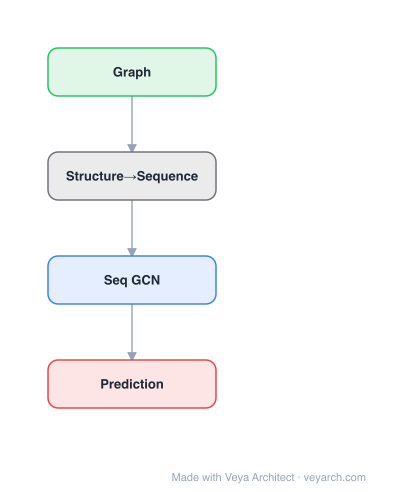

# Architecture: Structural Attention GNN

## Motivation

Graph classification is an important problem with practical applications in bioinformatics, chemoinformatics, social network analysis, and cyber-security. The usual strategy is to calculate graph statistics (e.g., graphlet counts) on the entire graph. However, real-world graphs can be both large and noisy, with significant subgraph patterns confined to small neighborhoods. Processing the entire graph can introduce noise into the calculated features and is computationally costly for large graphs.

Existing approaches like graphlet kernels count occurrences of subgraphs across the entire graph, while the Morgan algorithm iteratively updates node attributes by hashing neighborhood information. These methods cannot focus on informative parts of the graph and ignore noise in the rest. Deep learning approaches learn data-driven features but still process the entire graph.

The paper proposes attention-based graph classification, where attention is used to selectively process informative portions of the graph while obeying graph structure. The model, called GAM (Graph Attention Model), adaptively selects a sequence of informative nodes using an RNN with attention trained via reinforcement learning, processing only a small budget of T nodes rather than the entire graph.

## Core Idea

Graph classification using structural attention to capture hierarchical subgraph patterns.

## Architecture

### Overview

<b>Layer-by-layer (4 nodes)</b>

| # | Layer | Type | Params |
|---|---|---|---|
| 1 | Graph | `input` |  |
| 2 | Structure→Sequence | `custom` |  |
| 3 | Seq GCN | `gcn_conv` |  |
| 4 | Prediction | `output` |  |

GAM is a recurrent neural network model with a built-in attention mechanism for graphs. Instead of processing the entire graph, GAM uses attention-guided walks to sample a budget of T nodes from the graph. An attention mechanism trained via reinforcement learning guides the walk toward informative regions, while a memory component integrates information gathered from different parts of the graph.

The model processes only a node's local neighborhood at each step, keeping computation costs low (no need to load the entire graph into memory). The attention mechanism is trained using reinforcement learning to actively select informative regions, and the model is easily parallelizable.

### Components

- **RNN core**: A recurrent neural network that maintains a hidden state vector summarizing the information gathered so far from visited nodes. The hidden state serves as the memory component integrating information across different parts of the graph.

- **Attention mechanism**: At each step, the model computes attention scores over the local neighborhood of the current node. The attention mechanism processes only the node's local neighborhood, determining which neighboring node to visit next.

- **Reinforcement learning module**: The attention mechanism is trained using RL (policy gradient) to actively select informative nodes. The reward is based on the classification accuracy of the final graph-level prediction.

- **Node visit budget T**: A fixed budget of T nodes that the model can visit. The model must select the most informative T nodes within this budget.

- **Classifier**: After visiting T nodes, the aggregated information is used to predict the graph's class label.

### Data Flow

1. **Input**: Attributed graph G = (A_G, D_G) with adjacency matrix and attribute matrix, a starting node v*, and a budget T.
2. **Initialization**: Initialize the RNN hidden state and set the current node to the starting node v*.
3. **Attention computation**: At the current node, compute attention scores over its local neighborhood using the RNN hidden state.
4. **Node selection**: Select the next node to visit based on the attention scores (RL policy).
5. **State update**: Update the RNN hidden state using the attributes of the selected node.
6. **Walk continuation**: Repeat steps 3-5 until T nodes have been visited.
7. **Classification**: Use the final RNN hidden state to predict the graph's class label.
8. **Reward computation**: Compute the classification reward and backpropagate through the RL policy to update the attention mechanism.

### State / Memory

The RNN hidden state serves as the **memory component**, integrating information gathered from different parts of the graph across visited nodes. This hidden state evolves as the model visits new nodes, accumulating a summary of the informative regions traversed by the attention-guided walk.

## Design Decisions

- **Attention-guided walks over full graph processing**: Processing only a budget of T nodes avoids noise from uninformative regions and reduces computational cost, especially for large graphs where loading the entire graph into memory is infeasible.

- **Reinforcement learning for attention**: RL enables the model to learn which nodes are informative for the classification task, rather than using fixed heuristics. The reward signal (classification accuracy) directly ties node selection to task performance.

- **Local neighborhood processing**: The attention mechanism processes only the current node's local neighborhood, keeping space complexity low and enabling parallelization.

- **RNN memory**: The recurrent architecture naturally integrates information from a sequence of visited nodes, maintaining a running summary that captures the graph's discriminative substructure.

- **Budget constraint T**: Forces the model to be selective and focus on the most informative parts, acting as a regularizer against noise.

## Evolution

**Predecessors:**
- Graphlet kernel — counts occurrences of graphlets (subgraphs) across the entire graph
- Morgan algorithm — iterative neighborhood attribute hashing for graph features
- Deep learning graph classification — learns data-driven features from the entire graph
- Glimpse-based attention (RAM model) — attentional processing on non-graph data (vision)
- DeepWalk / node2vec — random walk-based graph embedding

**Successors:**
- GAM inspired subsequent attention-based graph classification models that combine attention with GNN architectures
- The RL-based node selection paradigm influenced works on explainable GNNs that identify important subgraphs

## Characteristics

| Property | Value |
|----------|-------|
| Year | 2018 |
| Authors | Lee et al. |
| Category | GNN/Architecture |
| Source Paper | `Graph_Classification_using_Structural_Attention_Lee_Rossi_Kong_2018.md` |
| PaperVault Path | `GNN/03-gnn-architectures/Graph_Classification_using_Structural_Attention_Lee_Rossi_Kong_2018.md` |

## Limitations

- The budget T limits the amount of graph information the model can use; if discriminative patterns are spread across many regions, T may be insufficient.
- The RL training can be unstable and slow to converge compared to supervised training.
- The starting node v* can affect which parts of the graph are explored; the model may miss informative regions not reachable within the walk budget.
- The model is limited to processing only a portion of the graph, which may be suboptimal for graphs where global structure is important.
- The attention mechanism relies on local neighborhood information, which may not capture long-range dependencies.
- The paper notes the model is competitive against baselines despite processing only a portion of the graph, but does not consistently outperform all methods on all datasets.

## Implementation Notes

See `implementation/` for a minimal runnable implementation.

## Information Layers

- **Evidence:** Source paper available in `references/papers/`
- **Analysis:** GAM's key innovation is bringing the attentional processing paradigm (glimpse-based attention from vision) to graph-structured data, where the "glimpse" is a local neighborhood walk. The RL-based training enables the model to learn task-relevant node selection without explicit supervision of which nodes are important.
- **Hypothesis:** The effectiveness of GAM on noisy graphs suggests that discriminative patterns in real-world graphs are often localized, and full-graph processing may actually hurt performance by diluting signal with noise. The budget T may serve as an implicit regularizer.
