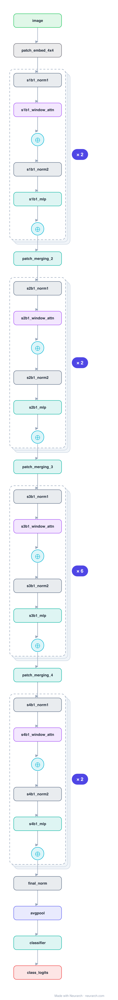

# Architecture: Swin Transformer (Tiny)

## Motivation

The Vision Transformer that became a general-purpose backbone. Self-attention runs inside fixed local windows (linear cost in image size), and every other block shifts the windows so information crosses window boundaries, while patch merging builds a CNN-like pyramid.

## Core Idea

The Vision Transformer that became a general-purpose backbone.

## Architecture

### Overview

*Identical repeated blocks are folded into one representative block with a `× N` badge, so the whole architecture fits on screen. `model.json` uses NAXS block templates + `repeat` directives and expands back to all 81 nodes (open it in Neurarch to see and edit every layer). Vector: [diagram.svg](assets/diagram.svg).*

| Hyperparameter | Value |
|---|---|
| Type | Hierarchical Vision Transformer |
| Parameters | 28M |
| Patch embed | 4x4 conv (96) |
| Stages | 4 stages, depths 2/2/6/2 |
| Block | Window attention, alternating with shifted-window attention |
| Downsampling | Patch merging (2x2 → linear) between stages |

`model.json` is the full graph, hand-built against the official config.json.

### Design Notes

- Windowed attention makes cost linear in pixels (not quadratic like ViT), so Swin scales to detection/segmentation resolutions.
- The shifted-window trick (alternating W-MSA and SW-MSA) is what lets non-adjacent windows communicate without global attention.
- Hierarchical (4 stages, halving resolution and doubling channels) so it drops into FPN-style dense-prediction heads; compare with the flat [vit-b16](../vit-b16/).

### Parameter Check

Neurarch's per-layer parameter estimate over this graph: **28.3M**.

## Design Decisions

> **Analysis** — Observations derived from studying the architecture.

- Windowed attention makes cost linear in pixels (not quadratic like ViT), so Swin scales to detection/segmentation resolutions.
- The shifted-window trick (alternating W-MSA and SW-MSA) is what lets non-adjacent windows communicate without global attention.
- Hierarchical (4 stages, halving resolution and doubling channels) so it drops into FPN-style dense-prediction heads; compare with the flat [vit-b16](../vit-b16/).

## Implementation Notes

- `model.json` contains the full structural graph with real dimensions and parameters, using NAXS block templates + `repeat` for repeated units.
- Open in [Neurarch](https://www.neurarch.com/) to visualize, edit, or export training code.
- Diagrams fold repeated identical blocks with a `× N` badge; `model.json` defines each repeated unit once at real dimensions and expands to all nodes.

## Limitations

- This package focuses on the architectural structure. Training pipelines, 
dataset preparation, and production optimizations are out of scope.

## Evolution

> See `references/related/` for predecessor and successor architectures.

