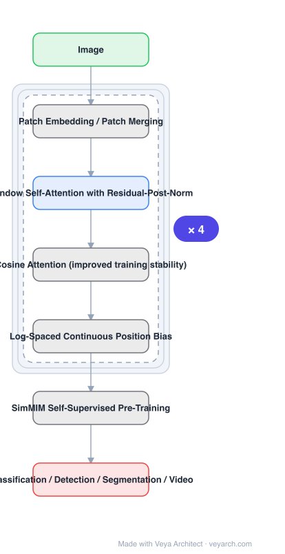

# Architecture: Swin Transformer V2

## Motivation

Scaling language models past 530B dense parameters brought few-shot capabilities, while vision models had only just reached 1–2B parameters. Worse, unlike large language models, **existing large vision models were applied to image classification only**. Swin V2 targets large-scale vision models and names three obstacles: **training instability**, **resolution gaps between pre-training and fine-tuning**, and **hunger on labelled data**.

## Core Idea

Three techniques, one per obstacle: **residual-post-norm combined with cosine attention** for stability, a **log-spaced continuous position bias** so low-resolution pre-trained models transfer to high-resolution inputs, and **SimMIM** self-supervised pre-training to cut the need for labelled images. Applied to the Swin backbone, these yield a 3B-parameter model trainable up to 1,536×1,536.

## Architecture

### Overview

<b>Layer-by-layer (7 nodes)</b>

| # | Layer | Type | Params |
|---|---|---|---|
| 1 | Image | `input` |  |
| 2 | Patch Embedding / Patch Merging | `custom` |  |
| 3 | Window Self-Attention with Residual-Post-Norm | `attention` |  |
| 4 | Cosine Attention (improved training stability) | `custom` |  |
| 5 | Log-Spaced Continuous Position Bias | `custom` |  |
| 6 | SimMIM Self-Supervised Pre-Training | `custom` |  |
| 7 | Classification / Detection / Segmentation / Video | `output` |  |

### Components

1. **Residual-post-norm** — replaces the previous normalization placement to address training instability at scale.
2. **Cosine attention** — attention logits computed via cosine similarity instead of dot product; combined with residual-post-norm, this is the stability fix.
3. **Log-spaced continuous position bias** — a continuous formulation of relative position bias in log space, so a model pre-trained at low resolution transfers to high-resolution downstream tasks without re-learning position structure.
4. **SimMIM self-supervised pre-training** — reduces the need for vast labelled image sets.
5. **Swin hierarchical backbone** — windowed self-attention with patch merging, retained from Swin.

### Data Flow

Image → patch embedding → hierarchical stages of windowed self-attention with residual-post-norm and cosine attention, log-spaced continuous position bias applied to attention, patch merging between stages → task head for classification, detection, segmentation or video.

### State / Memory

No recurrent state. The scaling constraints being solved are training stability and memory at high resolution — SimMIM and the position-bias formulation both act to make large-resolution training feasible rather than adding state.

## Design Decisions

- **Target three named obstacles, one technique each** — the paper is explicit that these are the issues in training *and application* of large vision models.
- **Cosine attention rather than dot product** — chosen for training stability, which is what blocked scaling.
- **Continuous, log-spaced position bias** — the mechanism that decouples pre-training resolution from fine-tuning resolution.
- **Self-supervised pre-training** — SimMIM addresses labelled-data hunger, enabling 40× less labelled data.
- **Demonstrate breadth** — the model is evaluated on four representative tasks (classification, detection, segmentation, video), countering the classification-only limitation of prior large vision models.

## Evolution

- **Swin Transformer** (predecessor): hierarchical windowed attention backbone.
- **BERT / large language models** (the scaling inspiration).
- **Swin Transformer V2 (2021)**: scaling techniques for capacity and resolution.
- **Siblings**: PVT, CSWin, MaxViT, MViTv2, VideoMAE.
- **Contrast**: prior large vision models, which reached 1–2B parameters but were applied to image classification only.

## Characteristics

| Property | Value |
|---|---|
| Task | large-scale classification / detection / segmentation / video |
| Stability | residual-post-norm + cosine attention |
| Resolution transfer | log-spaced continuous position bias |
| Pre-training | SimMIM self-supervised |
| Scale | 3B parameters, up to 1,536×1,536 resolution |
| Efficiency | 40× less labelled data, 40× less training time vs Google's billion-level models |

## Limitations

- The 3B-parameter model requires very large compute; the contributions are aimed at scale and may not pay off at small model sizes.
- Self-supervised pre-training (SimMIM) adds a separate pre-training stage to the pipeline.
- Cosine attention and residual-post-norm change optimization behaviour, so hyperparameters tuned for Swin may not transfer.
- High-resolution training (1,536×1,536) remains memory-expensive even with the proposed techniques.

## Implementation Notes

Essentials: (1) apply residual-post-norm **and** cosine attention together — they are presented as one combined stability fix, and either alone is not the reported solution, (2) implement position bias as a continuous, log-spaced function rather than a learned discrete table; discrete bias is what fails to transfer across resolution, (3) pre-train with SimMIM if labelled data is limited, since labelled-data hunger is one of the three named obstacles, (4) validate on more than classification — the paper's critique of prior large vision models is exactly that they were classification-only, so detection, segmentation and video are part of the claim, (5) report labelled-data and training-time budgets, as the 40× figures are part of the result.
