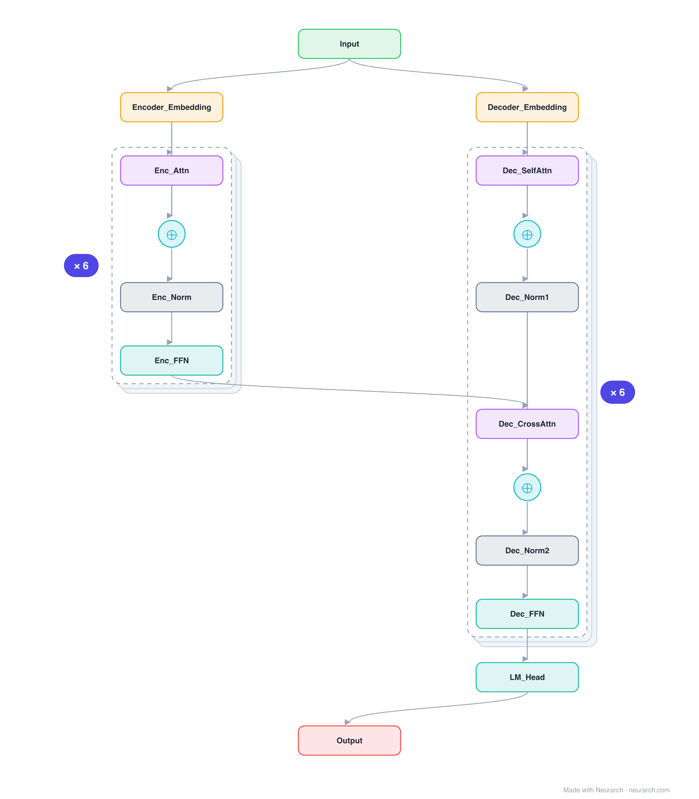

# Architecture: T5-Small

## Motivation

The text-to-text encoder-decoder that reframed every NLP task as sequence generation. The full two-stream graph: bidirectional encoder, causal decoder, and cross-attention tying them together.

## Core Idea

The text-to-text encoder-decoder that reframed every NLP task as sequence generation.

## Architecture

### Overview

*Identical repeated blocks are folded into one representative block with a `× N` badge, so the whole architecture fits on screen. `model.json` keeps all 71 nodes (open it in Neurarch to see and edit every layer). Vector: [diagram.svg](assets/diagram.svg).*

| Hyperparameter | Value |
|---|---|
| Type | Encoder-decoder transformer (text-to-text) |
| Parameters | 60.5M |
| Layers | 6 encoder + 6 decoder |
| Hidden size | 512 |
| Attention | 8 heads; decoder adds cross-attention |
| FFN | Dense, 2048, ReLU |
| Normalization | RMSNorm, pre-norm |
| Positions | Relative position biases |
| Vocabulary | 32,128 (shared) |

`model.json` is the full graph, produced with the same import path the Neurarch app uses for "load from Hugging Face".

### Design Notes

- Both streams and the LM head share one 32128-token SentencePiece embedding matrix (see the parameter note below).
- RMSNorm (T5 called it "simplified LayerNorm") years before the Llama lineage made it standard; relative position biases instead of absolute embeddings.
- The graph makes the three attention types visually distinct: encoder self-attention, decoder causal self-attention, and cross-attention.

### Parameter Check

Neurarch's per-layer parameter estimate over this graph: **60.6M**.
Hugging Face safetensors metadata reports **60.5M** for the real weights.
Deviation from the authoritative count (60.5M): **+0.1%**.

> T5 ties the encoder embedding, decoder embedding, and LM head to one 16.4M-parameter matrix; the graph carries each occurrence separately, so the naive per-layer sum overcounts by roughly 27M. The real unique count is 60.5M (safetensors).

## Design Decisions

> **Analysis** — Observations derived from studying the architecture.

- Both streams and the LM head share one 32128-token SentencePiece embedding matrix (see the parameter note below).
- RMSNorm (T5 called it "simplified LayerNorm") years before the Llama lineage made it standard; relative position biases instead of absolute embeddings.
- The graph makes the three attention types visually distinct: encoder self-attention, decoder causal self-attention, and cross-attention.

## Implementation Notes

- `model.json` contains the full structural graph with real dimensions and parameters.
- Open in [Neurarch](https://www.neurarch.com/) to visualize, edit, or export training code.
- Diagrams fold repeated identical blocks with a `× N` badge; `model.json` holds all nodes at real dimensions.

## Limitations

- This package focuses on the architectural structure. Training pipelines, 
dataset preparation, and production optimizations are out of scope.

## Evolution

> See `references/related/` for predecessor and successor architectures.

