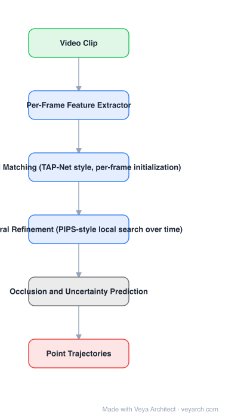

# Architecture: TAPIR

## Motivation

Tracking-any-point splits into two families with opposite failure modes. **TAP-Net** matches globally and independently on each frame: robust to occlusion, because a lost point can be re-found, but jittery and "unrealistic" because it ignores temporal continuity. **PIPs** refines locally over time: smooth, but it processes video sequentially in chunks, struggles under occlusion, and is slow (the paper cites ~1 month to evaluate TAP-Vid-Kinetics on one GPU). TAPIR's insight is that these are complementary, not competing.

## Core Idea

A two-stage model: **per-frame global matching** initializes a coarse track (occlusion-robust), then **temporal refinement** searches a local neighbourhood across time to smooth it into a physically plausible trajectory. Plus explicit occlusion/uncertainty prediction.

## Architecture

### Overview

<b>Layer-by-layer (6 nodes)</b>

| # | Layer | Type | Params |
|---|---|---|---|
| 1 | Video Clip | `input` |  |
| 2 | Per-Frame Feature Extractor | `conv2d` |  |
| 3 | Global Matching (TAP-Net style, per-frame initialization) | `attention` |  |
| 4 | Temporal Refinement (PIPS-style local search over time) | `attention` |  |
| 5 | Occlusion and Uncertainty Prediction | `custom` |  |
| 6 | Point Trajectories | `output` |  |

### Components

1. **Per-frame feature extractor** — CNN features for every frame independently.
2. **Global matching (initialization)** — matches each query point against every frame's features, giving a coarse but occlusion-tolerant track.
3. **Temporal refinement** — a local search around the initialized position, propagating information across time to smooth the track.
4. **Occlusion and uncertainty prediction** — predicts whether a point is visible, so downstream consumers can discard unreliable positions.
5. **Non-sequential design** — unlike PIPs, it does not chain chunk outputs, which is what makes parallel evaluation practical.

### Data Flow

Query point + video → per-frame features → global matching (coarse track per frame) → temporal refinement (local search, smoothed trajectory) → trajectories + occlusion/uncertainty flags.

### State / Memory

The per-frame match set is the intermediate structure; temporal refinement carries information forward over the local time window. There is no global sequential chain — that absence is the design decision.

## Design Decisions

- **Combine the two families** — the contribution is the observation of complementarity, not a new matching module.
- **Per-frame initialization** — independent matching per frame means the model cannot be derailed by an earlier mistake.
- **Refinement over time, not sequential chunks** — preserves smoothness while allowing parallelism.
- **Predict occlusion explicitly** — a trajectory is only usable if you know which part is visible.

## Evolution

- **Optical flow** (contrast): dense but two-frame only; no long-term identity.
- **TAP-Net (2022)** and **PIPs (2022)** (predecessors): global-per-frame vs. local-over-time.
- **TAPIR (2023)**: both stages, plus occlusion prediction.
- **Siblings**: CoTracker (joint tracking of point sets), BootsTAP (self-supervised).
- **Contrast**: box-level MOT (ByteTrack, OC-SORT) tracks detected objects, not arbitrary points.

## Characteristics

| Property | Value |
|---|---|
| Task | tracking any point (long-term) |
| Stage 1 | per-frame global matching (initialization) |
| Stage 2 | temporal refinement (local search) |
| Output | trajectories + occlusion and uncertainty |
| Reported | ~20% over TAP-Net on TAP-Vid-DAVIS; ~20% over PIPs on TAP-Vid-Kinetics, much faster |

## Limitations

- Long-range occlusion still degrades tracks; refinement cannot invent a trajectory through a long invisible interval.
- Cost grows with the number of tracked points and video length.
- Requires a query point specification (per-frame initialization), unlike dense flow.
- Trajectories are 2D; lifting to 3D needs additional depth/supervision.

## Implementation Notes

Essentials: (1) keep per-frame matching independent — do not feed frame *t*'s output into frame *t+1*'s initialization, or the occlusion robustness is lost, (2) implement temporal refinement as a local search within a time window so it can be parallelized, (3) supervise with occlusion labels and output a per-point visibility score, (4) evaluate on TAP-Vid benchmarks with runtime reported — PIPs' weakness was throughput, so the comparison must include it, (5) for many points, batch the refinement across points, not across time.
