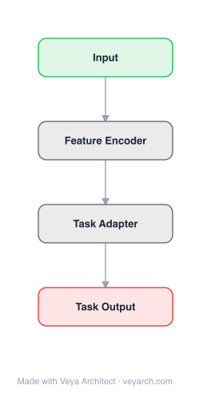

# Architecture: TDL (Topological Deep Learning)

## Motivation

Graph-based deep learning has been tremendously successful, but many real-world datasets have structures that go beyond pairwise relationships — including simplicial complexes, cell complexes, combinatorial complexes, and hypergraphs. Topological Deep Learning (TDL) aims to generalize deep learning beyond graph data to these richer topological spaces, enabling the modeling of higher-order relationships and multi-way interactions that graphs cannot capture.

## Core Idea

A framework for deep learning on topological spaces (simplicial complexes, cell complexes, combinatorial complexes) that generalizes graph neural networks to higher-dimensional structures. TDL provides a unified perspective on deep learning and structured computation, offering tools for modeling and learning from data on topological spaces.

## Architecture

### Overview

<b>Layer-by-layer (4 nodes)</b>

| # | Layer | Type | Params |
|---|---|---|---|
| 1 | Input | `input` |  |
| 2 | Feature Encoder | `custom` |  |
| 3 | Task Adapter | `custom` |  |
| 4 | Task Output | `output` |  |

TDL is not a single architecture but a framework encompassing multiple neural network architectures designed for topological spaces. The core idea is to generalize message passing from graphs (0-dimensional and 1-dimensional simplices) to higher-dimensional topological structures (simplices, cells). The framework includes simplicial neural networks, cell complex neural networks, and combinatorial complex neural networks.

### Components

1. **Topological Spaces** — Data structures beyond graphs:
   - **Simplicial Complexes**: Collections of simplices (points, edges, triangles, tetrahedra, etc.)
   - **Cell Complexes**: Generalization of simplicial complexes with cells of arbitrary shape
   - **Combinatorial Complexes**: Most general, with rank function on subsets
   - **Hypergraphs**: Generalization of graphs with hyperedges connecting multiple nodes

2. **Simplicial Neural Networks (SNNs)** — Neural networks on simplicial complexes:
   - Message passing generalized to higher-dimensional simplices
   - Boundary and coboundary operators connect simplices of different dimensions
   - Hodge Laplacian generalizes graph Laplacian
   - Captures higher-order interactions (e.g., group dynamics)

3. **Cell Complex Neural Networks** — Neural networks on cell complexes:
   - More flexible than simplicial complexes
   - Cells can have arbitrary shape (not just simplices)
   - Generalizes both graph and simplicial neural networks
   - Adjacency, incidence, and boundary operators

4. **Combinatorial Complex Neural Networks** — Most general:
   - Rank function defines hierarchy of relationships
   - Can represent any topological structure
   - Most flexible but most complex

5. **Message Passing on Topological Spaces** — Generalized information propagation:
   - Messages passed between cells of same dimension (adjacency)
   - Messages passed between cells of different dimensions (incidence/boundary)
   - Generalizes graph message passing to higher dimensions
   - Captures multi-way relationships

### Data Flow

1. **Input**: Data on a topological space (features on cells/simplices)
2. **Message passing (within dimension)**: Cells of same dimension exchange messages
3. **Message passing (across dimensions)**: Cells of different dimensions exchange messages (boundary/coboundary)
4. **Feature update**: Each cell's features updated based on received messages
5. **Output**: Cell-level or complex-level representations

### State / Memory

- **No explicit memory mechanism**: TDL architectures are typically feedforward.
- **Topological structure**: The underlying topological space (simplicial/cell complex) defines the computation graph.
- **Boundary/coboundary operators**: Encode relationships between cells of different dimensions.
- **Hodge Laplacian**: Generalizes graph Laplacian for simplicial complexes.

## Design Decisions

1. **Topological generalization** — Going beyond graphs:
   - Graphs capture pairwise relationships only
   - Topological spaces capture multi-way relationships (groups, interactions)
   - Richer structure enables more expressive models

2. **Multiple topological spaces** — Different levels of generality:
   - Simplicial complexes: most structured, well-studied
   - Cell complexes: more flexible, generalizes simplicial
   - Combinatorial complexes: most general, can represent any structure

3. **Generalized message passing** — Extending GNN message passing:
   - Same-dimension messages (adjacency): like graph message passing
   - Cross-dimension messages (boundary/coboundary): new, captures hierarchical relationships
   - Enables information flow across topological dimensions

4. **Unifying perspective** — Connecting deep learning and topology:
   - Provides common framework for graph, simplicial, cell complex learning
   - Reveals connections between seemingly different architectures
   - Enables transfer of insights across topological domains

## Evolution

**Predecessors:**
- **Graph Neural Networks** (GNNs) — Deep learning on graphs (pairwise relationships).
- **Spectral graph theory** — Laplacian operators on graphs.
- **Algebraic topology** — Mathematical foundations for topological spaces.
- **Persistent homology** — Topological data analysis.

**Successors:**
- **Topological neural networks** — Further development of TDL architectures.
- **Higher-order network analysis** — Multi-way relationship modeling.
- **Topological transformers** — Attention mechanisms on topological spaces.

## Characteristics

| Property | Value |
|----------|-------|
| Year | 2023 |
| Authors | Hajij, Zamzmi, Papamarkou, Miolane, et al. |
| Category | DL/Topology |
| Source Paper | `Topological_Deep_Learning_Going_Beyond_Graph_Data_Citation_2023.md` |
| PaperVault Path | `GNN/05-hypergraphs-topology/Topological_Deep_Learning_Going_Beyond_Graph_Data_Citation_2023.md` |

## Limitations

1. **Complexity** — Topological structures are more complex than graphs, increasing computational and implementation complexity.
2. **Data representation** — Converting real-world data to topological structures is non-trivial.
3. **Scalability** — Higher-dimensional topological structures can be computationally expensive.
4. **Limited adoption** — TDL is still a niche area compared to graph neural networks.
5. **Theoretical vs. practical** — The framework is theoretically rich but practical advantages over GNNs are not always clear.
6. **Benchmarking** — Lack of standardized benchmarks for topological deep learning.

## Implementation Notes

See `implementation/` for a minimal runnable implementation. Key details:
- Topological spaces: simplicial complexes, cell complexes, combinatorial complexes
- Message passing: within-dimension (adjacency) + cross-dimension (boundary/coboundary)
- Operators: boundary, coboundary, Hodge Laplacian
- Generalizes GNN message passing to higher dimensions
- Framework includes: SNNs, cell complex NNs, combinatorial complex NNs
- Data: features on cells/simplices of various dimensions
- Applications: molecular graphs, social networks, biological networks
- Unifying perspective on deep learning and structured computation

## Information Layers

- **Evidence:** Source paper available in `references/papers/` (Hajij et al., 2023, "Topological Deep Learning: Going Beyond Graph Data")
- **Analysis:** TDL's key contribution is providing a principled framework for extending deep learning beyond pairwise relationships. The hierarchy of topological spaces (simplicial → cell → combinatorial complexes) offers a natural progression from graphs to more complex structures. The generalized message passing (including cross-dimension communication via boundary/coboundary operators) is the key innovation — it enables information flow between different levels of the topological hierarchy, which is impossible in standard GNNs. The unifying perspective reveals that many seemingly different architectures are special cases of topological neural networks.
- **Hypothesis:** Topological structure may be essential for modeling complex real-world systems where multi-way interactions are fundamental (molecules, social groups, biological networks). The cross-dimension message passing may be the key to capturing hierarchical relationships that flat graph structures miss. TDL may become increasingly important as the field moves beyond pairwise relationships toward richer structural models.
