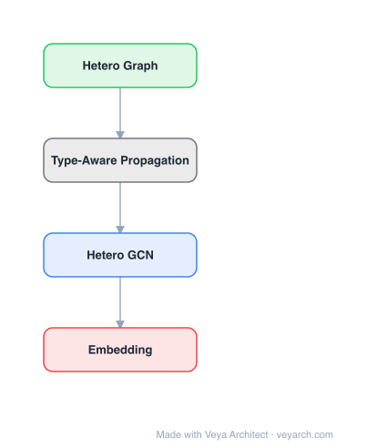

# Architecture: THNN (Tensorized Hypergraph Neural Networks)

## Motivation

Hypergraph neural networks (HGNNs) have received significant attention due to their excellent performance in various domains. However, most existing HGNNs rely on first-order approximations of hypergraph connectivity patterns, which ignores important high-order information. THNN addresses this by proposing an adjacency-tensor-based framework that faithfully models hypergraph connectivity through high-order outer product feature message passing.

## Core Idea

A novel hypergraph neural network that uses adjacency tensors (instead of adjacency matrices) to faithfully model hypergraph connectivity. THNN is a natural tensor extension of adjacency-matrix-based GNNs, equivalent to a high-order polynomial regression scheme that efficiently extracts high-order information from uniform hypergraphs. CP decomposition reduces complexity from exponential to linear.

## Architecture

### Overview

<b>Layer-by-layer (4 nodes)</b>

| # | Layer | Type | Params |
|---|---|---|---|
| 1 | Hetero Graph | `input` |  |
| 2 | Type-Aware Propagation | `custom` |  |
| 3 | Hetero GCN | `gcn_conv` |  |
| 4 | Embedding | `output` |  |

THNN extends graph neural networks from adjacency matrices (2D) to adjacency tensors (N-dimensional) for hypergraphs. For a k-uniform hypergraph (where each hyperedge connects k nodes), THNN uses a k-dimensional adjacency tensor. Feature message passing uses high-order outer products of node features, and partially symmetric CP decomposition reduces the exponential complexity to linear.

### Components

1. **Adjacency Tensor** — N-dimensional generalization of adjacency matrix:
   - For k-uniform hypergraph: k-dimensional adjacency tensor
   - Captures full hypergraph connectivity (not first-order approximation)
   - Generalizes the adjacency matrix from graphs to hypergraphs

2. **High-Order Outer Product Feature Message Passing** — Core message passing:
   - Node features combined via outer products (not simple sums)
   - Captures high-order interactions between nodes in hyperedges
   - Equivalent to high-order polynomial regression

3. **CP Decomposition** — Complexity reduction:
   - Partially symmetric CP (Canonical Polyadic) decomposition
   - Reduces exponential complexity O(d^N) to linear O(Nd)
   - d = feature dimension, N = hypergraph uniformity
   - Makes high-order computation tractable

4. **Feature Transformation** — Per-node linear transformation:
   - Θ(l) parameters transform node features before outer product
   - Learnable weight matrix per layer
   - Different from standard GNN weight sharing

5. **Activation Function** — Numerical stability:
   - Tanh(·) used to prevent numerical instability from outer products
   - Outer products of many vectors can cause numerical issues
   - Activation stabilizes training

### Data Flow

1. **Input**: Node features on a k-uniform hypergraph
2. **Feature transformation**: Apply Θ(l) to each node's features
3. **Outer product**: Compute outer products of transformed features for nodes in each hyperedge
4. **Aggregation**: Sum outer products over neighbors (using adjacency tensor)
5. **CP decomposition**: Factorize the high-order computation for efficiency
6. **Activation**: Apply Tanh for numerical stability
7. **Lower-order terms**: Concatenate scalar 1 to features for lower-order information
8. **Output**: Updated node features

### State / Memory

- **No explicit memory mechanism**: THNN is a feedforward architecture.
- **Adjacency tensor**: The hypergraph structure is encoded in a k-dimensional adjacency tensor.
- **CP factors**: The CP decomposition factors are persistent model parameters.
- **Feature transformations**: Per-layer weight matrices Θ(l).

## Design Decisions

1. **Adjacency tensor (not matrix)** — Faithful hypergraph modeling:
   - Standard HGNNs use first-order approximation (adjacency matrix)
   - Adjacency tensor captures full high-order connectivity
   - More faithful to the hypergraph structure

2. **High-order outer products** — Capturing multi-way interactions:
   - Outer products capture joint interactions of all nodes in a hyperedge
   - More expressive than pairwise (matrix) operations
   - Equivalent to high-order polynomial regression

3. **CP decomposition** — Making high-order computation tractable:
   - Exponential complexity O(d^N) is intractable for high-order hypergraphs
   - Partially symmetric CP decomposition reduces to O(Nd)
   - Preserves expressiveness while being computationally feasible

4. **Lower-order terms** — Concatenating scalar 1:
   - Outer products emphasize high-order interactions but may lose lower-order info
   - Concatenating scalar 1 to features generates lower-order dynamics
   - Ensures the model captures both high and low-order information

5. **Tanh activation** — Numerical stability:
   - Outer products of many vectors can cause numerical instability
   - Tanh bounds the output to [-1, 1]
   - Stabilizes training

## Evolution

**Predecessors:**
- **Graph Neural Networks** (GCN, GAT, GraphSAGE) — Message passing on graphs (pairwise).
- **Hypergraph Neural Networks** (HGNN) — First-order approximation on hypergraphs.
- **Tensor decomposition** — CP, Tucker decompositions for multi-way data.
- **Spectral hypergraph theory** — Laplacian operators on hypergraphs.

**Successors:**
- **Non-uniform hypergraph extensions** — THNN extended to non-uniform hypergraphs.
- **Dynamic hypergraph neural networks** — Time-varying hypergraphs.
- **Higher-order network analysis** — Beyond hypergraphs.

## Characteristics

| Property | Value |
|----------|-------|
| Year | 2024 |
| Authors | Wang, Zhen, Pan, Zhao, Zhuang, Xu, Guo |
| Category | DL/Hypergraph |
| Source Paper | `Tensorized_Hypergraph_Neural_Networks_Wang_Zhen_Pan_etal_2024.md` |
| PaperVault Path | `GNN/05-hypergraphs-topology/Tensorized_Hypergraph_Neural_Networks_Wang_Zhen_Pan_etal_2024.md` |

## Limitations

1. **Uniform hypergraphs only** — Basic THNN requires uniform hypergraphs (all hyperedges same size); extensions for non-uniform are proposed but add complexity.
2. **CP decomposition approximation** — CP decomposition is an approximation; information may be lost.
3. **Computational cost** — Even with CP decomposition, high-order hypergraphs can be expensive.
4. **Limited evaluation** — Evaluated on 3D visual object classification; broader evaluation needed.
5. **Hypergraph construction** — Converting data to hypergraph form is non-trivial.
6. **Comparison to GNNs** — The practical advantage over GNNs on real-world tasks is not always clear.

## Implementation Notes

See `implementation/` for a minimal runnable implementation. Key details:
- Adjacency tensor: k-dimensional for k-uniform hypergraph
- Feature message passing: high-order outer products
- CP decomposition: partially symmetric, reduces O(d^N) to O(Nd)
- Activation: Tanh for numerical stability
- Lower-order terms: concatenate scalar 1 to features
- Formula: x_i^(l+1) = σ(Σ_{(j1,...,jN-1)∈N_i} Q^(l) Tanh(...))
- Extensions for non-uniform hypergraphs proposed
- Datasets: 3D visual object classification (hypergraph datasets)
- Equivalent to high-order polynomial regression
- Natural tensor extension of adjacency-matrix-based GNNs

## Information Layers

- **Evidence:** Source paper available in `references/papers/` (Wang et al., 2024, "Tensorized Hypergraph Neural Networks")
- **Analysis:** THNN's key insight is that the adjacency matrix (used in standard HGNNs) is a first-order approximation that loses high-order information. By using the full adjacency tensor, THNN faithfully captures the multi-way connectivity of hypergraphs. The high-order outer product message passing is mathematically equivalent to high-order polynomial regression, providing a principled way to capture multi-way interactions. The CP decomposition is crucial — without it, the exponential complexity would make high-order hypergraphs intractable. The concatenation of scalar 1 for lower-order terms is a simple but effective trick to ensure the model doesn't only capture high-order interactions.
- **Hypothesis:** The adjacency tensor approach may be the "right" way to model hypergraphs, analogous to how adjacency matrices are the "right" way to model graphs. The CP decomposition may reveal structural properties of hypergraph connectivity. The polynomial regression interpretation suggests connections to other polynomial-based architectures (RPN). The non-uniform extensions may be key to practical adoption, as real-world hypergraphs are often non-uniform.
