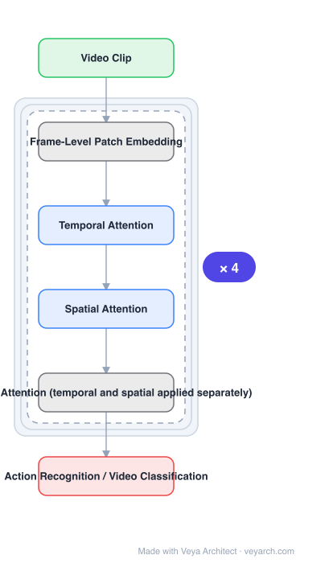

# Architecture: TimeSformer

## Motivation

Video understanding resembles NLP in two ways: both are sequential, and atomic actions in short segments need contextualizing with the rest of the video, just as a word's meaning depends on its sentence. So long-range self-attention should be highly effective for video. Yet **2D or 3D convolutions remained the core operators** for spatiotemporal feature learning, and self-attention had only been used **on top of** convolutional layers.

## Core Idea

A **convolution-free** video model built **exclusively on self-attention over space and time**, learning spatiotemporal features directly from a sequence of **frame-level patches**. Several scalable space-time attention schemes are proposed and empirically compared; the winner is **divided attention**, where temporal and spatial attention are applied separately within each block.

## Architecture

### Overview

<b>Layer-by-layer (6 nodes)</b>

| # | Layer | Type | Params |
|---|---|---|---|
| 1 | Video Clip | `input` |  |
| 2 | Frame-Level Patch Embedding | `custom` |  |
| 3 | Temporal Attention | `attention` |  |
| 4 | Spatial Attention | `attention` |  |
| 5 | Divided Attention (temporal and spatial applied separately) | `custom` |  |
| 6 | Action Recognition / Video Classification | `output` |  |

### Components

1. **Frame-level patch embedding** — the video is decomposed into a sequence of frame-level patches whose linear embeddings are the input tokens; the paper states the efficiency stems mainly from this decomposition.
2. **Divided attention** — **temporal attention and spatial attention applied separately within each block**; found to give the best video classification accuracy among the schemes considered.
3. **Alternative attention schemes (compared, not selected)** — joint space-time attention, sparse local/global attention, and axial attention generalized to the spatiotemporal volume; all evaluated in the ablation.
4. **Positional embeddings** — spatiotemporal position information for the tokens.
5. **Classification token / head** — for action recognition.

### Data Flow

Clip of \(F\) RGB frames → split into frame-level patches → linear embedding per patch plus positional embedding → transformer blocks, each applying temporal attention then spatial attention (divided attention) → classification head.

### State / Memory

No recurrent state. The cost question is central: joint space-time attention over all patches is expensive, which is why the schemes are compared, and why divided attention's separation matters.

## Design Decisions

- **Convolution-free, not conv-plus-attention** — explicitly built exclusively on self-attention; this is the design being tested ("Is Space-Time Attention All You Need?").
- **Reuse ViT's patch tokenisation** — decomposing into frame-level patches is where the efficiency comes from, rather than from sparse or axial tricks.
- **Compare attention schemes empirically** — the paper proposes several and compares them rather than asserting one; divided attention is an empirical finding.
- **Separate temporal from spatial** — the ablation's conclusion, and the reason the model scales to long clips.
- **Long clips as an explicit goal** — applicability to clips over one minute long is a reported advantage over 3D CNNs.

## Evolution

- **Two-stream networks** (predecessor): RGB frames and optical flow processed independently then fused.
- **Spatiotemporal 3D CNNs** (predecessor): the prior state of the art, requiring large training datasets.
- **ViT** (predecessor): patch tokenisation strategy adapted here to video.
- **TimeSformer (2021)**: convolution-free divided space-time attention.
- **Siblings**: ViViT, SlowFast, UniFormer, VideoMAE.
- **Contrast**: 3D convolutional networks — slower to train, lower test efficiency, limited clip length.

## Characteristics

| Property | Value |
|---|---|
| Task | action recognition / video classification |
| Convolutions | none |
| Tokenisation | frame-level patches (ViT-style) |
| Attention scheme | divided attention (temporal, then spatial, per block) |
| Benchmarks | Kinetics-400, Kinetics-600 (best reported accuracy) |
| vs 3D CNNs | faster training, much higher test efficiency, clips over one minute |

## Limitations

- Divided attention is not joint space-time attention; interactions between space and time within one block are indirect.
- Attention over all frames still grows with clip length, so very long clips remain costly.
- Convolution-free design lacks the locality inductive bias, making training data requirements heavier.
- The scheme comparison is empirical on specific benchmarks; the winner may differ elsewhere.

## Implementation Notes

Essentials: (1) tokenise the video as **frame-level patches** and feed linear embeddings — that decomposition is where the stated efficiency comes from, more than any attention sparsification, (2) apply **temporal and spatial attention separately within each block** (divided attention); that is the empirical winner, and joint space-time attention is the more expensive alternative the ablation rejects, (3) keep the model convolution-free if reproducing the claim — adding conv features is the "attention on top of conv" design this replaces, (4) include spatiotemporal positional embeddings; without them patches are unordered, (5) report training time, test efficiency and maximum clip length against a 3D CNN baseline, since those three advantages are the practical case for the model rather than accuracy alone.
