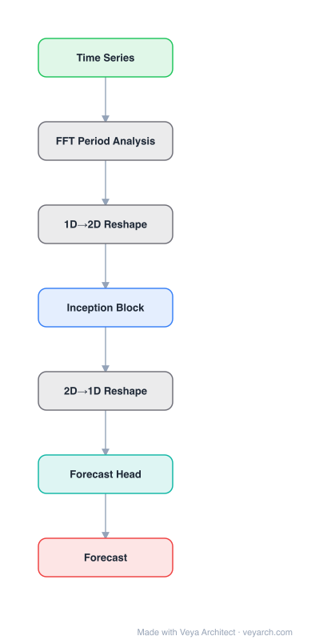

# Architecture: TimesNet

## Motivation

Time series analysis is of immense importance in extensive applications such as weather forecasting, anomaly detection, and action recognition. The common key problem is temporal variation modeling. Previous methods attempt to accomplish this directly from the 1D time series, which is extremely challenging due to intricate temporal patterns. Based on the observation of multi-periodicity in time series, TimesNet unravels complex temporal variations into multiple intraperiod- and interperiod-variations, extending the analysis from 1D to 2D space.

## Core Idea

A task-general backbone for time series analysis that transforms 1D time series into a set of 2D tensors based on multiple periods, embedding intraperiod-variations into columns and interperiod-variations into rows. TimesBlock discovers multi-periodicity adaptively (via FFT) and extracts complex temporal variations from 2D tensors using a parameter-efficient inception block.

## Architecture

### Overview

<b>Layer-by-layer (7 nodes)</b>

| # | Layer | Type | Params |
|---|---|---|---|
| 1 | Time Series | `input` |  |
| 2 | FFT Period Analysis | `custom` |  |
| 3 | 1D→2D Reshape | `custom` |  |
| 4 | Inception Block | `conv2d` |  |
| 5 | 2D→1D Reshape | `custom` |  |
| 6 | Forecast Head | `linear` |  |
| 7 | Forecast | `output` |  |

TimesNet uses TimesBlock as its core building block. Each TimesBlock first discovers periods in the 1D time series using Fast Fourier Transform (FFT), then reshapes the 1D series into 2D tensors based on these periods. The 2D tensors are processed by an inception block (2D convolution), capturing both intraperiod (column) and interperiod (row) variations. Multiple TimesBlocks are stacked to form the full network, with task-specific heads for forecasting, imputation, classification, and anomaly detection.

### Components

1. **TimesBlock** — Core building block:
   - **Period discovery**: FFT to find dominant periods in the time series
   - **1D-to-2D reshape**: Reshape 1D series into 2D tensors (period × period_count)
   - **2D inception block**: Parameter-efficient 2D convolution on reshaped tensors
   - **2D-to-1D reshape**: Convert back to 1D representation

2. **Period Discovery (FFT)** — Adaptive multi-periodicity:
   - Apply FFT to the time series
   - Select top-k dominant frequencies as periods
   - Each period defines a 2D reshaping of the 1D series

3. **Inception Block** — 2D convolution for temporal variation:
   - Multi-scale 2D kernels capture variations at different granularities
   - Parameter-efficient (shared across 2D tensors)
   - Processes both intraperiod (within-period) and interperiod (between-period) variations

4. **Task-Specific Heads** — For different analysis tasks:
   - **Forecasting**: Linear projection to future values
   - **Imputation**: Linear projection to fill missing values
   - **Classification**: Pooling + linear classification head
   - **Anomaly detection**: Reconstruction-based anomaly scoring

### Data Flow

1. **Input**: 1D time series (batch × channels × length)
2. **Embedding**: Linear projection to d-dimensional features
3. **TimesBlock (×N layers)**:
   a. **FFT**: Discover dominant periods from the time series
   b. **Reshape 1D→2D**: For each period, reshape to 2D tensor (period × period_count)
   c. **2D Inception**: Apply 2D convolution to capture 2D variations
   d. **Reshape 2D→1D**: Convert back to 1D representation
   e. **Aggregation**: Combine results from different periods
4. **Task head**: Apply task-specific output layer
5. **Output**: Forecasting/imputation/classification/anomaly scores

### State / Memory

- **No explicit recurrent state**: TimesNet is a feedforward architecture.
- **2D tensor representations**: Transient 2D tensors created from 1D series per layer.
- **Period information**: Dominant periods discovered via FFT are used within each TimesBlock.
- **Model parameters**: Inception block weights and task-specific head weights.

## Design Decisions

1. **1D-to-2D transformation** — Extending time series to 2D space:
   - Intraperiod variations (within a period) → 2D columns
   - Interperiod variations (between periods) → 2D rows
   - 2D kernels can simultaneously capture both types of variation
   - More expressive than 1D analysis

2. **FFT for period discovery** — Adaptive multi-periodicity:
   - Data-driven period detection (no manual period specification)
   - Captures multiple periods simultaneously
   - Computationally efficient (FFT is O(n log n))

3. **Inception block** — Parameter-efficient 2D processing:
   - Multi-scale kernels capture variations at different granularities
   - Shared parameters across 2D tensors (parameter efficiency)
   - Inspired by Inception networks in computer vision

4. **Task-general backbone** — Unified architecture for multiple tasks:
   - Same TimesBlock backbone for forecasting, imputation, classification, anomaly detection
   - Only the task-specific head differs
   - Demonstrates the generality of 2D variation modeling

## Evolution

**Predecessors:**
- **RNN-based models** (LSTM, GRU) — Sequential processing of time series.
- **TCN-based models** — Temporal convolutional networks.
- **Transformer-based models** (Informer, Autoformer) — Attention-based time series.
- **MLP-based models** (DLinear) — Simple linear models.

**Successors:**
- **PatchTST** — Patch-based transformer for time series.
- **iTransformer** — Inverted transformer for time series.
- **TimeMixer** — Multi-scale MLP mixing for time series.

## Characteristics

| Property | Value |
|----------|-------|
| Year | 2022 |
| Authors | Wu, Hu, Liu, Zhou, Wang, Long (Tsinghua University) |
| Category | DL/Time Series |
| Source Paper | `TimesNet_Wu_2022.md` |
| PaperVault Path | `GNN/06-gnn-for-time-series/TimesNet_Wu_2022.md` |

## Limitations

1. **Period assumption** — Assumes time series have discernible periodicity; non-periodic series may not benefit from 2D transformation.
2. **Fixed top-k periods** — The number of periods to consider is a hyperparameter.
3. **2D reshape artifacts** — Reshaping 1D to 2D may introduce artifacts if periods are not exact divisors of the series length.
4. **Computational overhead** — FFT and 2D convolution add overhead compared to simple 1D models.
5. **Multi-variate handling** — Processes channels independently; inter-channel correlations may be underutilized.
6. **Classification weakness** — May not capture hierarchical representations as well as specialized classification models.

## Implementation Notes

See `implementation/` for a minimal runnable implementation. Key details:
- TimesBlock: FFT → 1D-to-2D reshape → 2D inception → 2D-to-1D reshape
- Period discovery: FFT, select top-k dominant frequencies
- 2D inception: multi-scale 2D convolution kernels
- Task heads: linear (forecasting/imputation), pooling+linear (classification), reconstruction (anomaly)
- SOTA on 5 tasks: short/long-term forecasting, imputation, classification, anomaly detection
- Code: github.com/thuml/TimesNet
- Consistent state-of-the-art across all five mainstream time series tasks

## Information Layers

- **Evidence:** Source paper available in `references/papers/` (Wu et al., 2023, "TimesNet: Temporal 2D-Variation Modeling for General Time Series Analysis")
- **Analysis:** TimesNet's key insight is that 1D time series contain multi-periodic patterns that are better captured in 2D space. By reshaping the series into 2D tensors based on discovered periods, both within-period and between-period variations become accessible to 2D kernels. The FFT-based period discovery is elegant — it's data-driven, efficient, and naturally captures multi-periodicity. The task-general design demonstrates that 2D variation modeling is a fundamental capability for time series analysis, unifying what were previously task-specific architectures.
- **Hypothesis:** The 2D transformation may be the "right" representation for periodic time series, analogous to how 2D convolutions revolutionized image processing. The FFT-based period discovery could be extended to discover non-integer or hierarchical periods. The task-general backbone approach may become standard for time series, replacing task-specific architectures.
