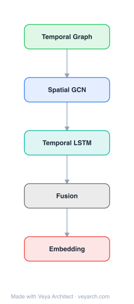

# Architecture: Temporal Network Embedding via Neighborhood Formation

## Motivation

Network embedding has become a focal point of study, aiming to represent large-scale networks by mapping nodes to low-dimensional space. However, existing methods generally focus on static network structure, considering neighbors as unordered sets. This assumes the link formation history is omitted.

In reality, networks are formed by adding nodes and edges sequentially, driven by interactive events between a node and its neighbors. The neighborhood of a node is not formed simultaneously—the observed snapshot is the accumulation of neighborhood formation over time. For example, in a co-author network, a Ph.D. student's early co-authors (advisor) differ from later ones, and early connections can excite new ones (advisor's academic friend becomes co-author).

Existing dynamic network embedding methods segment timelines into fixed time windows, producing embeddings for particular time periods without modeling the dynamic formation process itself. The paper proposes HTNE (Hawkes process based Temporal Network Embedding), which directly models the neighborhood formation sequence and the excitation effects between historical and current neighbor formation events.

## Core Idea

Temporal network embedding via temporal neighborhood formation process.

## Architecture

### Overview

<b>Layer-by-layer (5 nodes)</b>

| # | Layer | Type | Params |
|---|---|---|---|
| 1 | Temporal Graph | `input` |  |
| 2 | Spatial GCN | `gcn_conv` |  |
| 3 | Temporal LSTM | `lstm` |  |
| 4 | Fusion | `custom` |  |
| 5 | Embedding | `output` |  |

HTNE integrates the Hawkes process into network embedding to capture the influence of historical neighbors on current neighbor formation. The method first induces neighborhood formation sequences from the temporal network by tracking all timestamped events. The Hawkes process models the conditional intensity function—the arrival rate of events—where historical events excite future ones.

Low-dimensional node vectors are fed into the Hawkes process by mapping pairwise vectors to the base rate and the temporal influence from history. An attention mechanism is further integrated to enhance the expressiveness of the influence from historical neighbors on current neighbor formation events. The model is optimized by maximizing the likelihood of neighborhood formation sequences rather than the conditional intensity function directly.

### Components

- **Neighborhood formation sequence**: For each node x, the chronological interactive events with its neighbors are organized into a sequence H_x, capturing the temporal evolution of the node's neighborhood.

- **Hawkes process model**: A point process where the conditional intensity function λ(t) = μ + Σ α·g(t - t_j) models the arrival rate of events. Historical events before time t influence the occurrence of the current event. μ is the base rate, α is the influence magnitude, and g(·) is a decay kernel.

- **Node embedding vectors**: Low-dimensional vectors that are mapped into the Hawkes process: pairwise interactions between vectors serve as the base rate and temporal influence. The embedding of a node pair (x, y) determines how the historical presence of neighbor y influences the formation of a new connection.

- **Attention mechanism**: Enhances the expressiveness of the influence from historical neighbors on current neighbor formation. Different historical neighbors can have varying influence strengths depending on the node's state.

- **Likelihood optimization**: The model is trained by optimizing the likelihood of the observed neighborhood formation sequences, scalable to large networks.

### Data Flow

1. **Input**: Temporal network G = ⟨V, E; A⟩ where each edge (x, y) is annotated with chronological interactive events a_{x,y} = {a_1 → a_2 → ...} with timestamps.
2. **Sequence construction**: For each node x, induce the neighborhood formation sequence H_x by tracking all timestamped events in which x interacts with its neighbors, ordered by time.
3. **Embedding initialization**: Initialize D-dimensional vectors for each node.
4. **Hawkes process modeling**: For each neighbor formation event in H_x, compute the conditional intensity using: base rate (from embedding interaction) + temporal influence (from historical neighbors' embeddings).
5. **Attention weighting**: Apply attention mechanism to determine the varying influence of different historical neighbors on the current neighbor formation.
6. **Likelihood computation**: Compute the likelihood of the observed neighborhood formation sequences.
7. **Optimization**: Maximize the likelihood to learn node embeddings that capture temporal excitation effects.
8. **Output**: D-dimensional node embeddings for tasks including node classification, link prediction, and temporal recommendation.

### State / Memory

The Hawkes process inherently maintains **temporal state**: the conditional intensity function at time t depends on all historical events before t. This means the model's state is the complete history of neighbor formation events, with the influence of past events decaying over time via the kernel function g(·). The attention mechanism adds a learned weighting over this temporal history, allowing the model to emphasize certain historical events over others.

## Design Decisions

- **Hawkes process over time-window segmentation**: Directly models the temporal formation process rather than producing static snapshots for different time periods. This captures the excitation effects between sequential events that time-window methods miss.

- **Neighborhood formation sequences**: Organizing neighbors chronologically (rather than as unordered sets) preserves the link formation history, which contains richer information than the static snapshot.

- **Likelihood optimization over intensity function**: Optimizing the likelihood of sequences (rather than the conditional intensity function directly) makes the model scalable to large networks.

- **Attention mechanism integration**: Different historical neighbors have varying influence on current neighbor formation; attention allows the model to learn these varying influence strengths rather than treating all historical events equally.

- **Dual role of embeddings**: Node embeddings serve both as the base rate (intrinsic tendency to form connections) and as the temporal influence (how one neighbor's presence excites another's formation).

## Evolution

**Predecessors:**
- DeepWalk (Perozzi et al., 2014) — random walk-based network embedding using word2vec
- node2vec (Grover & Leskovec, 2016) — biased random walks for network embedding
- LINE (Tang et al., 2015) — first-order and second-order proximity preservation
- Time-window-based dynamic network embedding methods — segment timelines into fixed windows

**Successors:**
- HTNE inspired subsequent temporal network embedding methods that model event sequences
- The Hawkes process integration influenced works on temporal point processes for dynamic graph learning
- The temporal recommendation approach using conditional intensity functions opened new directions for time-aware recommendation

## Characteristics

| Property | Value |
|----------|-------|
| Year | 2018 |
| Authors | Unknown |
| Category | GNN/Embedding |
| Source Paper | `Embedding_Temporal_Network_via_Neighborhood_Formation_Beijing_China_2018.md` |
| PaperVault Path | `GNN/02-network-embedding/Embedding_Temporal_Network_via_Neighborhood_Formation_Beijing_China_2018.md` |

## Limitations

- The Hawkes process assumes a specific parametric form for the excitation and decay of historical events, which may not capture all temporal dynamics in real networks.
- The model requires temporal interaction data with timestamps; networks without temporal information cannot use this approach.
- The neighborhood formation sequence construction can be expensive for very large networks with many events per edge.
- The attention mechanism adds computational overhead per event in the sequence.
- The model assumes that the temporal excitation is always positive (events excite future events); inhibitory effects (where one event suppresses another) are not modeled by the standard Hawkes process.
- The conditional intensity function's accuracy depends on the quality and completeness of the historical event data.

## Implementation Notes

See `implementation/` for a minimal runnable implementation.

## Information Layers

- **Evidence:** Source paper available in `references/papers/`
- **Analysis:** HTNE's key insight is that temporal network formation is not just a sequence of independent events but a self-exciting process where historical connections influence future ones. By embedding the Hawkes process into the learning objective, the model captures both the structural (who connects to whom) and temporal (when and why) aspects of network evolution.
- **Hypothesis:** The attention mechanism may be capturing different types of temporal influence (e.g., recency vs. frequency) that a uniform Hawkes process would miss. The temporal recommendation capability suggests that arrival rates inferred from embeddings encode meaningful predictive signals about future connections.
