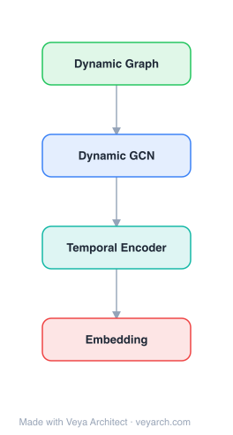

# Architecture: Tri-Party Deep Network Representation

## Motivation

Information network mining often requires examination of linkage relationships between nodes for analysis. Network representation has emerged to represent each node in a vector format, embedding network structure so off-the-shelf machine learning methods can be directly applied. However, existing methods only focus on one aspect of node information and cannot leverage node labels.

The drawback of existing methods is twofold: (1) they only utilize one source of information (either network structure or node content), so the representation is inherently shallow; (2) all methods learn network embedding in a fully unsupervised way, ignoring limited labeled nodes that could provide useful information to assist network representation.

The main challenge of learning latent representations for network nodes is combining multiple information sources. TriDNR addresses this by using information from three parties: node structure, node content, and node labels (if available) to jointly learn optimal node representation.

## Core Idea

Deep network representation learning involving three parties: structure, content, and labels.

## Architecture

### Overview

<b>Layer-by-layer (4 nodes)</b>

| # | Layer | Type | Params |
|---|---|---|---|
| 1 | Dynamic Graph | `input` |  |
| 2 | Dynamic GCN | `gcn_conv` |  |
| 3 | Temporal Encoder | `lstm` |  |
| 4 | Embedding | `output` |  |

TriDNR (Tri-Party Deep Network Representation) is based on a coupled deep natural language module whose learning is enforced at three levels: (1) at the network structure level, TriDNR exploits inter-node relationship by maximizing the probability of observing surrounding nodes given a node in random walks; (2) at the node content level, TriDNR captures node-word correlation by maximizing the co-occurrence of word sequences given a node; and (3) at the node label level, TriDNR models label-word correspondence by maximizing the probability of word sequences given a class label.

The tri-party information is jointly fed into the neural network model to mutually enhance each other to learn optimal representation. This results in up to 79% classification accuracy gain compared to state-of-the-art methods.

### Components

- **Network structure level**: Exploits inter-node relationships by maximizing the probability of observing surrounding nodes given a node in random walks. Uses the Skip-gram model to learn from random walk sequences, treating nodes as words and walks as sentences.

- **Node content level**: Captures node-word correlation by maximizing the co-occurrence of word sequences given a node. Maps text content associated with nodes into the same embedding space as the network structure.

- **Node label level**: Models label-word correspondence by maximizing the probability of word sequences given a class label. Uses available labeled nodes to guide the embedding learning, ensuring that embeddings are discriminative for the classification task.

- **Coupled deep natural language module**: The core architecture that jointly processes all three information sources. The coupling ensures that structure, content, and label information mutually enhance each other rather than being learned independently.

- **Skip-gram model**: The foundational neural network model (from word2vec) extended for network embedding, used as the base learning mechanism at each level.

### Data Flow

1. **Input**: Network with structure (adjacency), node content (text), and optionally node labels.
2. **Random walk generation**: Generate random walks on the network to capture structural relationships.
3. **Structure-level learning**: Use Skip-gram to maximize P(neighbor nodes | node) from random walk sequences.
4. **Content-level learning**: Maximize P(word sequence | node) to capture node-content correlations.
5. **Label-level learning**: Maximize P(word sequence | class label) to incorporate supervised information.
6. **Joint optimization**: Feed all three information sources into the coupled neural network model, jointly optimizing the embeddings so that structure, content, and labels mutually enhance each other.
7. **Output**: Low-dimensional node embeddings that encode network structure, node content, and label information.
8. **Downstream tasks**: Use embeddings for node classification, link prediction, and other network mining tasks.

### State / Memory

Stateless—TriDNR produces fixed embeddings through optimization of the coupled Skip-gram models. No recurrent state or memory mechanism is used. The three information sources (structure, content, labels) are processed jointly but in a feed-forward manner during training.

## Design Decisions

- **Three-party information fusion**: Combining structure, content, and labels addresses the shallowness of single-source methods. Structure captures topology, content captures node semantics, and labels provide task-relevant supervision.

- **Coupled deep natural language module**: Rather than learning three separate models and combining their outputs, the coupled module jointly optimizes all three objectives, allowing mutual enhancement. This is more effective than late fusion.

- **Skip-gram as the unifying framework**: Using the Skip-gram model at all three levels provides a consistent learning mechanism—nodes, words, and labels are all treated as "tokens" in sequences, enabling a unified optimization.

- **Label-level learning via word sequences**: Modeling P(word sequence | label) rather than P(label | node) allows the label information to flow through the content embeddings, providing a softer and more generalizable signal than direct classification.

## Evolution

**Predecessors:**
- DeepWalk (Perozzi et al., 2014) — random walk + word2vec for network embedding (structure only)
- LINE (Tang et al., 2015) — first/second-order proximity (structure only)
- Text embedding methods (TF-IDF, LDA, Skip-gram, Paragraph Vector) — content only
- Social dimensions (Tang & Liu, 2009) — early network embedding
- Knowledge base embeddings (Bordes et al., 2011; Socher et al., 2013)

**Successors:**
- TriDNR inspired subsequent multi-source network embedding methods that combine structure, content, and labels
- The coupled learning paradigm influenced semi-supervised graph representation learning methods

## Characteristics

| Property | Value |
|----------|-------|
| Year | 2014 |
| Authors | Pan et al. |
| Category | GNN/Embedding |
| Source Paper | `Tri_Party_Deep_Network_Representation_Pan_Wu_Zhang_etal_2014.md` |
| PaperVault Path | `GNN/02-network-embedding/Tri_Party_Deep_Network_Representation_Pan_Wu_Zhang_etal_2014.md` |

## Limitations

- The method requires text content associated with nodes; networks without textual content cannot use the content-level learning.
- The label-level learning requires labeled nodes; in purely unsupervised settings, this component is unused.
- The coupled Skip-gram approach inherits word2vec's limitations, including sensitivity to window size and walk length.
- The method processes structure, content, and labels through a unified Skip-gram framework, which may not capture complex non-linear interactions between the three sources as effectively as deep neural network architectures.
- The 79% accuracy gain is measured on specific datasets; gains may vary across domains.
- The joint optimization of three objectives requires careful balancing of loss weights, which is a hyperparameter.

## Implementation Notes

See `implementation/` for a minimal runnable implementation.

## Information Layers

- **Evidence:** Source paper available in `references/papers/`
- **Analysis:** TriDNR's key insight is that network structure, node content, and node labels provide complementary information that, when combined through a coupled learning framework, produces representations that are richer than any single source. The Skip-gram model serves as a unifying mechanism that treats all three sources as sequences of tokens.
- **Hypothesis:** The label-level learning via P(word sequence | label) may be acting as a regularizer that aligns content embeddings with discriminative directions, effectively performing a form of supervised dimensionality reduction through the content space.
