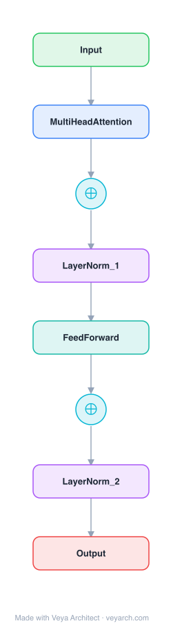

# Architecture: Transformer

## Motivation

The dominant sequence transduction models at the time of publication were built on recurrent or convolutional networks with an encoder-decoder structure. Recurrent models (LSTM, GRU) factor computation along symbol positions: each hidden state `h_t` is a function of the previous `h_{t-1}` and the input at position `t`. This inherently sequential nature **prevents parallelization within training examples**, becoming critical at longer sequence lengths as memory constraints limit batching across examples. Prior efforts used factorization tricks and conditional computation to improve efficiency, but the fundamental constraint of sequential computation remained.

While attention mechanisms had become integral to sequence models, they were always used *in conjunction with* a recurrent network. The Transformer was proposed to **dispense with recurrence entirely**, relying solely on an attention mechanism to draw global dependencies between input and output, enabling significantly more parallelization and reaching state-of-the-art translation quality after training for as little as twelve hours on eight P100 GPUs.

## Core Idea

Self-attention-based sequence model replacing recurrence with parallel attention; the foundation architecture for modern NLP.

## Architecture

### Overview

<b>Layer-by-layer (8 nodes)</b>

| # | Layer | Type | Params |
|---|---|---|---|
| 1 | Input | `input` |  |
| 2 | MultiHeadAttention | `attention` |  |
| 3 | ⊕ | `residual` |  |
| 4 | LayerNorm_1 | `layernorm` |  |
| 5 | FeedForward | `ffn` |  |
| 6 | ⊕ | `residual` |  |
| 7 | LayerNorm_2 | `layernorm` |  |
| 8 | Output | `output` |  |

The Transformer follows the standard encoder-decoder structure. The **encoder** maps an input sequence `(x_1, ..., x_n)` to a continuous representation `z = (z_1, ..., z_n)`. Given `z`, the **decoder** generates an output sequence `(y_1, ..., y_m)` one element at a time, auto-regressively consuming previously generated symbols as additional input. Both encoder and decoder are built from stacked self-attention and point-wise feed-forward layers. The base model uses `d_model = 512`, `N = 6` encoder layers and `N = 6` decoder layers.

### Components

1. **Encoder Stack** — `N = 6` identical layers, each with two sub-layers: (a) multi-head self-attention, and (b) position-wise fully connected feed-forward network. Residual connections wrap each sub-layer, followed by layer normalization: `LayerNorm(x + Sublayer(x))`. All sub-layers (and embeddings) produce `d_model = 512`-dimensional outputs to facilitate residual connections.

2. **Decoder Stack** — `N = 6` identical layers, each with three sub-layers: (a) masked multi-head self-attention, (b) encoder-decoder cross-attention (queries from previous decoder layer; keys/values from encoder output), and (c) position-wise feed-forward network. Residual connections and layer normalization as in the encoder. Masking in the self-attention sub-layer prevents positions from attending to subsequent positions, preserving auto-regressive property.

3. **Scaled Dot-Product Attention** — Core attention function: `Attention(Q, K, V) = softmax(QK^T / sqrt(d_k)) V`. Queries, keys are `d_k`-dimensional; values are `d_v`-dimensional. The scaling factor `1/sqrt(d_k)` counteracts the effect of large dot products pushing softmax into regions with small gradients.

4. **Multi-Head Attention** — Projects queries, keys, values `h = 8` times with different learned linear projections to `d_k = 64`, `d_v = 64` dimensions, performs attention in parallel, concatenates results, and applies a final linear projection: `MultiHead(Q,K,V) = Concat(head_1, ..., head_h) W^O`. This allows the model to jointly attend to information from different representation subspaces at different positions.

5. **Position-wise Feed-Forward Network (FFN)** — Two linear transformations with ReLU activation in between: `FFN(x) = max(0, xW_1 + b_1)W_2 + b_2`. Input/output dimension `d_model = 512`, inner dimension `d_ff = 2048`. Applied to each position separately and identically; different parameters per layer.

6. **Embeddings and Softmax** — Learned embeddings convert input/output tokens to `d_model`-dimensional vectors. The same weight matrix is shared between the two embedding layers and the pre-softmax linear transformation; embedding weights are multiplied by `sqrt(d_model)`.

7. **Positional Encoding** — Since the model contains no recurrence or convolution, positional information is injected by adding sinusoidal encodings to input embeddings: `PE(pos, 2i) = sin(pos / 10000^{2i/d_model})`, `PE(pos, 2i+1) = cos(pos / 10000^{2i/d_model})`. Wavelengths form a geometric progression from `2π` to `10000·2π`. Chosen because `PE_{pos+k}` can be represented as a linear function of `PE_pos`, enabling the model to learn relative-position attention; may also extrapolate to lengths longer than those seen in training.

### Data Flow

1. **Input embedding**: Input tokens `(x_1, ..., x_n)` are converted to `d_model`-dimensional vectors via learned embeddings.
2. **Positional injection**: Sinusoidal positional encodings are added to the embeddings.
3. **Encoder processing**: The summed embeddings pass through `N = 6` encoder layers. Each layer applies multi-head self-attention (all keys/values/queries from the previous encoder layer) → residual + LayerNorm → position-wise FFN → residual + LayerNorm. Output: `z = (z_1, ..., z_n)`.
4. **Decoder initialization**: Output embeddings (offset by one position) plus positional encodings enter the decoder.
5. **Decoder processing**: Each of `N = 6` decoder layers applies: masked multi-head self-attention → residual + LayerNorm → encoder-decoder cross-attention (queries from decoder, keys/values from encoder output `z`) → residual + LayerNorm → position-wise FFN → residual + LayerNorm.
6. **Output generation**: The decoder output passes through a linear transformation (shared with input embeddings) and softmax to produce next-token probabilities. Generation is auto-regressive — each step consumes previously generated symbols.

### State / Memory

The Transformer is largely **stateless within a forward pass** — there is no recurrent hidden state carried across time steps. However:

- **Encoder-decoder memory**: The encoder output `z` serves as a persistent memory that the decoder attends to via cross-attention at every decoding step. This is the primary state mechanism.
- **Auto-regressive cache**: During decoding, previously generated tokens serve as additional input, functioning as a form of working memory.
- **No internal recurrence**: Unlike RNNs/LSTMs, there is no hidden state `h_t` updated across positions. All positional information is injected via positional encodings, not via sequential state propagation.

## Design Decisions

1. **Self-attention over recurrence** — Chosen for three reasons: (a) total computational complexity per layer is `O(n²·d)` vs `O(n·d²)` for recurrent layers — self-attention is faster when `n < d` (typical for word-piece/BPE representations); (b) self-attention requires only `O(1)` sequential operations vs `O(n)` for recurrent layers, enabling massive parallelization; (c) maximum path length between any two positions is `O(1)` vs `O(n)` for recurrent layers, making long-range dependencies easier to learn.

2. **Scaled dot-product attention** — Chosen over additive attention for computational efficiency (can be implemented with highly optimized matrix multiplication). The scaling factor `1/sqrt(d_k)` was introduced to counteract the variance growth of dot products in high dimensions, which pushes softmax into saturation regions with vanishing gradients.

3. **Multi-head attention** — Counteracts the "reduced effective resolution" from averaging attention-weighted positions. Multiple heads allow attending to different representation subspaces at different positions simultaneously, analogous to multiple channels in a CNN.

4. **Sinusoidal positional encodings** — Chosen over learned positional embeddings because: (a) the sinusoidal structure allows `PE_{pos+k}` to be represented as a linear function of `PE_pos`, enabling relative-position attention; (b) may extrapolate to sequence lengths longer than those seen in training. Experiments showed sinusoidal and learned versions produced nearly identical results.

5. **Weight sharing** — The same weight matrix is shared between input embeddings, output embeddings, and pre-softmax linear transformation, reducing parameters and improving regularization.

6. **Label smoothing** — Used with `ε_ls = 0.1` during training; hurts perplexity but improves BLEU and accuracy by making the model less confident and more adaptable.

7. **Residual connections** — Wrap every sub-layer, enabling training of deeper stacks (`N = 6`) and facilitating gradient flow. All sub-layers output `d_model`-dimensional vectors to make residual addition possible.

## Evolution

**Predecessors:**
- **RNN/LSTM/GRU** — Dominant sequence models whose sequential nature motivated the Transformer's design.
- **ConvS2S (Convolutional Sequence to Sequence)**, **ByteNet**, **Extended Neural GPU** — Convolutional models that reduced sequential computation but had `O(n)` or `O(log_k(n))` path lengths.
- **Self-attention / intra-attention** — Previously used in reading comprehension, summarization, entailment, but always alongside recurrence.
- **End-to-end memory networks** — Recurrent attention without sequence-aligned recurrence, a conceptual precursor.

**Successors:**
- **BERT** (2018) — Encoder-only Transformer for bidirectional representation learning.
- **GPT family** (2018+) — Decoder-only Transformers for autoregressive language modeling.
- **T5** (2019) — Encoder-decoder Transformer unified as text-to-text framework.
- **ViT** (2020) — Transformer applied to image classification.
- All modern large language models (GPT-4, Gemini, LLaMA, etc.) trace their architecture to this design.

## Characteristics

## Characteristics

| Property | Value |
|----------|-------|
| Year | 2017 |
| Authors | Vaswani et al. |
| Category | DL/Transformer |
| Source Paper | `Attention_is_all_you_need_Vaswani_Shazeer_Parmar_etal_2017.md` |
| PaperVault Path | `DL-Architectures/01-transformers/Attention_is_all_you_need_Vaswani_Shazeer_Parmar_etal_2017.md` |

## Limitations

1. **Quadratic complexity in sequence length** — Self-attention has `O(n²·d)` complexity per layer, making it expensive for very long sequences. The paper acknowledges this and suggests restricting attention to a neighborhood of size `r` (which would increase maximum path length to `O(n/r)`).

2. **Reduced effective resolution** — Attention-weighted averaging can blur information from many positions. Multi-head attention counteracts this but does not fully eliminate the effect.

3. **No inherent position modeling** — Positional encodings are an add-on; the architecture itself is permutation-invariant. The sinusoidal choice was empirically validated but learned embeddings performed nearly identically, suggesting the optimal positional encoding strategy remains an open question.

4. **Fixed context window** — Unlike RNNs that can (in principle) process arbitrarily long sequences via state propagation, the Transformer processes a fixed-length context. Extrapolation beyond training lengths was hypothesized for sinusoidal encodings but not fully validated.

5. **Auto-regressive decoding bottleneck** — While training is fully parallelizable, decoding remains sequential (one token at a time), limiting inference speed. The encoder-decoder cross-attention also adds overhead at each decoding step.

## Implementation Notes

See `implementation/` for a minimal runnable implementation.

Key implementation details from the paper:
- Base model: `d_model = 512`, `d_ff = 2048`, `h = 8` heads, `N = 6` layers, `d_k = d_v = 64`
- Big model: `d_model = 1024`, `d_ff = 4096`, `h = 16` heads, `N = 6` layers
- Optimizer: Adam with `β1 = 0.9`, `β2 = 0.98`, `ε = 10^{-9}`
- Learning rate schedule: `lrate = d_model^{-0.5} · min(step_num^{-0.5}, step_num · warmup_steps^{-1.5})` with `warmup_steps = 4000`
- Dropout: `P_drop = 0.1` applied to sub-layer outputs and embeddings
- Label smoothing: `ε_ls = 0.1`

## Information Layers

- **Evidence:** Source paper available in `references/papers/` — all architectural details (dimensions, formulas, training regime) are directly stated in the paper.
- **Analysis:** The Transformer's key insight is that self-attention provides `O(1)` maximum path length and `O(1)` sequential operations, addressing both the parallelization bottleneck and the long-range dependency learning challenge of RNNs. The multi-head design is a direct response to the "reduced effective resolution" trade-off of single-head attention.
- **Hypothesis:** The sinusoidal positional encoding's extrapolation capability is hypothesized but not conclusively demonstrated; subsequent work (e.g., ALiBi, RoPE) suggests the positional encoding strategy significantly impacts length generalization, making this an open design dimension.
