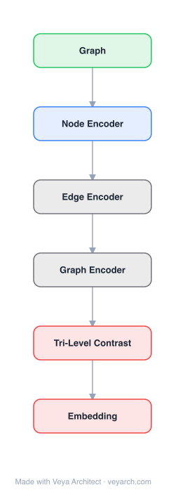

# Architecture: TriCL

## Motivation

The paper addresses **self-supervised representation learning on hypergraphs**. Machine learning on hypergraphs has attracted attention because many real-world interactions are group-wise (research collaborations, Q&A discussions, co-purchases, co-citations), and hypergraphs — where a hyperedge can join an arbitrary number of nodes — naturally represent such group interactions. However, prior work has focused on **(semi-)supervised learning**, which requires expensive labeling and risks overfitting and poor generalization. Contrastive learning has achieved great success in vision (SimCLR, MoCo) and graphs (DGI, GraphCL) as an unsupervised alternative, but **contrastive learning on hypergraphs remains largely underexplored**.

Three open questions exist: (Q1) **what to contrast?** — prior hypergraph contrastive studies use only node-level contrast, missing group-level structure; (Q2) **how to augment a hypergraph?** — effective augmentation strategies are unclear; (Q3) **how to select negative samples?** — the role of negative sampling is unexplored. TriCL fills this gap with a **tri-directional contrast** framework that maximizes agreement in two augmented views at three levels: node-level, group-level, and membership-level.

## Core Idea

Triangulated contrastive learning on hypergraphs for self-supervised representation.

## Architecture

### Overview

<b>Layer-by-layer (6 nodes)</b>

| # | Layer | Type | Params |
|---|---|---|---|
| 1 | Graph | `input` |  |
| 2 | Node Encoder | `gcn_conv` |  |
| 3 | Edge Encoder | `custom` |  |
| 4 | Graph Encoder | `custom` |  |
| 5 | Tri-Level Contrast | `loss` |  |
| 6 | Embedding | `output` |  |

TriCL (Tri-directional Contrastive Learning) is a self-supervised hypergraph representation learning framework. It creates two augmented views of the input hypergraph and maximizes three forms of agreement between them: (a) **node-level contrast** — between the same node in both views; (b) **group-level contrast** — between the same group (hyperedge) of nodes in both views; (c) **membership-level contrast** — between each group and its members. These three complementary contrasts capture both node-level and higher-order (group-level) structural information. The framework includes simple but effective data augmentation (membership corruption + feature corruption) and uniform random negative sampling.

### Components

- **Data augmentation:** Two simple augmentation strategies are combined:
  - **Membership corruption:** Randomly drops hyperedges or nodes from hyperedges, creating structural perturbations in the two views.
  - **Feature corruption:** Randomly masks or adds noise to node features, creating feature-level perturbations.
  The combination is shown to be surprisingly effective.
- **Hypergraph neural network encoder:** Encodes the augmented hypergraph views into node embeddings. The encoder can be any hypergraph neural network (e.g., HGNN, HNHN, UniGNN). The encoder is shared across both views.
- **Node-level contrast:** Maximizes agreement between embeddings of the same node in the two augmented views. This is the standard contrastive objective used in prior graph contrastive learning.
- **Group-level contrast:** Maximizes agreement between representations of the same group (hyperedge) in the two views. This captures higher-order structural information that node-level contrast alone misses.
- **Membership-level contrast:** Maximizes agreement between each group representation and the representations of its member nodes. This captures the relationship between groups and their constituents, encoding membership structure.
- **Negative sampling:** Uses uniform random sampling. Surprisingly, even extremely small negative sample sizes lead to only marginal performance degradation, challenging the assumption that hard negative mining is necessary.

### Data Flow

1. **Input:** A hypergraph with nodes (with features) and hyperedges (connecting arbitrary numbers of nodes).
2. **Augmentation:** Create two augmented views using membership corruption (drop hyperedges/nodes) and feature corruption (mask/noise features).
3. **Encoding:** Pass both views through a shared hypergraph neural network encoder to obtain node (and group) embeddings.
4. **Tri-directional contrast:** Compute three contrastive losses:
   - Node-level: maximize agreement between same-node embeddings across views.
   - Group-level: maximize agreement between same-group representations across views.
   - Membership-level: maximize agreement between each group and its members.
5. **Negative sampling:** Sample negative pairs uniformly at random.
6. **Training:** Minimize the combined contrastive loss (self-supervised, no labels required).
7. **Output:** Learned node embeddings that capture both node- and group-level structural information, usable for downstream tasks (node classification, clustering).

### State / Memory

Stateless at inference. The learned encoder parameters are the persistent model state. The augmentation is applied per-training-step (stochastic); at inference, the encoder processes the original (unaugmented) hypergraph. There is no recurrent or dynamic memory.

## Design Decisions

- **Tri-directional contrast (the core contribution):** Node-level contrast alone (used in prior work) captures only individual node similarity. Adding group-level and membership-level contrast captures the higher-order, group-wise interactions that are the defining feature of hypergraphs. The three forms are complementary.
- **Simple augmentation (membership + feature corruption):** Rather than complex augmentation strategies, the combination of membership corruption and feature corruption is simple and effective. This mirrors the finding in graph contrastive learning that simple augmentations often suffice.
- **Uniform random negative sampling:** Contrary to the common assumption that hard negative mining is necessary, uniform random sampling works surprisingly well — even tiny sample sizes suffice. This simplifies the training pipeline.
- **Encoder-agnostic framework:** TriCL is a general framework that can use any hypergraph neural network as the encoder, making it compatible with existing architectures (HGNN, HNHN, UniGNN).

## Evolution

**Predecessors:**
- DGI (Veličković et al., 2018) — graph contrastive learning via mutual information maximization; pairwise graphs only.
- GraphCL (You et al., 2020), GRACE (Zhu et al., 2020) — graph contrastive learning with augmentation; no group-level contrast.
- SimCLR (Chen et al., 2020), MoCo (He et al., 2020) — vision contrastive learning; the paradigm TriCL adapts.
- HGNN (Feng et al., 2019), HNHN (Dong et al., 2020) — hypergraph neural networks (supervised); the encoders TriCL builds upon.
- gCooL (Li et al., 2022) — community contrast in graphs; similar to membership-level contrast but with information loss for subgroups.

**Successors:**
- Hypergraph contrastive learning extensions with adaptive augmentation and hard negative mining.
- Multi-scale hypergraph contrastive frameworks incorporating higher-order structural hierarchies.
- Self-supervised hypergraph pre-training for transfer learning across hypergraph domains.

## Characteristics

| Property | Value |
|----------|-------|
| Year | 2023 |
| Authors | Lee & Shin |
| Category | GNN/Hypergraph |
| Source Paper | `TriCL_Lee_Shin_2023.md` |
| PaperVault Path | `GNN/05-hypergraphs-topology/TriCL_Lee_Shin_2023.md` |

## Limitations

- **Augmentation sensitivity:** While simple augmentations work, the optimal augmentation strength (corruption rate) may vary across hypergraph domains and requires tuning.
- **Computational cost of group-level contrast:** Computing group representations and group-level contrasts adds overhead, especially for hypergraphs with many large hyperedges.
- **Encoder dependency:** The quality of learned representations depends on the choice of hypergraph encoder; weak encoders limit the benefit of contrastive learning.
- **Transductive setting:** Like most hypergraph learning methods, TriCL operates on a fixed hypergraph; inductive learning on unseen nodes requires extensions.
- **Limited to node-level downstream tasks:** The primary evaluation is node classification; extension to hyperedge-level or graph-level tasks is less explored.

## Implementation Notes

See `implementation/` for a minimal runnable implementation.

## Information Layers

- **Evidence:** Source paper available in `references/papers/`
- **Analysis:** TriCL's key insight is that hypergraph structure is inherently group-wise, so contrastive learning on hypergraphs must contrast at the group level — not just the node level. The tri-directional contrast (node, group, membership) is a principled decomposition that captures individual, collective, and membership relationships. The finding that uniform negative sampling suffices challenges conventional wisdom and simplifies deployment. The consistent outperformance of supervised baselines by this unsupervised method is a strong result.
- **Hypothesis:** The augmentation strategy could be improved with adaptive, learnable augmentations that preserve task-relevant structure. The group-level contrast could be extended to hierarchical group structures (groups of groups) for multi-scale representation. The transductive limitation could be addressed with inductive hypergraph encoders that generalize to unseen nodes via feature-based inference.
