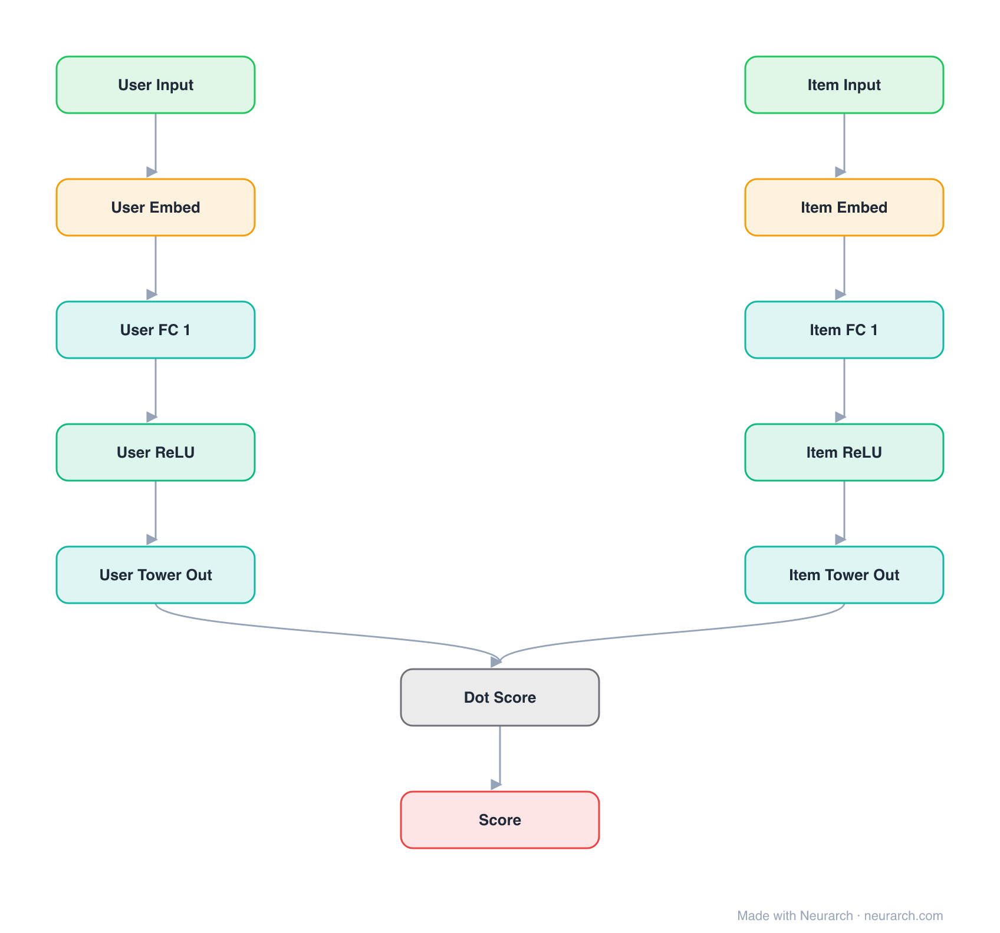

# Architecture: Two-Tower Retrieval

## Motivation

The dual-encoder retrieval architecture behind virtually every industrial recommender and semantic search stack: user tower and item tower embed into the same space, scored by dot product.

## Core Idea

The dual-encoder retrieval architecture behind virtually every industrial recommender and semantic search stack: user tower and item tower embed into the same space, scored by dot product.

## Architecture

### Overview

<b>Layer-by-layer (12 nodes)</b>

| # | Layer | Type | Params |
|---|---|---|---|
| 1 | User Input | `input` | shape: [1] |
| 2 | User Embed | `embedding` | vocabSize: 100000, embeddingDim: 64 |
| 3 | User FC 1 | `linear` | inFeatures: 64, outFeatures: 128 |
| 4 | User ReLU | `relu` |   |
| 5 | User Tower Out | `linear` | inFeatures: 128, outFeatures: 64 |
| 6 | Item Input | `input` | shape: [1] |
| 7 | Item Embed | `embedding` | vocabSize: 1000000, embeddingDim: 64 |
| 8 | Item FC 1 | `linear` | inFeatures: 64, outFeatures: 128 |
| 9 | Item ReLU | `relu` |   |
| 10 | Item Tower Out | `linear` | inFeatures: 128, outFeatures: 64 |
| 11 | Dot Score | `matmul` |   |
| 12 | Score | `output` |   |

This graph ships in Neurarch's in-app template library; the copy here passes shape propagation with zero errors.

### Design Notes

- The towers never interact until the final dot product, which is what makes billion-item retrieval feasible (items pre-embedded into an ANN index).
- Each tower here is embeddings into an MLP; in production the towers grow but the contract (two encoders, one similarity) stays.

## Design Decisions

> **Analysis** — Observations derived from studying the architecture.

- The towers never interact until the final dot product, which is what makes billion-item retrieval feasible (items pre-embedded into an ANN index).
- Each tower here is embeddings into an MLP; in production the towers grow but the contract (two encoders, one similarity) stays.

## Implementation Notes

- `model.json` contains the full structural graph with real dimensions and parameters.
- Open in [Neurarch](https://www.neurarch.com/) to visualize, edit, or export training code.
- Diagrams fold repeated identical blocks with a `× N` badge; `model.json` holds all nodes at real dimensions.

## Limitations

- This package focuses on the architectural structure. Training pipelines, 
dataset preparation, and production optimizations are out of scope.

## Evolution

> See `references/related/` for predecessor and successor architectures.

