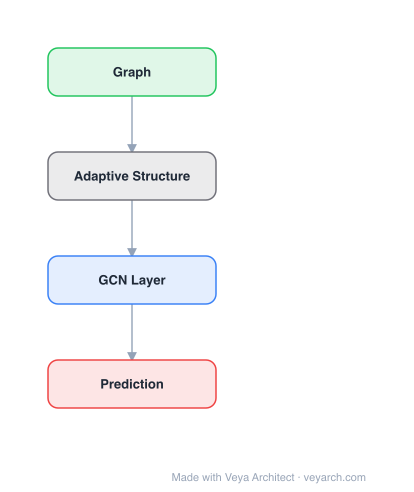

# Architecture: Uncertainty-Aware Graph Structure Learning

## Motivation

Graph Neural Networks (GNNs) have become a prominent approach for learning from graph-structured data, but their effectiveness can be significantly compromised when the graph structure is suboptimal. In practice, graph data frequently exhibit suboptimal characteristics such as noisy connections and incomplete information due to inherent complexities in data collection.

Graph Structure Learning (GSL) has emerged to refine node connections adaptively. However, existing embedding-based GSL methods have two key limitations: (1) They primarily rely on embedding similarity for graph construction while neglecting the quality of node information. Blindly connecting low-quality nodes and aggregating their ambiguous information can degrade the performance of other nodes. The paper empirically demonstrates that removing neighbors with the highest entropy significantly improves performance. (2) The constructed graph structures are often constrained to be symmetric, limiting the model's flexibility when connected nodes differ in information quality—a high-quality node benefits a low-quality neighbor, but the reverse influence may be harmful.

UnGSL addresses these limitations by estimating node uncertainty (via Shannon entropy) and utilizing it to adjust the strength of directional connections, where the influence of high-uncertainty nodes is adaptively reduced. It serves as a plug-in module that can be seamlessly integrated into existing GSL methods.

## Core Idea

GNN that jointly learns graph structure and predictions with uncertainty quantification.

## Architecture

### Overview

<b>Layer-by-layer (4 nodes)</b>

| # | Layer | Type | Params |
|---|---|---|---|
| 1 | Graph | `input` |  |
| 2 | Adaptive Structure | `custom` |  |
| 3 | GCN Layer | `gcn_conv` |  |
| 4 | Prediction | `output` |  |

UnGSL (Uncertainty-aware Graph Structure Learning) is a plug-in strategy that enhances existing embedding-based GSL methods by incorporating node uncertainty into graph structure construction. Rather than replacing GSL methods, UnGSL augments them by estimating the uncertainty of each node's information and using it to adjust directional edge weights.

The core idea is that nodes with high uncertainty (high classification entropy) carry low-quality information that can poison the representations of their neighbors during aggregation. UnGSL uses a learnable node-wise threshold to differentiate low-quality neighbors from high-quality ones and adaptively reduces the directional edge weights from high-uncertainty nodes. By modeling asymmetric (directional) relationships, UnGSL allows low-quality nodes to benefit from high-quality neighbors while protecting high-quality nodes from negative influence in the reverse direction.

### Components

- **Embedding-based GSL module**: An auxiliary GNN encoder that extracts node embeddings E from the initial graph and estimates embedding similarities as edge weights: E = GNN(A, X), S_ij = φ(E_i, E_j). This is the base GSL method that UnGSL augments.

- **Uncertainty estimation**: Node uncertainty is measured via Shannon entropy of the classification probabilities: u_i = -Σ_k p_ik log(p_ik). High entropy indicates the node's representation carries significant uncertainty.

- **Learnable node-wise threshold**: A per-node threshold θ_i that differentiates low-quality (high-uncertainty) neighbors from high-quality ones. Neighbors with uncertainty above the threshold have their directional edge weights reduced.

- **Asymmetric edge weight adjustment**: Rather than symmetric S_ij = S_ji, UnGSL computes directional weights where the influence from high-uncertainty nodes is reduced: the edge from a high-uncertainty node v_j to v_i is down-weighted, while the reverse edge (from high-quality v_i to low-quality v_j) retains its full weight.

- **Main GNN encoder**: The refined adjacency matrix S is fed into the main GNN to obtain node representations Z = GNN(S, X) for downstream tasks.

- **Training objective**: L = L_Task(Z, Y) + λL_Reg(Z, S), where L_Task uses supervised labels and L_Reg enforces desirable properties in S (sparsity, smoothness, connectivity).

### Data Flow

1. **Input**: Graph G = (V, E, A, X) with adjacency matrix A and node features X.
2. **Embedding computation**: Auxiliary GNN computes node embeddings E = GNN(A, X).
3. **Similarity-based structure**: Compute initial symmetric edge weights S_ij = φ(E_i, E_j) (e.g., cosine similarity).
4. **Uncertainty estimation**: Compute classification entropy u_i for each node from the GNN output probabilities.
5. **Threshold learning**: Learn a per-node threshold θ_i to classify neighbors as high or low quality.
6. **Asymmetric adjustment**: For each edge (v_j → v_i), if u_j > θ_i, reduce S_ij (the directional weight from high-uncertainty v_j to v_i). The reverse weight S_ji (from v_i to v_j) is not reduced, enabling asymmetric information flow.
7. **Main GNN encoding**: Feed refined asymmetric adjacency S into the main GNN: Z = GNN(S, X).
8. **Task loss**: Compute L_Task(Z, Y) using supervised labels.
9. **Joint optimization**: Backpropagate through both the structure learning and the GNN encoder.

### State / Memory

Stateless in the traditional sense—no recurrent state is maintained across layers. However, the learnable node-wise threshold θ_i serves as a per-node parameter that encodes the model's understanding of each node's quality boundary, effectively serving as a learned memory of the graph's information quality distribution.

## Design Decisions

- **Shannon entropy as uncertainty metric**: Chosen because it directly measures the information uncertainty within a probability distribution. A high-entropy node indicates the classifier is uncertain about its label, meaning its representation carries ambiguous information that can poison neighbors.

- **Asymmetric (directional) graph structure**: Breaking the symmetry constraint S_ij = S_ji is a key design choice. It allows high-quality nodes to send information to low-quality neighbors (beneficial) while preventing the reverse flow (harmful), addressing the "dilemma" in symmetric GSL.

- **Learnable per-node threshold**: Rather than a global threshold, each node learns its own threshold θ_i, allowing the model to adapt to varying local information quality distributions across the graph.

- **Plug-in design**: UnGSL is designed to be agnostic to the base GSL method, adding minimal computational overhead. This makes it practical for real-world deployment where existing GSL pipelines are already in place.

- **Theoretical grounding**: Proposition 1 proves that a node's entropy after GNN aggregation is lower-bounded by a weighted sum of its neighbors' initial entropies, providing formal justification for reducing influence from high-uncertainty neighbors.

## Evolution

**Predecessors:**
- GCN (Kipf & Welling, 2017) — foundational graph convolutional network
- ProGNN (Jin et al., 2020) — treats adjacency as learnable with sparsity regularization
- GRCN (Chen et al., 2020) — graph refinement with neural networks
- GEN (Wang et al., 2021) — graph structure estimation via embedding similarity
- Existing asymmetric GSL methods (limited to labeled-unlabeled relations)

**Successors:**
- UnGSL opens directions for uncertainty-aware graph learning beyond structure learning, potentially applicable to graph augmentation and adversarial robustness
- The asymmetric structure learning paradigm can be extended to dynamic graphs where information quality varies over time

## Characteristics

| Property | Value |
|----------|-------|
| Year | 2025 |
| Authors | Unknown |
| Category | GNN/Architecture |
| Source Paper | `Uncertainty_Aware_Graph_Structure_Learning_Hangzhou_China_2025.md` |
| PaperVault Path | `GNN/03-gnn-architectures/Uncertainty_Aware_Graph_Structure_Learning_Hangzhou_China_2025.md` |

## Limitations

- The uncertainty estimation relies on classification entropy, which requires a classification head—less directly applicable to purely unsupervised settings (though the paper discusses adaptations).
- The theoretical analysis assumes a linear classification model, which may not fully capture the behavior of deep GNN architectures.
- The learnable per-node threshold adds |V| parameters, which may be problematic for very large graphs.
- The asymmetric structure learning adds directional edges, which increases the adjacency matrix from symmetric to full, potentially doubling memory.
- The method is evaluated primarily on node classification tasks; effectiveness for link prediction and graph classification is less established.
- The plug-in design means performance depends on the quality of the base GSL method being augmented.

## Implementation Notes

See `implementation/` for a minimal runnable implementation.

## Information Layers

- **Evidence:** Source paper available in `references/papers/`
- **Analysis:** UnGSL's key insight is that not all neighbors are equally informative—high-uncertainty nodes carry ambiguous information that can degrade the representations of their neighbors. By making edge weights directional and uncertainty-aware, the model effectively creates an information quality gradient that flows from high-quality to low-quality nodes.
- **Hypothesis:** The asymmetric structure learning may be particularly beneficial on heterophilic graphs where nodes of different classes are connected, as it allows the model to selectively propagate information from more confident nodes while blocking noise from uncertain ones. The per-node threshold may also serve as an implicit attention mechanism.
