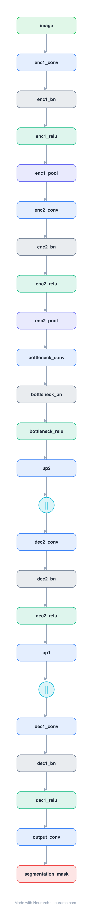

# Architecture: U-Net

## Motivation

The encoder-decoder with skip connections that owns biomedical and dense-prediction segmentation. Contracting path captures context, expanding path recovers resolution, skips carry the detail across.

## Core Idea

The encoder-decoder with skip connections that owns biomedical and dense-prediction segmentation.

## Architecture

### Overview

<b>Layer-by-layer (24 nodes)</b>

| # | Layer | Type | Params |
|---|---|---|---|
| 1 | image | `input` | shape: [3, 256, 256] |
| 2 | enc1_conv | `conv2d` | outChannels: 64, kernelSize: 3, stride: 1, padding: 1, inChannels: 3 |
| 3 | enc1_bn | `batchNorm` | numFeatures: 64 |
| 4 | enc1_relu | `relu` |   |
| 5 | enc1_pool | `maxpool2d` | kernelSize: 2, stride: 2 |
| 6 | enc2_conv | `conv2d` | outChannels: 128, kernelSize: 3, stride: 1, padding: 1, inChannels: 64 |
| 7 | enc2_bn | `batchNorm` | numFeatures: 128 |
| 8 | enc2_relu | `relu` |   |
| 9 | enc2_pool | `maxpool2d` | kernelSize: 2, stride: 2 |
| 10 | bottleneck_conv | `conv2d` | outChannels: 256, kernelSize: 3, stride: 1, padding: 1, inChannels: 128 |
| 11 | bottleneck_bn | `batchNorm` | numFeatures: 256 |
| 12 | bottleneck_relu | `relu` |   |
| 13 | up2 | `transposeConv2d` | outChannels: 128, kernelSize: 2, stride: 2 |
| 14 | dec2_skip | `concatenate` | axis: 1 |
| 15 | dec2_conv | `conv2d` | outChannels: 128, kernelSize: 3, stride: 1, padding: 1, inChannels: 128 |
| 16 | dec2_bn | `batchNorm` | numFeatures: 128 |
| 17 | dec2_relu | `relu` |   |
| 18 | up1 | `transposeConv2d` | outChannels: 64, kernelSize: 2, stride: 2 |
| 19 | dec1_skip | `concatenate` | axis: 1 |
| 20 | dec1_conv | `conv2d` | outChannels: 64, kernelSize: 3, stride: 1, padding: 1, inChannels: 64 |
| 21 | dec1_bn | `batchNorm` | numFeatures: 64 |
| 22 | dec1_relu | `relu` |   |
| 23 | output_conv | `conv2d` | outChannels: 1, kernelSize: 1, stride: 1, padding: 0, inChannels: 64 |
| 24 | segmentation_mask | `output` |   |

This graph ships in Neurarch's in-app template library; the copy here passes shape propagation with zero errors.

### Design Notes

- The long skip connections (encoder level i concatenated into decoder level i) are the defining feature; without them the decoder cannot localize.
- Still the backbone shape of choice ten years on, including inside latent diffusion models (see [diffusion-unet](../diffusion-unet/)).
- This is a compact reference graph of the topology, not a parameter-faithful replica of the 31M original.

## Design Decisions

> **Analysis** — Observations derived from studying the architecture.

- The long skip connections (encoder level i concatenated into decoder level i) are the defining feature; without them the decoder cannot localize.
- Still the backbone shape of choice ten years on, including inside latent diffusion models (see [diffusion-unet](../diffusion-unet/)).
- This is a compact reference graph of the topology, not a parameter-faithful replica of the 31M original.

## Implementation Notes

- `model.json` contains the full structural graph with real dimensions and parameters.
- Open in [Neurarch](https://www.neurarch.com/) to visualize, edit, or export training code.
- Diagrams fold repeated identical blocks with a `× N` badge; `model.json` holds all nodes at real dimensions.

## Limitations

- This package focuses on the architectural structure. Training pipelines, 
dataset preparation, and production optimizations are out of scope.

## Evolution

> See `references/related/` for predecessor and successor architectures.

