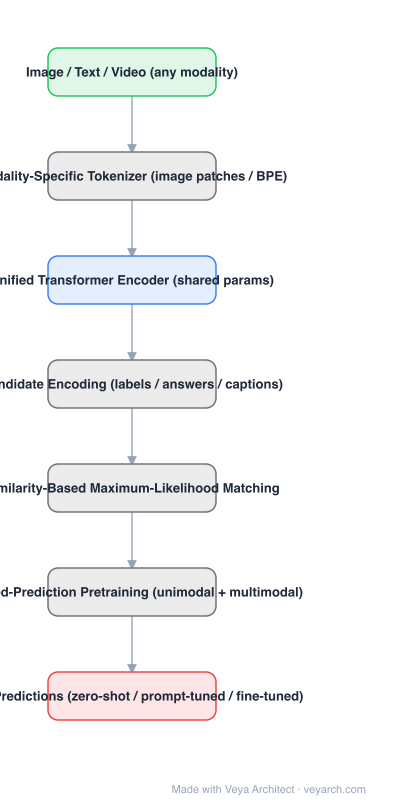

# Architecture: Uni-Perceiver

## Motivation

The dominant paradigm is one-task-one-model: every new perception task costs a new architecture, a new training pipeline, and a new deployment artifact, and tasks cannot share what they have learned. Uni-Perceiver asks whether a *single* network with shared parameters can serve as a generic perception system across modalities and tasks — with zero/few-shot transfer to unseen tasks as the acid test.

## Core Idea

Unify by **representation**, not by architecture: encode inputs from any modality into one shared latent space with lightweight modality-specific tokenizers, then formulate *every* task as maximum-likelihood estimation — find the target (label, answer, caption) whose representation best matches the input's. Because tasks differ only in which representations are compared, a pretrained encoder transfers zero-shot to a task it has never been trained on: just encode the candidates and compare.

## Architecture

### Overview

<b>Layer-by-layer (7 nodes)</b>

| # | Layer | Type | Params |
|---|---|---|---|
| 1 | Image / Text / Video (any modality) | `input` |  |
| 2 | Modality-Specific Tokenizer | `custom` |  |
| 3 | Unified Transformer Encoder (shared params) | `attention` |  |
| 4 | Shared Representation Space | `custom` |  |
| 5 | Candidate Encoding (labels / answers / captions) | `custom` |  |
| 6 | Similarity-Based Maximum-Likelihood Matching | `custom` |  |
| 7 | Task Predictions | `output` |  |

### Components

1. **Modality-specific tokenizers** — vision: patch embedding (ViT-style); text: BPE tokens. Tokenizers are deliberately lightweight; all semantic processing happens in the shared encoder.
2. **Unified Transformer encoder** — a single Transformer shared by every modality and task; no task-specific trunk.
3. **Task formulation as retrieval** — for classification, label texts are encoded as candidates; for VQA, answers; for retrieval, the other modality. Generation-style tasks (captioning) extend this autoregressively.
4. **Pretraining** — masked-prediction-style objectives (masked token prediction for text and image tokens) plus cross-modal prediction on paired image-text data, over large unimodal and multimodal corpora.
5. **Transfer modes** — zero-shot (encode and compare, no gradient), prompt tuning (a small percentage of data), full fine-tuning.

### Data Flow

Input (any modality) → tokenizer → shared Transformer → representation; candidates → same path → representations; prediction = argmax similarity / maximum likelihood. During pretraining the same machinery is trained with masked-prediction losses instead of candidate matching.

### State / Memory

No recurrent state. The shared encoder is stateless; the "state" of the system is the single latent space shared by all tasks.

## Design Decisions

- **Shared parameters, lightweight tokenizers** — modality differences are pushed to the periphery so that one encoder amortizes across everything.
- **Retrieval formulation for all tasks** — this is the key to zero-shot: a new task needs only a set of candidate representations, no new head or training.
- **Masked-prediction pretraining** — BERT-style objectives transfer to both unimodal and multimodal prediction without task labels.

## Evolution

- **Predecessors**: BERT (masked prediction), CLIP (dual-encoder contrastive alignment), DETR (set-prediction perception).
- **Uni-Perceiver** (2021): first unified-perception architecture with zero-shot/few-shot transfer across vision, language, and vision-language tasks.
- **Uni-Perceiver v2** (2022): scales with mixture-of-experts — task-specific experts plus a globally shared expert.
- **Successors / same spirit**: OFA, BEiT-3, Unified-IO, Gato, Flamingo — the "one model, many tasks" line that converged into today's multimodal LLMs.

## Characteristics

| Property | Value |
|---|---|
| Task | generic perception: classification, retrieval, VQA, captioning |
| Tokenizers | image patches / BPE (lightweight, modality-specific) |
| Encoder | single shared Transformer |
| Task head | similarity-based maximum-likelihood matching (no task-specific heads) |
| Pretraining | masked-prediction objectives, unimodal + multimodal |
| Transfer | zero-shot / prompt tuning (~1% data) / fine-tuning |

## Limitations

- 2021-scale models (ViT-L era); zero-shot numbers are "reasonable," not SOTA — the claim is transferability, not supremacy.
- Generation tasks need the autoregressive extension; pure retrieval formulation handles fixed candidate sets best.
- Single shared encoder can be stretched thin across very heterogeneous tasks — v2's task-specific experts were added for exactly this reason.
- No video tokenizer in the original formulation.

## Implementation Notes

Essentials: (1) keep tokenizers dumb and the encoder shared, (2) represent *outputs* as well as inputs in the same latent space — encode label text and compare, instead of adding a classification head, (3) pretrain with masked-prediction objectives over mixed unimodal/multimodal data, (4) implement zero-shot inference as candidate encoding + similarity, with no gradient path. The candidate-encoding trick is the single most reusable idea.

## Relevance to Veya

The blueprint for **shared-latent multi-task perception**: Veya's one-backbone-many-heads program (Veya-SAM / Veya-DETR / Veya-Depth / …) is the perception-side descendant of this design. Encoding candidate *outputs* into the latent space — so a new task is just a new candidate set — is directly reusable for zero-shot task routing across Veya's perception portfolio, and Uni-Perceiver's later MoE split (shared expert + task experts) previews the compute-allocation question Veya will face as head count grows.
