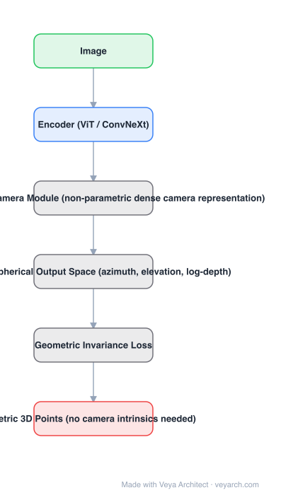

# Architecture: UniDepth

## Motivation

Monocular Metric Depth Estimation (MMDE) had a standing trade-off. Affine-invariant models (MiDaS, LeReS, OmniData) generalize across domains but output **no metric scale**, so downstream tasks cannot use them. Metric models give real scale but overfit their training domain and degrade badly under even small domain shifts. Moreover, most methods assume camera intrinsics are supplied — unavailable for in-the-wild images. UniDepth wants all three: metric, zero-shot, and no intrinsics.

## Core Idea

Three coupled designs: a **self-prompting camera module** that learns a dense non-parametric camera representation (so intrinsics are inferred, not required); a **pseudo-spherical output space** whose azimuth/elevation and log-depth axes are orthogonal by construction, decoupling camera from depth; and a **geometric invariance loss** enforcing that camera-conditioned depth features from two views of the same image are consistent.

## Architecture

### Overview

<b>Layer-by-layer (6 nodes)</b>

| # | Layer | Type | Params |
|---|---|---|---|
| 1 | Image | `input` |  |
| 2 | Encoder (ViT / ConvNeXt) | `attention` |  |
| 3 | Self-Prompting Camera Module (non-parametric dense camera representation) | `custom` |  |
| 4 | Pseudo-Spherical Output Space (azimuth, elevation, log-depth) | `custom` |  |
| 5 | Geometric Invariance Loss | `custom` |  |
| 6 | Metric 3D Points (no camera intrinsics needed) | `output` |  |

### Components

1. **Encoder** — a ViT or ConvNeXt image encoder.
2. **Self-prompting camera module** — learns a dense camera representation C ∈ R^(H×W×2) (azimuth and elevation per pixel) and bootstraps it for conditioning; the camera is predicted from data rather than provided.
3. **Pseudo-spherical output space** — output parameterized as (θ, φ, log z) instead of Cartesian (x, y, z); camera components (θ, φ) and depth (log z) are orthogonal by design, unlike the entanglement of Cartesian backprojection where rays and depth are multiplied.
4. **Spherical harmonic camera embedding** — camera components encoded with Laplace spherical harmonic encoding.
5. **Geometric invariance loss** — two geometric augmentations of the same image simulate different apparent cameras; their camera-conditioned depth features must be reciprocally consistent.

### Data Flow

Image → encoder → self-prompting camera module (dense camera prediction) → camera-conditioned depth features → pseudo-spherical output (θ, φ, log-depth) → metric 3D points per pixel. Geometric invariance loss supervises consistency across two augmented views.

### State / Memory

No recurrent state. The dense camera tensor is an intermediate output that is also used to condition the depth features — the bootstrapping is what "self-prompting" refers to.

## Design Decisions

- **Predict the camera instead of requiring it** — the only way to be usable on arbitrary internet images.
- **Make camera and depth orthogonal by construction** — the pseudo-spherical parameterization is chosen because Cartesian backprojection multiplies rays by depth, entangling the two sub-tasks.
- **Enforce geometric invariance** — consistency between two simulated cameras is what prevents the camera branch from absorbing scene geometry.
- **Re-benchmark the field fairly** — part of the contribution is evaluating prior SOTA on ten datasets under a comparable zero-shot protocol, because the existing numbers were not comparable.

## Evolution

- **MiDaS / LeReS / OmniData** (contrast): affine-invariant, generalize, no metric scale.
- **Supervised MMDE** (contrast): metric but domain-bound.
- **UniDepth (2024)**: universal MMDE — metric, zero-shot, camera-free.
- **Siblings**: Depth Pro (sharp, fast, focal-length estimation), Metric3D (canonical camera space), Depth Anything (relative).
- **Successors**: UniDepthV2 and follow-up universal MMDE work.

## Characteristics

| Property | Value |
|---|---|
| Task | monocular metric depth estimation (universal) |
| Camera | predicted (self-prompting module), intrinsics not required |
| Output space | pseudo-spherical (azimuth, elevation, log-depth) |
| Camera embedding | Laplace spherical harmonics |
| Loss | geometric invariance loss |
| Result | ranks first on the official KITTI Depth Prediction Benchmark |

## Limitations

- Single-image only; no temporal or multi-view consistency unless added.
- Camera prediction is non-parametric and learned — accuracy depends on the camera diversity seen in training.
- Metric accuracy in-the-wild still trails in-domain supervised models on their own domains.
- Heavier than affine-invariant models because it must also infer the camera.

## Implementation Notes

Essentials: (1) parameterize the output as (θ, φ, log z) rather than Cartesian — the orthogonality is the mechanism, not a cosmetic change, (2) implement the camera module to output a dense per-pixel azimuth/elevation tensor and condition the depth features on it, (3) add the geometric invariance loss with pairs of geometric augmentations per image, (4) encode camera components with spherical harmonics, (5) evaluate zero-shot on multiple datasets without fine-tuning and *without* supplying intrinsics — supplying intrinsics would mask the actual claim.
